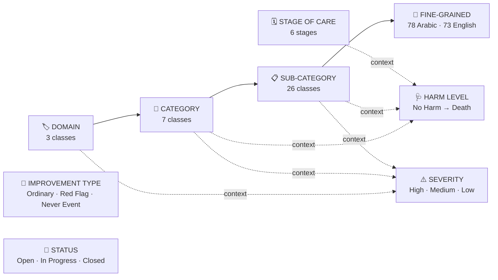
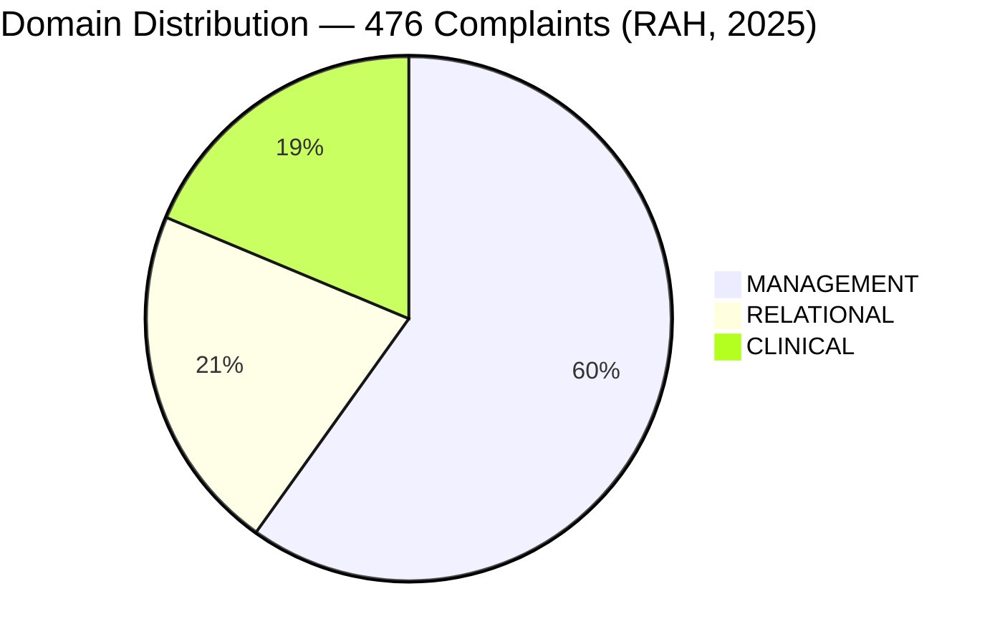
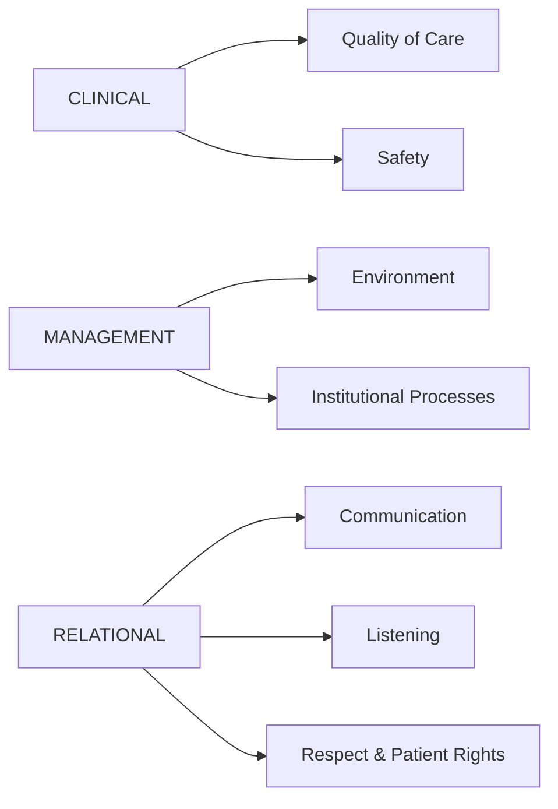
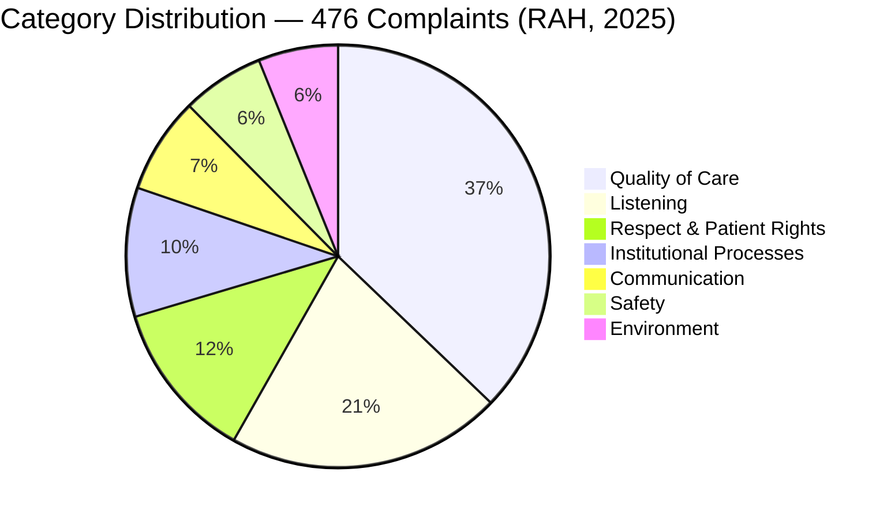
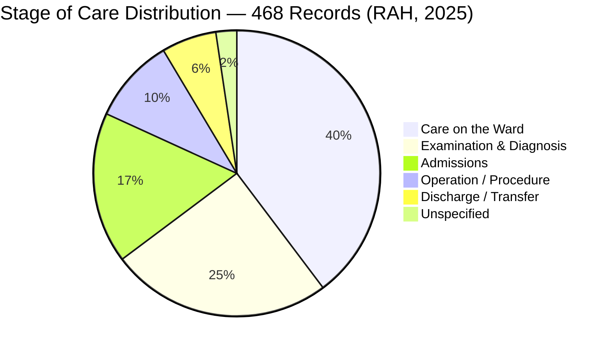
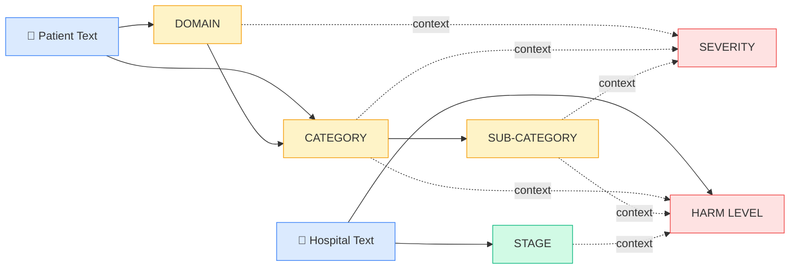

# HCAT Taxonomy Documentation
## HCAT Insight — Rassoul Azam Hospital
**Document:** 07 — HCAT Taxonomy
**Version:** 1.0
**Date:** May 2026
**Project:** HCAT Insight — AI-Assisted Healthcare Complaint Management System

---

## Table of Contents

1. [Introduction](#1-introduction)
2. [HCAT Framework Background](#2-hcat-framework-background)
3. [RAH Adaptation Context](#3-rah-adaptation-context)
4. [Taxonomy Architecture Overview](#4-taxonomy-architecture-overview)
5. [Primary Classification Dimensions](#5-primary-classification-dimensions)
   - 5.1 [Domain](#51-domain)
   - 5.2 [Category](#52-category)
   - 5.3 [Sub-Category](#53-sub-category)
6. [Fine-Grained Classification Layer](#6-fine-grained-classification-layer)
7. [Complaint Severity Level](#7-complaint-severity-level)
8. [Stage of Care](#8-stage-of-care)
9. [Harm Level](#9-harm-level)
10. [Improvement Opportunity Type](#10-improvement-opportunity-type)
11. [Complaint Status](#11-complaint-status)
12. [Label Dependency Structure](#12-label-dependency-structure)
13. [Data Distribution Summary](#13-data-distribution-summary)
14. [Annotation Challenges and Data Quality](#14-annotation-challenges-and-data-quality)
15. [Operational Usage](#15-operational-usage)
16. [AI/ML Integration](#16-aiml-integration)
17. [Conclusion](#17-conclusion)

---

## 1. Introduction

This document provides a complete, authoritative reference for the classification taxonomy used within **HCAT Insight**, the healthcare complaint management and AI-assisted analysis platform deployed at Rassoul Azam Hospital (RAH).

The taxonomy defines how patient complaints are structured, labelled, and interpreted across nine classification dimensions. It serves as the semantic foundation of the entire HCAT Insight system: every workflow routing decision, every AI model prediction, and every analytical report is anchored to this taxonomy.

This document covers:
- The origin and purpose of the classification framework
- The definition and operational meaning of every class in every dimension
- The hierarchical dependency structure between dimensions
- The actual data distributions observed in the RAH complaint dataset
- Challenges in annotation and label consistency
- How the taxonomy is used operationally and by AI/ML components

---

## 2. HCAT Framework Background

The **Healthcare Complaints Analysis Tool (HCAT)** is an internationally recognized framework for the systematic classification and analysis of patient complaints within healthcare institutions. It was developed to provide a standardized vocabulary for capturing the nature, severity, and context of complaints, enabling healthcare institutions to identify patterns, benchmark performance, and drive quality improvement.

The HCAT framework organizes complaints across a set of structured dimensions:
- A broad **Domain** that indicates the general area of care affected
- A **Category** that specifies the type of failure within that domain
- More granular **Sub-Category** and fine-grained classification labels
- Severity and harm assessments that capture the clinical impact of the incident
- Stage of care labels that identify where in the care pathway the issue arose

HCAT has been applied in multiple international studies. A relevant 2025 study published in JMIR (Koh et al.) demonstrated that large language models including GPT-4o and Claude 3.5 Sonnet could classify patient complaints according to HCAT with a mean concordance of approximately 68.8% in zero-shot conditions, confirming both the viability of automated classification and the inherent complexity of the taxonomy.

---

## 3. RAH Adaptation Context

Rassoul Azam Hospital (RAH) is a specialized cardiac care hospital in which the HCAT taxonomy has been adapted and operationalized in Arabic for local complaint processing.

Key adaptation characteristics:
- **Language**: All complaint text is written in Arabic, with occasional mixed Arabic-English clinical terminology
- **Dataset**: 476 cleaned complaint records collected starting from January 2025
- **Extended taxonomy**: RAH extends the base HCAT dimensions with a fine-grained Arabic/English classification layer of 78 Arabic labels and 73 English labels
- **Operational fields**: RAH adds operational fields not present in base HCAT, including Improvement Opportunity Type (Red Flag, Never Event) and Complaint Status

The taxonomy as implemented in HCAT Insight is used simultaneously for:
1. Operational routing and escalation of complaints within the hospital
2. Training and evaluation of AI/ML classification models
3. Analytical reporting and trend identification

---

## 4. Taxonomy Architecture Overview

The HCAT taxonomy as implemented in HCAT Insight contains nine classification dimensions. Three of these dimensions form a strict hierarchical tree (Domain → Category → Sub-Category). The remaining dimensions are semi-independent assessments that carry contextual dependencies on the primary three.

**Figure 1: HCAT Insight Taxonomy Architecture.** Solid arrows = strict hierarchical containment. Dashed arrows = contextual dependency used by AI/ML models.

---

## 5. Primary Classification Dimensions

The three primary dimensions form the semantic core of the HCAT taxonomy. They are organized as a strict tree: each Domain contains specific Categories, and each Category contains specific Sub-Categories. This structure is non-overlapping — a complaint belongs to exactly one path through the tree.

### 5.1 Domain

The Domain is the top-level classification that identifies the broad area of healthcare activity in which the complaint originates.

| Domain | Definition |
|--------|-----------|
| **CLINICAL** | Complaints arising from the clinical care process itself: diagnosis, treatment planning, nursing procedures, medications, medical decisions, and any direct patient care activity |
| **MANAGEMENT** | Complaints arising from organizational systems, administrative processes, the physical environment, resource availability, and institutional workflows |
| **RELATIONAL** | Complaints arising from the interpersonal behavior of staff toward patients and their families: communication failures, unwillingness to listen, and violations of dignity or patient rights |

**Distribution in RAH Dataset (n = 476):**

| Domain | Count | Percentage |
|--------|-------|-----------|
| MANAGEMENT | 285 | 59.9% |
| RELATIONAL | 102 | 21.4% |
| CLINICAL | 89 | 18.7% |

**Operational Significance:** MANAGEMENT is the dominant domain, reflecting that RAH complaints predominantly concern organizational and process issues rather than direct clinical care failures. CLINICAL complaints, while least frequent, carry the highest clinical risk and require prioritized investigation.

---

### 5.2 Category

The Category refines the Domain classification into a specific type of failure. Each Domain maps to a fixed, non-overlapping set of Categories.

**Domain-to-Category Mapping:**

**Figure 2: Domain-to-Category Hierarchy.**

| Category | Parent Domain | Definition |
|----------|--------------|-----------|
| **Quality of Care** | CLINICAL | Issues with the standard or quality of medical and nursing care delivered, including examination, monitoring, and basic care procedures |
| **Safety** | CLINICAL | Events where patient safety was directly compromised or threatened, including clinical errors, medication errors, and teamwork failures |
| **Environment** | MANAGEMENT | Issues with the physical environment, accommodation conditions, equipment availability, and cleanliness of facilities |
| **Institutional Processes** | MANAGEMENT | Issues with organizational workflows, administrative procedures, access delays, documentation, and bureaucratic obstacles |
| **Communication** | RELATIONAL | Failures in information exchange between staff and patients or families, including absent, delayed, or incorrect communication |
| **Listening** | RELATIONAL | Situations where staff failed to acknowledge, hear, or meaningfully respond to patient concerns or complaints |
| **Respect & Patient Rights** | RELATIONAL | Incidents where patient dignity, personal beliefs, or institutional rights were not upheld |

**Distribution in RAH Dataset:**

| Category | Count | Percentage |
|----------|-------|-----------|
| Quality of Care | 177 | 37.2% |
| Listening | 100 | 21.0% |
| Respect & Patient Rights | 58 | 12.2% |
| Institutional Processes | 47 | 9.9% |
| Communication | 35 | 7.4% |
| Safety | 30 | 6.3% |
| Environment | 29 | 6.1% |

**Operational Significance:** Quality of Care dominates, followed by Listening — together accounting for nearly 60% of all complaints. Safety complaints, while the least frequent, carry the highest clinical significance and require immediate review regardless of volume.

---

### 5.3 Sub-Category

The Sub-Category provides granular identification of the specific nature of the complaint within its Category. Sub-Categories are strictly contained within their parent Category and do not overlap across Categories.

**Complete Sub-Category Hierarchy:**

> **Figure 3** — Full three-level taxonomy tree (Domain → Category → Sub-Category).
> Generated externally. Use the prompt below to reproduce this figure.

---

**GPT Image Generation Prompt for Figure 3:**

> Create a professional, publication-quality hierarchical tree diagram for a healthcare complaint classification system called HCAT Insight. The diagram has three levels: Domain, Category, and Sub-Category. Use a clean white background with a minimal design suitable for an academic paper. Use three distinct soft colors — one per Domain — that flow through the Category and Sub-Category nodes to show group membership. Use rounded rectangles for nodes. Font should be clean and sans-serif. Arrows should be thin and directional (parent to child).
>
> The hierarchy is:
>
> **DOMAIN: CLINICAL** (blue tones)
> - Category: Quality of Care → Sub-Categories: Neglect — General, Examination & Monitoring, Neglect — Hygiene & Personal Care
> - Category: Safety → Sub-Categories: Clinician Errors, Error — Diagnosis, Error — General, Error — Medication, Failure to Respond, Teamwork
>
> **DOMAIN: MANAGEMENT** (green tones)
> - Category: Environment → Sub-Categories: Accommodation, Equipment, Ward Cleanliness
> - Category: Institutional Processes → Sub-Categories: Bureaucracy, Delay — Access, Delay — General, Delay — Procedure, Documentation, Visiting
>
> **DOMAIN: RELATIONAL** (orange tones)
> - Category: Communication → Sub-Categories: Absent Communication, Delayed Communication, Failure to Provide, Incorrect Communication
> - Category: Listening → Sub-Categories: Dismissing Patients, Ignoring Patients
> - Category: Respect & Patient Rights → Sub-Categories: Disrespect, Rights
>
> Layout: horizontal tree expanding left to right. Domain nodes on the left, Category nodes in the middle column, Sub-Category nodes on the right. Title at the top: "HCAT Insight — Three-Level Complaint Taxonomy". Include a small legend indicating the three Domain color groups. Style: clean, academic, suitable for a healthcare informatics journal.

---

**Figure 3: Complete Sub-Category Hierarchy by Domain and Category.**

**Sub-Category Definitions:**

| Sub-Category | Parent Category | Definition |
|-------------|----------------|-----------|
| Neglect — General | Quality of Care | General failure to provide expected level of nursing or clinical care |
| Examination & Monitoring | Quality of Care | Inadequate, incorrect, or absent patient examination or clinical monitoring |
| Neglect — Hygiene & Personal Care | Quality of Care | Failure to maintain patient hygiene, personal care, or basic comfort needs |
| Clinician Errors | Safety | Clinical mistakes made by physicians or specialists that compromise care quality |
| Error — Diagnosis | Safety | Incorrect, missed, or delayed diagnosis |
| Error — General | Safety | General clinical errors not specifically categorized under other safety sub-types |
| Error — Medication | Safety | Incorrect medication, dose, timing, or administration errors |
| Failure to Respond | Safety | Failure of nursing or clinical staff to respond to patient calls or emergencies |
| Teamwork | Safety | Coordination failures between clinical team members that affected patient care |
| Accommodation | Environment | Issues with patient room conditions, bed availability, privacy, ventilation, or comfort |
| Equipment | Environment | Missing, malfunctioning, or insufficient medical or non-medical equipment |
| Ward Cleanliness | Environment | Complaints about the hygiene and cleanliness of rooms, bathrooms, or common areas |
| Bureaucracy | Institutional Processes | Excessive administrative procedures, approvals, or obstacles blocking timely care |
| Delay — Access | Institutional Processes | Delays in accessing care, appointments, or consultations |
| Delay — General | Institutional Processes | General delays in hospital services not fitting a more specific sub-type |
| Delay — Procedure | Institutional Processes | Delays in the execution of a specific medical or nursing procedure |
| Documentation | Institutional Processes | Issues with medical records, discharge documentation, or administrative file preparation |
| Visiting | Institutional Processes | Complaints about visiting policies, visiting hours, or visitor restrictions |
| Absent Communication | Communication | Complete absence of communication from staff regarding the patient's condition or plan |
| Delayed Communication | Communication | Communication that occurred too late to be useful or to prevent distress |
| Failure to Provide | Communication | Staff failing to provide required information, instructions, or explanations |
| Incorrect Communication | Communication | Staff providing inaccurate, misleading, or conflicting information |
| Dismissing Patients | Listening | Staff visibly dismissing or minimizing patient concerns without engaging with them |
| Ignoring Patients | Listening | Staff failing to acknowledge patient presence, calls, or requests |
| Disrespect | Respect & Patient Rights | Rude, demeaning, or unprofessional behavior toward patients or their families |
| Rights | Respect & Patient Rights | Violations of patient rights including religious beliefs, consent, or institutional rights |

**Total: 26 Sub-Categories across 7 Categories.**

---

## 6. Fine-Grained Classification Layer

Beyond the three-level primary hierarchy, HCAT Insight includes an extended fine-grained classification layer that further specifies the exact nature of the complaint. This layer was developed by RAH to support more detailed operational analysis and routing.

- **Arabic Classification Labels:** 78 distinct classes in Arabic
- **English Classification Labels:** 73 distinct classes in English

This layer captures highly specific complaint types such as:
- IV insertion errors, imaging appointment delays, discharge paperwork problems
- Specific noise complaints (equipment noise vs. workshop noise vs. staff noise)
- Specific accommodation sub-types (air conditioning, bed availability, hygiene supplies)

**Operational Role:** The fine-grained layer is used for detailed internal reporting and root-cause analysis. Due to the large number of classes and the limited dataset size (476 records), this layer is not currently targeted by AI classification models.

---

## 7. Complaint Severity Level

The Severity Level is an ordinal assessment of the intensity, impact, and urgency of the complaint. It is assigned by the complaint officer at the time of case intake, based on the complaint narrative and supporting context.

| Level | Definition | Operational Response |
|-------|-----------|---------------------|
| **HIGH** | The complaint describes a serious incident with significant impact on patient care, safety, or institutional reputation. Requires urgent attention. | Immediate escalation; senior management notification |
| **MEDIUM** | The complaint describes a significant issue that caused notable patient distress or disruption to care. Requires structured follow-up. | Priority review within defined timeframe |
| **LOW** | The complaint describes a less serious issue, minor inconvenience, or service dissatisfaction without direct care impact. | Standard resolution workflow |

**Distribution in RAH Dataset:**

| Level | Count | Percentage |
|-------|-------|-----------|
| LOW | 317 | 66.6% |
| MEDIUM | 125 | 26.3% |
| HIGH | 28 | 5.9% |

> **Note:** A small number of records (n=6) carry a legacy severity label ("Moderate") that predates the standardized three-level scale. These were retained in the cleaned dataset for model training purposes and treated as a MEDIUM equivalent.

**Clinical Significance:** Severity assessment is inherently subjective and context-dependent. It is influenced by the Domain, Category, and Sub-Category of the complaint. A Delay in access for a routine appointment (LOW) and a Delay in access during an acute emergency (HIGH) share the same Sub-Category but differ dramatically in severity. This context-dependence is one of the primary reasons Severity is among the most challenging features to classify automatically.

---

## 8. Stage of Care

The Stage of Care identifies the point in the patient care pathway at which the complaint-generating event occurred. This information is used to identify systemic failures at specific care stages and to route complaints to the appropriate clinical or administrative team.

| Stage | Definition |
|-------|-----------|
| **Admissions** | Issues occurring during the patient registration, intake, and admission process |
| **Examination & Diagnosis** | Issues occurring during clinical examination, diagnostic workup, or test result communication |
| **Care on the Ward** | Issues occurring during inpatient care on the ward, including nursing care, daily rounds, and in-room services |
| **Operation / Procedure** | Issues occurring during a surgical operation or medical intervention procedure |
| **Discharge / Transfer** | Issues occurring at the time of patient discharge or transfer to another unit or facility |
| **Unspecified** | The stage cannot be determined from the available complaint narrative |

**Distribution in RAH Dataset:**

| Stage | Count | Percentage |
|-------|-------|-----------|
| Care on the Ward | 186 | 39.1% |
| Examination & Diagnosis | 117 | 24.6% |
| Admissions | 80 | 16.8% |
| Operation / Procedure | 45 | 9.5% |
| Discharge / Transfer | 29 | 6.1% |
| Unspecified | 11 | 2.3% |

**Note:** Care on the Ward is the dominant stage, reflecting the extended duration of inpatient experience and the multiple opportunities for service failures during hospitalization.

**AI Classification Significance:** Stage classification presents a unique challenge because a single complaint may reference events across multiple stages. A complaint about receiving incorrect discharge instructions, for example, may also reference care quality issues that began on the ward. The HCAT Insight AI pipeline uses a dedicated semantic projection approach for Stage prediction rather than a standard classification model, due to the multi-stage nature of many complaints.

---

## 9. Harm Level

The Harm Level assesses the actual clinical impact of the complaint event on the patient. Unlike Severity (which reflects perceived urgency), Harm reflects the objective clinical consequence — the damage, if any, that occurred.

| Level | Definition |
|-------|-----------|
| **No Harm** | The incident occurred or the complaint concern was raised, but no physical or psychological harm resulted to the patient |
| **Minor Harm** | The patient experienced temporary, minor harm or distress that required minimal or no additional clinical intervention |
| **Moderate Harm** | The patient experienced moderate harm requiring significant additional intervention or causing meaningful distress or delay in recovery |
| **Severe Harm** | The patient experienced permanent or life-altering harm as a result of the incident |
| **Death** | The incident resulted in or contributed to the death of the patient |

**Distribution in RAH Dataset:**

| Level | Count | Percentage |
|-------|-------|-----------|
| No Harm | 122 | 25.6% |
| Minor Harm | 28 | 5.9% |
| Moderate Harm | 7 | 1.5% |
| Severe Harm | 186 | 39.1% |
| Death | 128 | 26.9% |

> **Important Contextual Note:** The distribution of Harm Level in the RAH dataset reflects the operational context of HCAT Insight as deployed within a specialized cardiac care hospital. Cardiac patients present inherently with serious underlying conditions, and the hospital manages a high acuity patient population. The presence of complaints involving Severe Harm and Death categories is expected in this clinical environment and reflects the severity of the patients' baseline conditions, not necessarily institutional failures.

**AI Classification Significance:** Harm is considered the most challenging classification target in the HCAT framework. Human annotators have historically shown lower inter-rater agreement on Harm than on any other dimension, because determining harm requires knowledge of:
- What actually happened to the patient (not just what they reported)
- The patient's baseline clinical condition
- The counterfactual — what would have happened without the incident

The AI system addresses this by using both patient complaint text and hospital administration response text as inputs, and by implementing a two-stage architecture: a binary High-Harm versus Low-Harm classifier for safety triage, combined with a fine-grained 5-class classifier for reporting purposes.

---

## 10. Improvement Opportunity Type

This dimension classifies the operational priority and escalation level of the complaint, distinct from its clinical content.

| Type | Definition | Frequency |
|------|-----------|-----------|
| **Ordinary Complaint** | A standard complaint that follows the normal complaint resolution workflow | 92.6% (n=441) |
| **Red Flag** | A complaint requiring urgent escalation to hospital management, outside the normal resolution workflow. Applied when the complaint content or context demands immediate management attention. | 4.0% (n=19) |
| **Never Event** | A complaint involving a serious adverse event that should never occur in a properly functioning healthcare setting, by international standards. Triggers a formal investigation protocol. | < 1% (from dataset header; encoded separately) |

**Operational Role:** This dimension directly governs workflow routing in HCAT Insight. Red Flag complaints trigger immediate notification to designated management personnel. Never Events activate a formal root-cause analysis process. Ordinary Complaints enter the standard queue.

**AI Classification Significance:** The extreme class imbalance (92.6% Ordinary Complaint) makes this a difficult classification target despite high overall accuracy. The AI model achieves ~97.8% accuracy but this is largely driven by the dominant class. Red Flag and Never Event detection from text alone remains a research challenge.

---

## 11. Complaint Status

Status tracks the lifecycle position of a complaint within the HCAT Insight workflow.

| Status | Definition |
|--------|-----------|
| **Open** | Complaint received and entered into the system but not yet assigned for investigation |
| **In Progress** | Complaint under active investigation, resolution, or follow-up |
| **Closed** | Complaint fully resolved, response provided, and case documented |

Status is an operational field managed by users in the HCAT Insight workflow system. It does not function as an AI classification target.

---

## 12. Label Dependency Structure

One of the most important discoveries in the HCAT Insight AI research is that the nine classification dimensions are **not independent**. They form a structured dependency graph that mirrors the natural cognitive process a human annotator follows when classifying a complaint.

**Figure 4: Label Dependency Graph for HCAT Insight AI Pipeline.**

**Key Structural Properties:**

| Property | Description |
|----------|-------------|
| **Domain is independent** | Domain is predicted solely from patient text with no dependence on other labels |
| **Category depends on Domain** | Each Domain admits only specific Categories; Category predictions conditioned on Domain are more accurate |
| **Sub-Category depends on Category** | Sub-Category is non-overlapping across Categories; conditioning reduces the classification space dramatically |
| **Severity is derived** | Severity depends on Domain, Category, Sub-Category, and text features simultaneously |
| **Stage is semi-independent** | Stage correlates with Domain and Category but primarily signals from hospital administration text |
| **Harm is the most complex** | Harm depends on all upstream labels plus both patient and hospital text; it is the terminal node of the dependency graph |

**Annotation Order Insight:** Human annotators at RAH implicitly follow this dependency order when classifying complaints:
1. What area of care does this concern? → Domain
2. What type of failure is this? → Category
3. What specifically happened? → Sub-Category
4. How bad was it? → Severity
5. Where in the care pathway? → Stage
6. What actually happened to the patient? → Harm

This cognitive ordering is the basis for the HCAT Insight hierarchical AI architecture.

---

## 13. Data Distribution Summary

**Dataset Overview:**

| Property | Value |
|----------|-------|
| Total Records (Clean) | 476 |
| Training Set | 380 (79.8%) |
| Test Set | 96 (20.2%) |
| Language | Arabic (with mixed English clinical terms) |
| Date Range | January 2025 onwards |
| Hospital | Rassoul Azam Hospital (RAH) — Specialized Cardiac Care |

**Classification Dimension Summary:**

| Dimension | Classes | Most Frequent Class | Dominant % |
|-----------|---------|--------------------|-----------:|
| Domain | 3 | MANAGEMENT | 59.9% |
| Category | 7 | Quality of Care | 37.2% |
| Sub-Category | 26 | Documentation | — |
| Severity | 3 | LOW | 66.6% |
| Stage | 6 | Care on the Ward | 39.1% |
| Harm | 5 | Severe Harm | 39.1% |
| Improvement Type | 3 | Ordinary Complaint | 92.6% |

**Class Imbalance:** All dimensions exhibit significant class imbalance. This is an inherent property of real operational complaint data and has direct implications for AI model training, evaluation, and deployment. The macro-averaged F1 score is the primary metric used for all models to counteract the effect of dominant classes.

---

## 14. Annotation Challenges and Data Quality

### 14.1 Label Ambiguity

Several sub-categories overlap semantically, creating annotation ambiguity. The most notable overlaps are:

- **Communication vs. Listening**: Both concern staff-patient interaction. Communication focuses on information exchange failures; Listening focuses on the staff's willingness to engage. However, in practice, a complaint about a doctor not explaining the treatment plan can be interpreted as either.

- **Clinician Errors vs. Error — General**: The boundary between a specific clinician's mistake and a general clinical error is not always clear, particularly when the complaint narrative is brief.

- **Delay — General vs. Delay — Procedure vs. Delay — Access**: The three delay sub-categories are semantically close. Without temporal context clues in the text, distinguishing them requires inference.

### 14.2 Multi-Stage Complaints

Many complaints reference events that occurred across multiple stages of care. Because the annotation schema forces a single-label assignment for Stage, annotators must select the most clinically significant stage. This introduces noise into stage labels and is a recognized limitation of the HCAT protocol as applied to narrative complaints.

### 14.3 Data Quality Issues Encountered and Resolved

During preprocessing, the following data quality issues were identified and resolved:

| Issue | Description | Resolution |
|-------|-------------|-----------|
| Inconsistent severity casing | Values such as "MEDIUM", "Medium", and "mEDIUM" present simultaneously | Standardized to three canonical values: HIGH, MEDIUM, LOW |
| Trailing whitespace in stage labels | "Admissions " and "Admissions" treated as different classes | Stripped during preprocessing |
| Legacy harm label | "High Severe" present as an additional harm level | Mapped to Severe Harm during cleaning |
| Duplicate sub-category names | Case variants such as "Delay -Access" and "Delay -access" | Unified to canonical form |
| Null stage values | 8 records with missing Stage label | Retained in dataset; excluded from Stage model training |

---

## 15. Operational Usage

The HCAT taxonomy governs four operational functions within HCAT Insight:

| Function | Dimensions Used |
|----------|----------------|
| **Complaint Routing** | Domain, Category, Sub-Category → determines which team receives the case |
| **Priority Escalation** | Improvement Opportunity Type, Severity → determines urgency and escalation path |
| **Safety Monitoring** | Harm Level, Severity, Never Event → triggers safety review processes |
| **Reporting & Analytics** | All dimensions → aggregated in monthly and seasonal reports for management |

The taxonomy also defines the structure of all dashboard metrics, trend charts, and comparative analyses produced by the HCAT Insight reporting system.

---

## 16. AI/ML Integration

The HCAT taxonomy directly shapes the architecture of the HCAT Insight AI classification system.

| AI Component | Taxonomy Dimension | Architecture Notes |
|-------------|-------------------|--------------------|
| Domain Classifier | Domain (3 classes) | Single-head Logistic Regression on patient text embeddings; best-performing model |
| Category Classifier | Category (7 classes) | Hierarchical model conditioned on predicted Domain; separate classifier per Domain |
| Sub-Category Classifier | Sub-Category (26 classes) | Hierarchical model conditioned on predicted Category; separate classifier per Category |
| Severity Classifier | Severity (3 levels) | Ordinal Logistic Regression using combined patient + hospital text embeddings |
| Stage Classifier | Stage (6 stages) | Semantic projection model using vocab-based metric embeddings; hospital text primary |
| Harm Classifier | Harm (5 levels) | Two-stage: binary safety triage + fine-grained 5-class model; all embeddings as input |
| Improvement Type | IOT (3 types) | Single-head classifier; dominated by Ordinary Complaint class |

All text inputs are encoded using the `sentence-transformers/paraphrase-multilingual-mpnet-base-v2` model, which produces 768-dimensional dense embeddings capable of representing Arabic clinical text effectively without fine-tuning.

The dependency structure described in Section 12 directly informs the hierarchical and stacked model architecture — where predictions from upstream models (Domain, Category) are fed as additional input features to downstream models (Severity, Harm).

---

## 17. Conclusion

The HCAT taxonomy as implemented in HCAT Insight is a multi-dimensional, hierarchically structured classification system adapted from the international HCAT framework for the Arabic-language operational environment of Rassoul Azam Hospital.

Key characteristics of this taxonomy:

1. **Three-level primary hierarchy**: Domain → Category → Sub-Category, forming a strict non-overlapping tree with 3 × 7 × 26 nodes
2. **Extended fine-grained layer**: 78 Arabic and 73 English labels for detailed operational analysis
3. **Four contextual assessment dimensions**: Severity, Stage, Harm, and Improvement Opportunity Type
4. **Non-independence of labels**: Labels form a structured dependency graph that mirrors natural human annotation order and directly informs the AI architecture
5. **Real-world data quality**: The taxonomy was applied to 476 real operational complaints collected at RAH, exhibiting class imbalance and annotation ambiguity characteristic of real healthcare data

This document serves as the semantic foundation for all other HCAT Insight documentation. The labels, hierarchy, and dependency structure described here are referenced in the Dataset Documentation, AI System Design, Model Experiments, and Benchmark Results documents that follow.

---

*Document prepared for research and academic publication purposes.*
*Source of truth: HCAT Insight codebase, SQL Server database, and operational complaint dataset at Rassoul Azam Hospital.*
