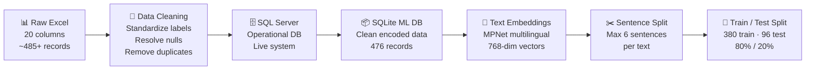
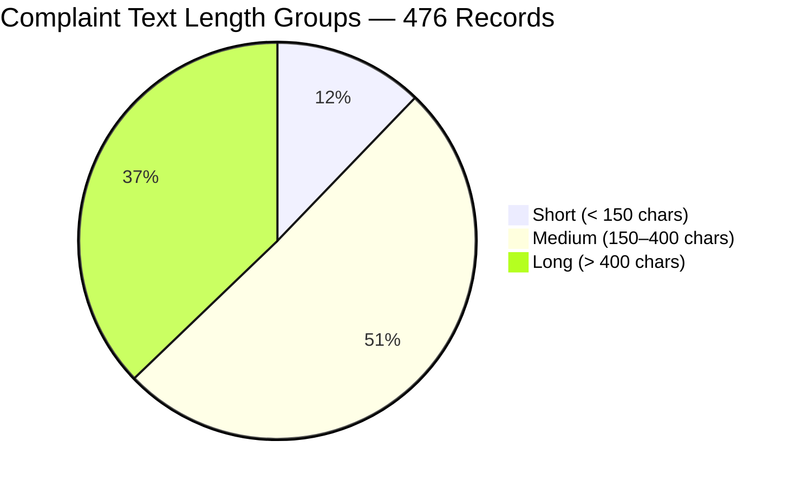
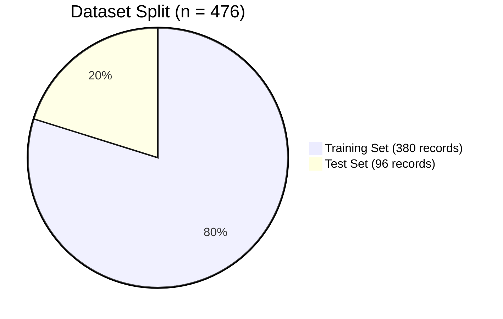
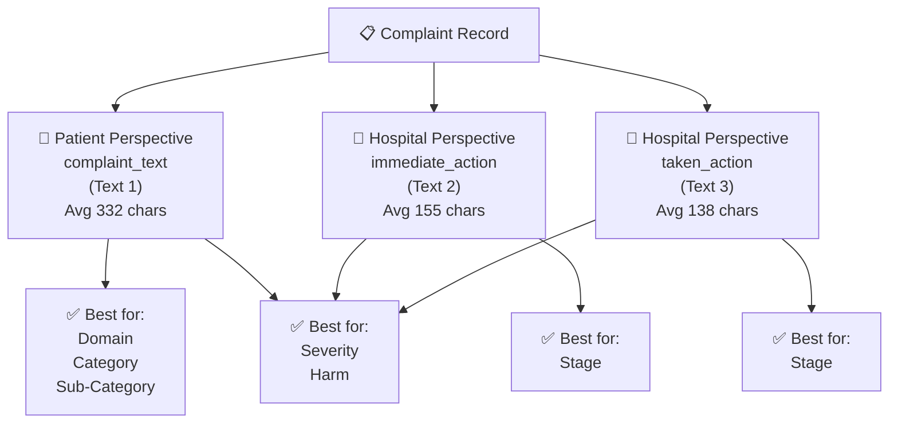

# Dataset Documentation
## HCAT Insight — Rassoul Azam Hospital
**Document:** 05 — Dataset Documentation
**Version:** 1.0
**Date:** May 2026
**Project:** HCAT Insight — AI-Assisted Healthcare Complaint Management System

---

## Table of Contents

1. [Introduction](#1-introduction)
2. [Dataset Purpose and Origin](#2-dataset-purpose-and-origin)
3. [Data Collection Context](#3-data-collection-context)
4. [Dataset Structure Overview](#4-dataset-structure-overview)
5. [Field Descriptions](#5-field-descriptions)
   - 5.1 [Administrative Fields](#51-administrative-fields)
   - 5.2 [Classification Label Fields](#52-classification-label-fields)
   - 5.3 [Text Content Fields](#53-text-content-fields)
   - 5.4 [Embedding Fields](#54-embedding-fields)
6. [Text Content Characteristics](#6-text-content-characteristics)
7. [Dataset Size and Splits](#7-dataset-size-and-splits)
8. [Class Distributions](#8-class-distributions)
9. [Missing Data Analysis](#9-missing-data-analysis)
10. [Preprocessing Pipeline](#10-preprocessing-pipeline)
11. [Embedding Preparation Strategy](#11-embedding-preparation-strategy)
12. [Dual-Perspective Design](#12-dual-perspective-design)
13. [Dataset Limitations](#13-dataset-limitations)
14. [Comparison with Related Work](#14-comparison-with-related-work)
15. [Ethical and Privacy Considerations](#15-ethical-and-privacy-considerations)
16. [Conclusion](#16-conclusion)

---

## 1. Introduction

This document provides a complete technical description of the healthcare complaint dataset used within **HCAT Insight** for AI/ML model training, evaluation, and continuous retraining. The dataset is derived from real operational patient complaints collected at **Rassoul Azam Hospital (RAH)**, a specialized cardiac care hospital.

The dataset constitutes the empirical foundation of the HCAT Insight AI system. Every classification model, every benchmark result, and every performance claim in this project traces back to this dataset. Documenting its structure, characteristics, limitations, and preprocessing decisions is therefore essential for research reproducibility, model auditability, and future development.

This document does not repeat the label definitions and class hierarchies already covered in **Document 07 — HCAT Taxonomy**. It focuses instead on the dataset as a technical artifact: its structure, statistical properties, preprocessing decisions, and research implications.

---

## 2. Dataset Purpose and Origin

The dataset was compiled from the operational complaint intake records of Rassoul Azam Hospital, captured through the HCAT Insight complaint management system. Each record corresponds to one patient complaint submitted to the hospital through one of several intake channels including direct submission, hotline, WhatsApp, suggestion boxes, ward rounds, or staff reporting.

**Purpose of the dataset:**

| Purpose | Description |
|---------|-------------|
| AI Model Training | Train classification models for all nine HCAT dimensions |
| Model Evaluation | Evaluate classification performance against held-out test records |
| Benchmark Comparison | Compare RAH model performance against published HCAT classification benchmarks |
| Continuous Retraining | Serve as the expanding training pool as new complaints are added to the system |
| Research | Enable academic publication on Arabic HCAT classification using classical ML |

The dataset is **not synthetic** and was **not produced by external annotation teams**. All labels were assigned by trained complaint officers at RAH following the HCAT protocol. This gives the dataset direct operational validity but also introduces the annotation variability inherent to human labeling of subjective clinical narratives.

---

## 3. Data Collection Context

**Hospital:** Rassoul Azam Hospital (RAH)
**Specialization:** Cardiac care (specialized, not general hospital)
**Date range:** January 2025 onwards
**Language:** Arabic, with mixed English clinical and medical terminology
**Complaint channels:** Physical suggestion boxes, ward rounds, supervisor reports, staff reporting, hotline, WhatsApp office channel, and social media

The specialized cardiac care context of RAH has direct implications for the dataset:

- **High patient acuity:** The patient population presents with serious cardiac conditions, which elevates the baseline frequency of complaints categorized under Severe Harm and Death compared to a general hospital dataset
- **Clinical complexity:** Arabic complaint narratives at RAH frequently reference complex medical procedures, devices, and multi-specialist care, producing longer and more technically detailed texts than general hospital complaints
- **Single-institution data:** The dataset reflects one hospital's complaint culture, operational workflows, and annotation practices, which limits generalization to other institutions without domain adaptation

---

## 4. Dataset Structure Overview

The original complaint data is sourced from an Excel file maintained by the Quality and Patient Safety department. For AI/ML purposes, the data is stored and accessed through a structured **SQLite database** used as the ML training environment, which extends the original 20-column schema with computed embedding columns.

**Figure 1: Dataset Preprocessing Pipeline from Raw Excel to ML-Ready Format.**

**Table counts in the SQLite ML database:**

| Table | Records | Description |
|-------|---------|-------------|
| `patient_feedback_encoded` | 476 | Active clean dataset — primary source for all ML work |
| `patient_feedback_encoded_Old` | 485 | Previous version — retained for audit, not used in training |
| `table_feedback_train` | 380 | Training split (80%) |
| `table_feedback_test` | 96 | Test split (20%) |

---

## 5. Field Descriptions

The active dataset (`patient_feedback_encoded`) contains 25 columns: 20 original data fields and 5 families of computed embedding columns.

### 5.1 Administrative Fields

| Field | Type | Description |
|-------|------|-------------|
| `id` | Integer | Unique complaint record identifier |
| `feedback_received_date` | Datetime | Timestamp of complaint submission |
| `feedback_type` | Encoded Integer | Type of feedback (single operational value in current dataset: improvement opportunity) |
| `issuing_department` | String / Encoded | The department from which the complaint was submitted or received |
| `target_department` | String / Encoded | The department against which the complaint is directed |
| `source` | Encoded Integer | Intake channel (hotline, WhatsApp, suggestion box, ward rounds, supervisor, staff, social media) |
| `patient_name` | String | Patient full name — used only for case management; excluded from ML inputs |
| `status` | Encoded Integer | Workflow lifecycle state: Open, In Progress, Closed |

### 5.2 Classification Label Fields

These nine fields are the prediction targets of the HCAT Insight AI system. Full definitions for each label are provided in **Document 07 — HCAT Taxonomy**.

| Field | Classes | ML Target | Notes |
|-------|---------|-----------|-------|
| `domain` | 3 | Yes | Highest-performing AI target |
| `category` | 7 | Yes | Predicted conditionally on domain |
| `sub_category` | 26 | Yes | Predicted conditionally on category |
| `classification_en` | 73 | Partially | Too sparse for reliable training at full resolution |
| `severity_level` | 3 | Yes | Ordinal — treated with ordinal-aware model |
| `stage` | 6 | Yes | Predicted using semantic projection approach |
| `harm_level` | 5 | Yes | Hardest target — two-stage prediction architecture |
| `improvement_opportunity_type` | 3 | Yes | Extreme class imbalance (92.6% dominant class) |

### 5.3 Text Content Fields

The dataset contains three distinct text fields that capture different perspectives on the same complaint event. This dual-perspective design (patient voice + hospital voice) is a central feature of the dataset and directly shapes the AI architecture.

| Field | Source | Arabic Column Name | Avg Length (chars) | Min | Max |
|-------|--------|-------------------|--------------------|-----|-----|
| `complaint_text` | Patient / Guardian narrative | محتوى الشكوى (Raw Content) | 332 | 13 | 1,457 |
| `immediate_action` | Hospital — immediate response | الإجراء الفوري | 155 | 1 | 870 |
| `taken_action` | Hospital — full response documentation | الإجراءات المتخذة | 138 | 1 | 812 |

**Text length distribution:**

> **Note:** Length thresholds are approximate based on distribution observation. "Short" complaints are typically brief statements of dissatisfaction. "Long" complaints are multi-paragraph narratives describing sequences of events across multiple care interactions. Long narratives are more common in complaints that ultimately receive higher Severity or Harm classifications.

### 5.4 Embedding Fields

After text preprocessing, five combined embedding columns and six sentence-level embedding columns are computed and stored directly in the database for efficient model training and inference.

| Column | Dimensions | Source | Primary Use |
|--------|-----------|--------|-------------|
| `embedding_text1` | 768 | `complaint_text` | Domain, Category, Sub-Category prediction |
| `embedding_text2` | 768 | `immediate_action` | Stage prediction (secondary) |
| `embedding_text3` | 768 | `taken_action` | Hospital-side context |
| `embedding_text123` | 768 | Text 1 + Text 2 + Text 3 (concatenated) | Severity, Harm prediction |
| `embedding_text23` | 768 | Text 2 + Text 3 (concatenated) | Stage prediction (primary) |
| `sentence_1_embedding` … `sentence_6_embedding` | 768 each | Six sentence segments of `complaint_text` | Stage semantic projection model |

All embeddings are 768-dimensional dense float vectors produced by the `sentence-transformers/paraphrase-multilingual-mpnet-base-v2` model. Storing embeddings in the database eliminates redundant computation during model training, hyperparameter search, and retraining cycles.

---

## 6. Text Content Characteristics

The complaint texts in the RAH dataset exhibit several characteristics that distinguish them from standard NLP benchmark datasets and that directly influenced the AI architecture choices.

### 6.1 Language and Script

All texts are written in **Modern Standard Arabic** with significant admixture of **dialectal Arabic** (Lebanese and Iraqi dialects are most common, reflecting the patient population served). Medical and clinical terminology frequently appears in English, particularly for procedure names, device names, and diagnostic terms.

Examples of language mixing observed:
- Arabic narrative with English procedure names: "سحب البلغم suction", "bottle suction", "salmonella"
- Arabic with English unit names: "CCU", "ICU", "IV", "echo"
- Arabic numbers mixed with Arabic text in ward and room references: "غرفة 323"

This multilingual mixed-script nature makes Arabic-only models insufficient and was the primary motivation for selecting a **multilingual sentence transformer** rather than a monolingual Arabic model.

### 6.2 Narrative Structure

Complaint texts at RAH are structurally diverse:

| Structure Type | Description | Frequency |
|---------------|-------------|-----------|
| **Single grievance** | One concise complaint statement | Common (short texts) |
| **Numbered narrative** | Multi-point complaint with numbered items (1., 2., 3.) | Common (medium/long texts) |
| **Chronological sequence** | Events described in temporal order across care stages | Frequent in long texts |
| **Emotionally charged** | High emotional language with implicit rather than explicit clinical facts | Present across all length groups |

### 6.3 Cognitive Complexity for Classification

The complaint text carries high cognitive load for classification models because it is simultaneously:
- **Long** (avg 332 chars, max 1,457)
- **Emotionally heavy** (patient distress language throughout)
- **Mixed** in content (clinical, relational, and management issues often co-occur in a single complaint)
- **Bilingual** (Arabic + English clinical terms)
- **Causal** in structure (patients describe chains of events that led to the problem)

These characteristics explain why classical machine learning models trained on sentence embeddings perform below human-level accuracy for fine-grained classification targets, while achieving reasonable performance for higher-level dimensions like Domain.

---

## 7. Dataset Size and Splits

**Total cleaned records: 476**
**Train / Test split: 80% / 20%**

| Split | Records | Use |
|-------|---------|-----|
| Training set | 380 | Model fitting for all classifiers |
| Test set | 96 | Performance evaluation — held out throughout training |

The split was applied consistently across all models so that comparative results are evaluated on the same 96 test records.

**Context on dataset size:**

The 476-record dataset is small by machine learning standards. For reference, the 2025 JMIR study by Koh et al. — the most directly comparable published work — used a dataset of **1,816 complaints** and still employed GPT-4o zero-shot inference rather than trained classifiers, precisely because of the challenges of training on limited data. The RAH dataset is **approximately one-quarter the size** of that study's corpus.

This size constraint is not a design failure but an operational reality: the HCAT Insight system was deployed starting January 2025, and the 476 records represent genuine operational complaints collected in the system's initial months of operation. The dataset size grows continuously as new complaints enter the system, enabling retraining at defined data volume milestones.

---

## 8. Class Distributions

All nine classification dimensions exhibit significant class imbalance, which is expected for real operational complaint data and has direct implications for AI model training and evaluation.

**Key imbalance characteristics by dimension:**

| Dimension | Dominant Class | Dominant % | Rarest Class | Rarest Count |
|-----------|---------------|-----------|-------------|-------------|
| Domain | MANAGEMENT | 59.9% | CLINICAL | 89 |
| Category | Quality of Care | 37.2% | Environment | 29 |
| Severity | LOW | 66.6% | HIGH | 28 |
| Stage | Care on the Ward | 39.7% | Unspecified | 11 |
| Harm | Severe Harm | 39.1% | Moderate Harm | 7 |
| Improvement Type | Ordinary Complaint | 92.6% | Red Flag | 19 |

**Implication for model evaluation:** All models are evaluated using **macro-averaged F1 score** as the primary metric, because accuracy is misleading when dominant classes constitute 60–93% of records. A model that always predicts the dominant class achieves high accuracy but zero utility.

**Implication for model training:** Class weighting was applied in all training runs to partially compensate for imbalance. For severely sparse classes (fewer than 10 training samples), reliable learning is not possible regardless of algorithmic choice, and this is reflected in the per-class F1 scores reported in the model experiments.

> Full class-by-class distributions with Mermaid charts are provided in **Document 07 — HCAT Taxonomy**, Sections 5.1, 5.2, 8, and 10.

---

## 9. Missing Data Analysis

Missing values in the RAH dataset are concentrated in a small number of fields and arise from two sources: operational gaps (complaints where the information was genuinely unavailable) and preprocessing cleaning (records where normalization could not be resolved automatically).

| Field | Null Count | % Missing | Reason |
|-------|-----------|-----------|--------|
| `stage` | 8 | 1.7% | Stage could not be determined from complaint narrative |
| `harm_level` | 4 | 0.8% | Harm assessment not completed for some records |
| `improvement_opportunity_type` | 16 | 3.4% | Field left blank at intake for some older records |
| `feedback_type` | 12 | 2.5% | Metadata gap for a subset of records |
| `taken_action` | 5 | 1.0% | Hospital response not yet filed at time of export |
| All label fields (domain, category, sub_category, severity) | 0 | 0% | Fully complete — required fields in intake workflow |

**Handling strategy:** Records with null stage values were retained in the dataset and excluded from Stage model training only. Records with null harm values were treated similarly. No records were dropped entirely due to missing values, as all records contain complete complaint text and primary classification labels.

---

## 10. Preprocessing Pipeline

The data went through a multi-stage preprocessing pipeline before reaching the ML-ready format used for model training.

### Stage 1 — Label Standardization

Raw label values extracted from the hospital system contained inconsistencies introduced by manual data entry over time. These were resolved as follows:

| Issue | Before | After |
|-------|--------|-------|
| Severity casing | "MEDIUM", "Medium", "mEDIUM", "Moderate" | Canonical: HIGH, MEDIUM, LOW |
| Stage trailing whitespace | "Admissions " ≠ "Admissions" | Stripped and unified |
| Harm level variants | "Severe Harm", " Severe Harm" (leading space) | Unified to canonical form |
| Sub-category casing | "Delay -Access" vs "Delay -access" | Unified to canonical form |
| Examination & Monitoring casing | "examination & Monitoring" | Unified |

### Stage 2 — Integer Encoding

All categorical label values were encoded to integers for storage and ML use. A bidirectional mapping (`Database_To_ML_Encoding.json`, `ML_To_Database_Encoding.json`) was maintained to allow decoded predictions to be written back to the operational SQL Server database in their original string form.

### Stage 3 — Text Concatenation

For embedding generation, two compound text fields were created:
- **Text 1+2+3:** Full concatenation of all three text sources — used for Severity and Harm
- **Text 2+3:** Concatenation of hospital response texts only — used for Stage

### Stage 4 — Embedding Generation

Each text field was passed through the `sentence-transformers/paraphrase-multilingual-mpnet-base-v2` model to produce 768-dimensional dense vector representations. Embeddings for all five text variants were computed for each record and stored directly in the SQLite database.

### Stage 5 — Sentence Splitting

For the Stage semantic projection model, each `complaint_text` was segmented into a maximum of six sentences using Arabic punctuation and syntactic markers. Each sentence was independently embedded. Records with fewer than six sentences received null values for the remaining sentence embedding columns.

### Stage 6 — Train/Test Split

An 80/20 random split produced 380 training records and 96 test records. The same split was applied identically across all model training runs to ensure comparability of results.

---

## 11. Embedding Preparation Strategy

The choice to store precomputed embeddings in the database rather than computing them on-the-fly during training was a deliberate architectural decision driven by the deployment constraints of the system.

**Motivation:**

| Constraint | Implication |
|-----------|-------------|
| No GPU on the hospital VM | Embedding generation is CPU-bound and slow |
| Frequent retraining anticipated | Recomputing embeddings on every retrain would be expensive |
| Offline deployment | No access to cloud embedding APIs |
| Multiple models share the same embeddings | Compute once, reuse across all classifiers |

**Embedding model selection rationale:**

The `paraphrase-multilingual-mpnet-base-v2` model was selected over Arabic-specific models (such as AraBERT) because:

1. It produces **sentence-level representations** optimized for semantic similarity and classification tasks, rather than token-level contextual representations
2. It natively supports Arabic without requiring fine-tuning, and handles the mixed Arabic-English code-switching present in RAH complaint texts
3. It produces **768-dimensional** embeddings — a high-quality representation that is compact enough for lightweight classifiers to train on with 380 samples
4. It runs entirely **on CPU** with acceptable inference latency on the hospital's virtual machine infrastructure

---

## 12. Dual-Perspective Design

A structurally distinctive feature of the RAH dataset is that each complaint record contains **two independent perspectives** on the same event: the patient's subjective experience and the hospital's administrative assessment.

**Figure 2: Dual-Perspective Design and Signal Attribution by Classification Dimension.**

**Empirical findings on text source selection** (from model training experiments):

| Dimension | Best Text Input | Rationale |
|-----------|----------------|-----------|
| Domain | Patient text (Text 1) | High-level semantics of the complaint are best captured in the patient narrative |
| Category | Patient text (Text 1) | Category-level distinctions arise from the nature of the event as reported by the patient |
| Sub-Category | Patient text (Text 1) | Specific sub-type signals are embedded in patient language |
| Severity | Combined (Text 1+2+3) | Severity requires context from both patient distress and hospital assessment |
| Stage | Hospital text (Text 2+3) | The hospital response texts contain more precise temporal and procedural language |
| Harm | Combined (Text 1+2+3) | Harm assessment requires both patient experience and hospital-documented outcome |

This finding has significant research implications: the two text sources are not interchangeable. They carry complementary signals for different classification tasks, and treating them separately is a design principle of the HCAT Insight AI architecture.

---

## 13. Dataset Limitations

The following limitations are inherent to the dataset and must be acknowledged in any research using it.

| Limitation | Description | Impact |
|-----------|-------------|--------|
| **Small size** | 476 records across 9 classification tasks, with up to 26 sub-classes | Insufficient for deep learning; limits model generalization |
| **Single institution** | Data from one specialized cardiac hospital only | Models may not transfer to general hospitals without domain adaptation |
| **Class imbalance** | All dimensions are heavily imbalanced; some classes have fewer than 10 training samples | Rare classes cannot be reliably learned; macro F1 will be depressed |
| **Single-label forced annotation** | Complaints covering multiple categories, stages, or harms are forced into one label | Introduces annotation noise, especially for Stage |
| **Arabic dialectal variation** | Mixed Modern Standard Arabic and dialectal forms across patient records | Increases embedding noise; may require dialect-aware models for future improvements |
| **Temporal limitation** | Data spans only from January 2025 | Cannot capture seasonal trends or long-term patterns |
| **No inter-annotator agreement** | Labels were assigned by operational staff, not by multiple independent annotators | Annotation reliability cannot be formally assessed |
| **Fine-grained layer unusable** | The 78-class Arabic / 73-class English fine-grained labels are too sparse for reliable classification | This layer is excluded from the AI pipeline and used only for operational reporting |

---

## 14. Comparison with Related Work

The most directly comparable published study is Koh et al. (2025, JMIR), which applied large language models to HCAT classification in a zero-shot setting.

| Property | RAH Dataset (HCAT Insight) | Koh et al. 2025 (JMIR) |
|----------|--------------------------|------------------------|
| Dataset size | 476 records | 1,816 records |
| Language | Arabic (mixed with English) | English |
| Hospital type | Specialized cardiac care | General practice |
| Classification approach | Trained classical ML (LR, RF, XGBoost) | Zero-shot LLM (GPT-4o, Claude 3.5) |
| Dimensions classified | 9 (including fine-grained) | 5 (Domain, Category, Severity, Stage, Harm) |
| Best Domain accuracy | 82.0% (Hierarchical LR) | 79.4% (GPT-4o) |
| Best Category accuracy | 82.5% (Hierarchical RF, Domain 2 subset) | 69.8% (GPT-4o) |
| Computational constraint | CPU-only, offline | Cloud API access |

**Key observation:** The RAH hierarchical classification approach achieves Domain accuracy (82%) that is **comparable to or exceeding** GPT-4o zero-shot performance (79.4%) on a dataset one-quarter the size. This result supports the viability of the lightweight hierarchical ML approach under the operational constraints of the HCAT Insight deployment environment.

---

## 15. Ethical and Privacy Considerations

### 15.1 Patient Identity

The dataset originates from real patient complaints. Patient names were collected for case management purposes within the operational HCAT Insight system but are **excluded from all ML training pipelines**. The `patient_name` field is never included as a feature in any model and is not part of the embedding inputs.

### 15.2 Data Storage

The ML training dataset is stored in a local SQLite database on the hospital's virtual machine infrastructure. It is not transmitted to external servers or cloud services. All AI inference and training occurs within the hospital's offline network boundary.

### 15.3 Sensitive Content

Complaint texts may contain clinical details, family relationship information, and descriptions of adverse medical events. Access to the dataset is restricted to authorized technical staff involved in HCAT Insight development. The dataset is used exclusively for the purpose of improving complaint classification within RAH.

### 15.4 Consent and Institutional Approval

Use of the complaint data for AI model development was authorized by hospital administration as part of the HCAT Insight project mandate. Patient complaints submitted to the hospital are documented in accordance with RAH's patient feedback policy.

---

## 16. Conclusion

The HCAT Insight dataset is a real-world operational healthcare complaint corpus comprising 476 cleaned records from Rassoul Azam Hospital. Its defining characteristics are:

- **Authentic operational origin:** Complaints are genuine patient narratives, not synthetic or externally annotated data
- **Arabic multilingual text:** Mixed Arabic-English clinical language requiring a multilingual embedding approach
- **Rich annotation:** Nine HCAT classification dimensions per record, enabling multi-target AI research
- **Dual text perspective:** Separate patient and hospital response texts providing complementary signals for different classification tasks
- **Small size under real constraints:** 476 records reflecting the early operational phase of the system, with a growing retraining pool

The dataset's small size is its primary limitation, but empirical results demonstrate that the hierarchical classification architecture developed for HCAT Insight achieves competitive performance relative to published benchmarks using large language models on much larger datasets. This positions the dataset as a meaningful research contribution to Arabic-language healthcare NLP, particularly for resource-constrained offline deployment settings.

---

*Document prepared for research and academic publication purposes.*
*Source of truth: HCAT Insight codebase, SQLite ML database, and operational complaint dataset at Rassoul Azam Hospital.*
