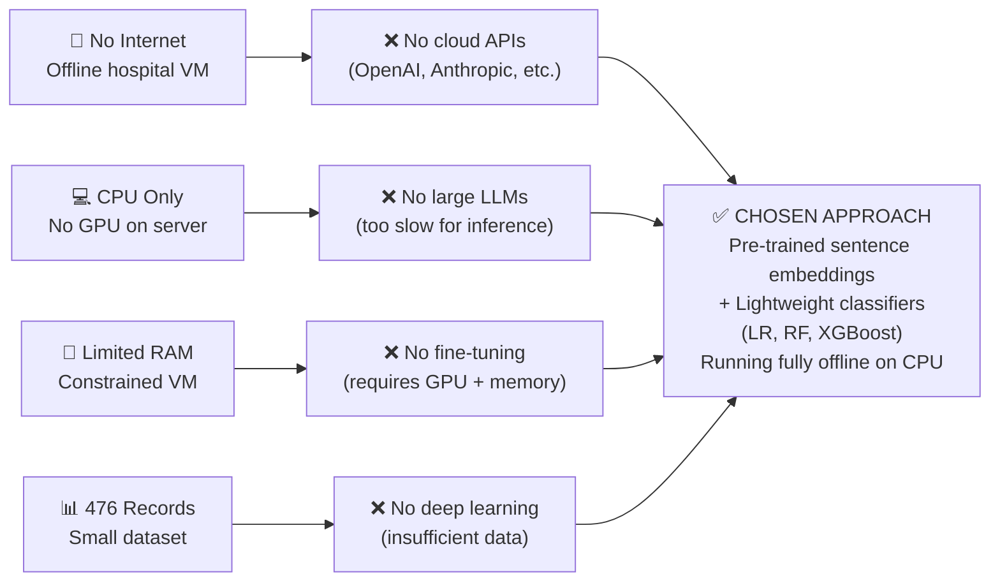
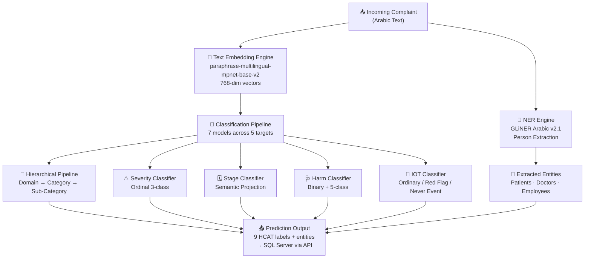
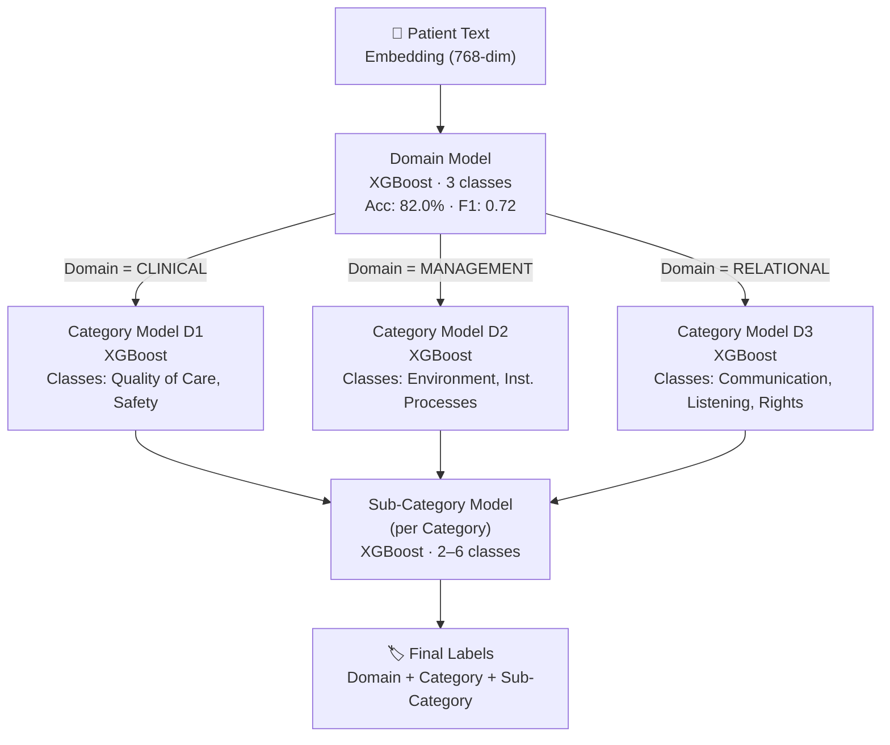
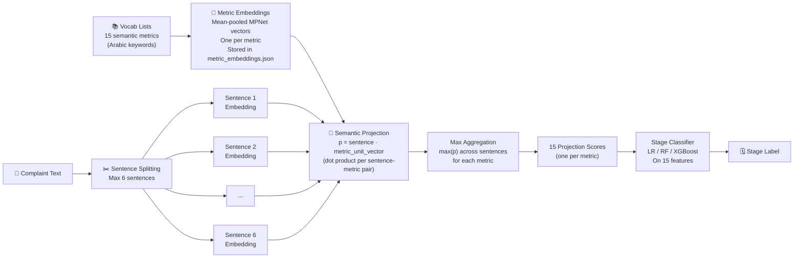
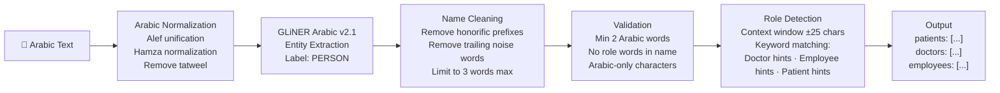
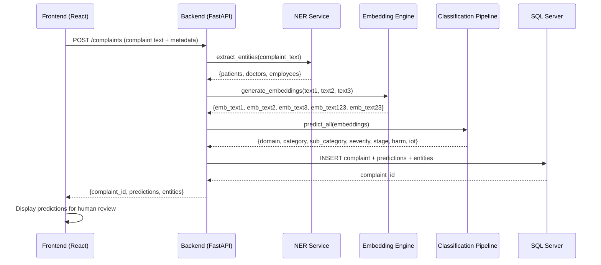
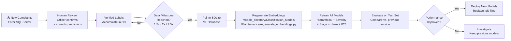

# AI System Design
## HCAT Insight — Rassoul Azam Hospital
**Document:** 04 — AI System Design
**Version:** 1.0
**Date:** May 2026
**Project:** HCAT Insight — AI-Assisted Healthcare Complaint Management System

---

## Table of Contents

1. [Introduction](#1-introduction)
2. [Why AI Was Included](#2-why-ai-was-included)
3. [Deployment Constraints and Their Effect on AI Design](#3-deployment-constraints-and-their-effect-on-ai-design)
4. [AI System Architecture Overview](#4-ai-system-architecture-overview)
5. [Text Embedding Engine](#5-text-embedding-engine)
6. [Classification System Architecture](#6-classification-system-architecture)
   - 6.1 [Hierarchical Classification Pipeline](#61-hierarchical-classification-pipeline)
   - 6.2 [Severity Level Classifier](#62-severity-level-classifier)
   - 6.3 [Stage of Care Classifier](#63-stage-of-care-classifier)
   - 6.4 [Harm Level Classifier](#64-harm-level-classifier)
   - 6.5 [Improvement Opportunity Type Classifier](#65-improvement-opportunity-type-classifier)
7. [Named Entity Recognition Engine](#7-named-entity-recognition-engine)
8. [Speech-to-Text Component](#8-speech-to-text-component)
9. [AI Inference Workflow](#9-ai-inference-workflow)
10. [Self-Training and Retraining Pipeline](#10-self-training-and-retraining-pipeline)
11. [Human-in-the-Loop Design](#11-human-in-the-loop-design)
12. [Backend Integration](#12-backend-integration)
13. [AI Risks and Safeguards](#13-ai-risks-and-safeguards)
14. [Conclusion](#14-conclusion)

---

## 1. Introduction

This document describes the design, architecture, and rationale of the AI/ML system within **HCAT Insight**, the healthcare complaint management platform deployed at Rassoul Azam Hospital (RAH).

The AI system serves two operational functions:

1. **Automated complaint classification** — predicting nine HCAT taxonomy labels from Arabic complaint text, reducing the manual annotation burden on complaint officers
2. **Named entity extraction** — automatically identifying persons mentioned in complaint narratives (patients, doctors, employees) to assist with case linkage

The AI system was designed from the ground up under a specific set of real-world constraints: offline deployment, CPU-only hardware, no cloud API access, a small training dataset, and Arabic-language text. Every architectural decision documented here traces back to these constraints and to the empirical evidence gathered during model experimentation.

This document focuses on the design of the AI system. Experimental results, model comparison tables, and benchmark analysis are covered in **Document 06 — Model Experiments**.

---

## 2. Why AI Was Included

Manual complaint classification at RAH required complaint officers to assign nine HCAT labels to each incoming complaint — a cognitively demanding and time-consuming process. As complaint volume grows, this bottleneck becomes increasingly unsustainable.

The primary goals of including AI classification in HCAT Insight are:

| Goal | Description |
|------|-------------|
| **Reduce manual labeling time** | AI suggests labels at intake; officer reviews and confirms rather than starting from scratch |
| **Improve consistency** | Human annotators vary in label assignment; a trained model applies the same learned criteria across all cases |
| **Enable real-time routing** | Predicted domain and category enable immediate routing to the correct team without waiting for manual classification |
| **Support analytics** | Accurate classification enables reliable trend analysis, reporting, and quality improvement tracking |
| **Scale with volume** | As complaint volume grows, the AI component scales without linear cost increase |

---

## 3. Deployment Constraints and Their Effect on AI Design

The AI architecture was not designed in isolation. Every major decision was shaped by the constraints of the RAH deployment environment. Understanding these constraints is essential for understanding why the system is designed the way it is.



**Figure 1: Constraint-to-Design Decision Flow.**

| Constraint | What It Ruled Out | What It Dictated |
|-----------|------------------|-----------------|
| Offline hospital VM | All cloud APIs (OpenAI, Anthropic, Azure AI) | Fully local model storage and inference |
| CPU-only server | GPU-accelerated models, fine-tuning, large LLMs | Lightweight classifiers (LR, RF, XGBoost) |
| Limited RAM | Loading multiple large models simultaneously | Lazy loading, singleton pattern, pre-computed embeddings |
| 476 training records | Deep learning, fine-tuning, few-shot transformers | Classical ML on pre-trained embeddings |
| Arabic text | English-only models | Multilingual embedding model |

---

## 4. AI System Architecture Overview

The HCAT Insight AI system consists of four independent components that operate on the same complaint text input.



**Figure 2: HCAT Insight AI System — Full Component Architecture.**

**GPT Image Generation Prompt for Figure 2:**

> Create a professional, publication-quality system architecture diagram for an AI-powered healthcare complaint management system called HCAT Insight. The diagram should be clean, modern, and suitable for an academic paper. Use a left-to-right or top-to-bottom flow. Color code components by type: blue for input/output, green for the embedding engine, orange for classification models, purple for NER, red/amber for risk-related models. Use rounded rectangles with thin borders. Include a legend for component types. The diagram should show: (1) Arabic complaint text entering the system; (2) splitting into a Text Embedding Engine (MPNet multilingual) and a NER Engine (GLiNER Arabic); (3) the embedding engine feeding into five parallel classification components: Hierarchical Pipeline (Domain/Category/Sub-Category), Severity Classifier, Stage Classifier, Harm Classifier, and IOT Classifier; (4) all outputs converging to a Prediction Output block that writes to SQL Server. Each component block should show its model type in smaller text. Title: "HCAT Insight — AI System Architecture". Style: clean, minimal, suitable for healthcare informatics journal.

---

## 5. Text Embedding Engine

The embedding engine is the single most important component of the HCAT Insight AI system. All classification models are built on top of the embeddings it produces.

### 5.1 Model Selection

**Model:** `sentence-transformers/paraphrase-multilingual-mpnet-base-v2`
**Storage:** `models_directory/Classification_Models/model_storage/mpnet_embeddings/`
**Deployment:** Fully offline — downloaded once, stored locally, loaded without internet access

**Why this model over alternatives:**

| Alternative Considered | Reason Not Selected |
|-----------------------|---------------------|
| AraBERT (Arabic BERT) | Produces token-level embeddings optimized for masked language modeling, not sentence similarity; requires additional pooling configuration |
| mBERT (Multilingual BERT) | Lower quality sentence representations than MPNet-based models on similarity/classification tasks |
| AraBART, CAMeL | Generative/sequence-to-sequence focus; not designed for embedding extraction |
| OpenAI text-embedding-ada | Requires internet and API key — incompatible with offline deployment |
| Larger sentence transformers | Higher RAM requirements — incompatible with constrained VM |

The MPNet-based multilingual model was selected because it:
- Produces **sentence-level representations** optimized for classification tasks
- Natively handles **Arabic text** without fine-tuning
- Handles **mixed Arabic-English** code-switching (common in RAH complaint texts)
- Produces **768-dimensional** vectors — rich enough for meaningful classification, compact enough for 380-sample training
- Runs efficiently on **CPU** within the hospital VM's RAM constraints

### 5.2 Embedding Generation Method

```python
# Implemented in models_directory/install_model.py
inputs = tokenizer(text, return_tensors="pt", padding=True, truncation=True)
with torch.no_grad():
    outputs = model(**inputs)
    embedding = outputs.last_hidden_state.mean(dim=1).squeeze()
```

**Method:** Mean pooling of all token hidden states from the last transformer layer, producing a single 768-dimensional vector per input text.

### 5.3 Embedding Storage Strategy

Embeddings are computed once per record and stored directly in the SQLite ML database. This is an explicit architectural decision:

| Approach | Compute Time per Training Run | Storage Required |
|----------|------------------------------|-----------------|
| On-the-fly embedding | Slow (CPU inference × 476 records) | None |
| **Pre-computed (chosen)** | **Near-zero (database read)** | **~2.5 GB for all embedding columns** |

Pre-computation eliminates the embedding bottleneck from the model training loop entirely. This is critical for a CPU-bound environment where embedding generation is the most expensive operation.

### 5.4 Five Embedding Variants

Five embedding columns are maintained per record, enabling each model to use the most informative text combination:

| Column | Source | Dimensions | Primary Consumer |
|--------|--------|-----------|-----------------|
| `embedding_text1` | `complaint_text` only | 768 | Domain, Category, Sub-Category |
| `embedding_text2` | `immediate_action` only | 768 | Stage (secondary) |
| `embedding_text3` | `taken_action` only | 768 | Stage (secondary) |
| `embedding_text123` | All three texts concatenated | 768 | Severity, Harm |
| `embedding_text23` | Hospital texts concatenated | 768 | Stage (primary) |

Additionally, `sentence_1_embedding` through `sentence_6_embedding` store embeddings of individual sentences from `complaint_text`, used exclusively by the Stage semantic projection model.

---

## 6. Classification System Architecture

### 6.1 Hierarchical Classification Pipeline

The most significant architectural discovery in the HCAT Insight AI research was that the primary HCAT labels — Domain, Category, and Sub-Category — form a **strict hierarchical tree** in the data. Each Domain contains only specific Categories, and each Category contains only specific Sub-Categories. This structure does not overlap across branches.

This discovery led to the replacement of a flat multi-class classifier with a **hierarchical pipeline** where each level is conditioned on the prediction from the level above.



**Figure 3: Hierarchical Classification Pipeline.**

**Why hierarchical beats flat classification:**

| Approach | Problem | Outcome |
|----------|---------|---------|
| Flat 7-class Category model | Trains on all 7 categories simultaneously, including class pairs that never co-occur (e.g., Safety and Listening never share a Domain) | Noise from structurally impossible class pairs; lower accuracy |
| **Hierarchical (chosen)** | Each Category model sees only the categories that belong to its Domain — e.g., the MANAGEMENT category model only ever chooses between Environment and Institutional Processes | Smaller, cleaner classification space; empirically higher accuracy |

**Label mapping at inference time:**

Label mappings for the hierarchical models are built dynamically from the training database at inference time using `label_mapping_helper.py`. This ensures the mapping always reflects exactly what the model was trained on, regardless of dataset changes between training runs.

### 6.2 Severity Level Classifier

**Classification target:** Severity (3 levels: HIGH, MEDIUM, LOW)
**Input:** `embedding_text123` — combined patient + hospital text
**Algorithm:** Ordinal-aware Logistic Regression

Severity is an inherently **ordinal** variable: HIGH > MEDIUM > LOW. Treating it as a standard categorical classification problem ignores this ordering and penalizes prediction errors incorrectly — treating a prediction of LOW when the true value is HIGH the same as predicting MEDIUM.

The ordinal approach addresses this by learning monotone decision boundaries that respect the ordering, reducing the cost of "off-by-one" errors and improving clinical relevance of predictions.

**Why combined text (text123) for Severity:**
Severity assessment requires both the patient's subjective experience (complaint_text) and the hospital's documented response (immediate_action, taken_action). The combination captures both the reported intensity of the event and the administrative assessment of its significance. Empirical results confirmed that text123 outperforms text1 alone for this target.

### 6.3 Stage of Care Classifier

The Stage classifier is the most architecturally novel component of the HCAT Insight AI system. Standard classification approaches performed poorly for Stage prediction because complaint narratives frequently reference events across multiple stages of care, making single-label stage assignment from text embedding alone unreliable.

**The semantic projection approach:**

Rather than classifying from a global text embedding, the Stage classifier uses a set of **semantic metric vectors** that represent specific clinical and administrative concepts known to correlate with particular stages of care.



**Figure 4: Stage of Care — Semantic Projection Architecture.**

**The 15 semantic metrics** represent concepts such as: arrival/admission events, bed and room issues, waiting and delays, billing and administrative processes, communication scheduling, clinical errors, lab and imaging issues, food, cleanliness, staff behavior, discharge-related events, and emergency escalations.

**Mathematical basis of the projection:**

For each metric $m$ with mean embedding $\bar{u}_m$ (unit-normalized), and each sentence embedding $s_j$ from the complaint text:

$$p_{m,j} = s_j \cdot \hat{u}_m \quad \text{(dot product projection)}$$

The final feature value for metric $m$ is:

$$f_m = \max_j \; p_{m,j}$$

This measures "how strongly does at least one sentence in the complaint align with the direction of this metric concept in embedding space." The 15 resulting scores are then used as features for a final lightweight classifier.

This approach shifts the problem from "classify stage from a diluted global embedding" to "measure how much this complaint talks about each of 15 concepts" — a fundamentally more tractable task for stage identification.

### 6.4 Harm Level Classifier

**Classification target:** Harm (5 levels: No Harm → Death)
**Input:** `embedding_text123` — all text sources combined
**Architecture:** Two-stage system

Harm is the most challenging classification target in the HCAT framework. Even human annotators show low inter-rater agreement on Harm, because determining what harm actually occurred requires knowledge beyond what the patient reports.

**Stage 1 — Binary Safety Model:**
A binary classifier (High Harm vs. Low Harm) is used for operational safety triage. Any complaint predicted as High Harm is automatically flagged for human review, regardless of the fine-grained 5-class prediction. This binary model has more training samples per class and significantly higher reliability than the 5-class version.

**Stage 2 — Fine-Grained 5-Class Model:**
The full 5-class model (No Harm, Minor, Moderate, Severe, Death) is used for reporting and trend analysis. Its predictions are presented with explicit uncertainty indications in the UI, and all HIGH-harm predictions are routed to human review.

**Why both patient and hospital text for Harm:**
- The patient text describes the subjective experience and distress
- The hospital administrative text contains clinical outcome documentation (readmissions, additional interventions, formal incident reports)
- Neither alone provides sufficient signal for reliable harm assessment

### 6.5 Improvement Opportunity Type Classifier

**Classification target:** Improvement Opportunity Type (Ordinary Complaint, Red Flag, Never Event)
**Input:** `embedding_text1` — patient complaint text
**Algorithm:** Logistic Regression

This is the simplest classification target from a technical perspective, but the most operationally consequential. A correct Red Flag or Never Event prediction triggers immediate workflow escalation.

**Class imbalance note:** With 92.6% of records classified as Ordinary Complaint, this classifier achieves high accuracy by dominant-class prediction. Red Flag and Never Event detection from text alone remains unreliable at current dataset sizes. Human oversight is mandatory for all escalation decisions.

---

## 7. Named Entity Recognition Engine

### 7.1 Overview

The NER engine extracts the names of persons mentioned in Arabic complaint texts and classifies them by role (patient, doctor, employee). This supports automated case linkage — associating a complaint with the specific doctor or employee named within it.

**Model:** `NAMAA-Space/gliner_arabic-v2.1`
**Location:** `models_directory/NER_Model/solution_gliner.py`
**Backend integration:** `backend/api/routers/ner_router.py` + `backend/api/services/ner_service.py`

### 7.2 Architecture

The NER component combines a pre-trained GLiNER model with a custom rule-based role classifier:



**Figure 5: NER Pipeline Architecture.**

### 7.3 Role Detection Logic

Role assignment is based on priority-ordered keyword matching within a ±25 character context window around each detected name:

| Role | Detection Keywords (Arabic) | Priority |
|------|---------------------------|---------|
| **Doctor** | د., دكتور, الدكتور, استشاري, أخصائي, طبيب | Highest |
| **Employee** | ممرض, فني, موظف, عامل, التمريض, المعلوماتية | Medium |
| **Patient** | المريض, الطفل, المسن, المصاب, المراجع | Lowest |

If no role keyword is found in the context window, the entity is discarded rather than assigned a default role. This conservative approach minimizes false role assignments.

### 7.4 Lazy Loading

The GLiNER model is loaded as a singleton using a lazy-loading pattern — it is initialized only on the first NER request and reused for all subsequent calls within the same server session. This avoids the model loading cost on server startup and during non-NER operations.

---

## 8. Speech-to-Text Component

**Status: Planned — not yet integrated**

The `ctranslate2` library (required by Faster Whisper) is installed in the project virtual environment, indicating that STT integration is a planned next development phase. No custom implementation file for STT currently exists in `models_directory/`.

The intended architecture would use **Faster Whisper** — a CTranslate2-optimized implementation of OpenAI's Whisper model — to transcribe Arabic audio complaint submissions to text, which would then enter the standard text classification and NER pipeline.

**Planned use case:** Patients or staff submitting complaints verbally through the hotline channel would have their audio transcribed automatically, reducing the manual transcription step currently required.

This component is documented here as a planned future addition. Its implementation is contingent on validation of transcription accuracy for the Arabic dialects spoken by RAH's patient population.

---

## 9. AI Inference Workflow

The following sequence describes how a complaint submitted through the HCAT Insight frontend is processed by the AI system in the complete end-to-end inference path.



**Figure 6: End-to-End AI Inference Sequence.**

**Inference time considerations:**
- Embedding generation is the most time-consuming step on CPU
- Pre-computed embeddings eliminate this cost for retraining
- At inference time, embedding generation happens once per complaint and feeds all classifiers
- All classifiers are lightweight (LR, XGBoost) with near-instantaneous prediction time

---

## 10. Self-Training and Retraining Pipeline

HCAT Insight is designed as a **continuously improving system**. As new complaints are classified and verified by human reviewers, the training dataset grows, enabling periodic retraining of all models with improved performance.



**Figure 7: Self-Training and Retraining Pipeline.**

**Retraining triggers:** Retraining is planned at dataset volume milestones — specifically when the dataset reaches 1.5×, 2×, and 2.5× its initial size (476 records). This milestone-based approach ensures retraining occurs when sufficient new data has accumulated to meaningfully improve model performance.

**Embedding regeneration:** When new records are added to the ML database, `regenerate_embeddings.py` computes and stores embeddings for all new records without recomputing existing ones, maintaining the computational efficiency of the pre-computed embedding strategy.

**Model versioning:** Retrained models replace existing `.pkl` files in the models directory. The previous model versions are archived before replacement to allow rollback if performance degrades.

---

## 11. Human-in-the-Loop Design

The HCAT Insight AI system is explicitly designed as a **human-assisted** system, not a fully autonomous one. AI predictions are suggestions, not decisions.

| Design Principle | Implementation |
|-----------------|---------------|
| **Predictions are always reviewable** | All AI predictions are displayed to the complaint officer, who can accept, modify, or reject each label individually |
| **High-risk predictions trigger mandatory review** | Red Flag and Never Event predictions, and any HIGH or SEVERE harm prediction, cannot be automatically committed — they require explicit human confirmation |
| **Corrected labels feed retraining** | Labels corrected by human reviewers are stored alongside the complaint record and become training data for the next retraining cycle |
| **Confidence is acknowledged, not displayed** | Model confidence scores are used internally for threshold-based routing decisions but are not shown to end users to avoid over-reliance on probabilistic outputs |
| **No autonomous escalation** | The AI system never directly escalates a case without a human in the chain — it flags for escalation, but a human confirms |

---

## 12. Backend Integration

The AI components integrate with the HCAT Insight backend through dedicated FastAPI service layers and routers.

| AI Component | Backend Service | Router | Database Interaction |
|-------------|----------------|--------|---------------------|
| Text Embedding | Inference service | Classification router | Reads from SQLite; writes to SQL Server |
| Classification Pipeline | Classification service | Classification router | Reads embeddings from SQLite; writes predictions to SQL Server |
| NER Engine | `ner_service.py` | `ner_router.py` | Reads complaint text; writes extracted entities to SQL Server |
| Retraining | Maintenance script | N/A (admin-triggered) | Reads from SQL Server; writes to SQLite |

**Label translation:** ML model outputs use integer-encoded labels. The `ML_To_Database_Encoding.json` mapping translates these integers back to their string equivalents before writing to the SQL Server operational database, ensuring consistency with the human-readable labels used throughout the system.

---

## 13. AI Risks and Safeguards

| Risk | Description | Safeguard |
|------|-------------|-----------|
| **Misclassification of Domain** | Wrong domain routes complaint to incorrect team | Human review before routing is finalized |
| **Missed Red Flag** | Complaint requiring urgent escalation classified as Ordinary | Human officer reviews all predictions; high-severity complaints are flagged through severity and harm channels independently |
| **Harm over/under-prediction** | Incorrect harm level affects patient safety assessment | Binary safety triage model provides conservative fallback; all HIGH-harm predictions require human confirmation |
| **NER false positive** | Wrong person named as patient or doctor in extracted entities | Officer reviews extracted entities before they are linked to profiles |
| **Embedding drift** | New complaint language patterns diverge from training distribution | Milestone-based retraining continuously updates the model to reflect evolving complaint language |
| **Class imbalance exploitation** | Model predicts dominant class exclusively | Macro-averaged F1 evaluation detects this; class weighting applied during training |
| **Outdated models** | Models not retrained as data grows | Milestone-based retraining schedule and performance comparison gate prevent deployment of stale models |

---

## 14. Conclusion

The HCAT Insight AI system is a carefully constrained, resource-aware, and clinically conscious design. Its defining characteristics are:

1. **Embedding-first architecture**: A single pre-trained multilingual model provides the semantic foundation for all downstream classifiers, avoiding fine-tuning under CPU and data constraints

2. **Hierarchical classification**: The primary HCAT taxonomy tree (Domain → Category → Sub-Category) is modeled as a sequential decision pipeline, not a flat multi-class problem, reflecting the true structure of the data

3. **Task-specific model designs**: Each of the five classification targets uses a distinct architecture — ordinal regression for Severity, semantic projection for Stage, two-stage binary+fine-grained for Harm — reflecting the unique nature of each prediction task

4. **Implemented NER with GLiNER Arabic**: A fully integrated named entity recognition system extracts persons from Arabic complaint text using the `NAMAA-Space/gliner_arabic-v2.1` model, enhanced by rule-based role classification

5. **Human-in-the-loop throughout**: AI predictions are suggestions. The system is designed so that high-risk predictions always pass through human confirmation before operational action is taken

6. **Self-improving by design**: The milestone-based retraining pipeline ensures model performance improves continuously as the complaint database grows, without requiring manual intervention for each update

---

*Document prepared for research and academic publication purposes.*
*Source of truth: HCAT Insight codebase at `c:\Users\Administrator\Documents\GitHub\Patient_Feedback\models_directory\` and operational system at Rassoul Azam Hospital.*
