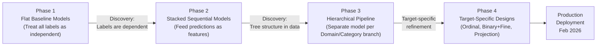
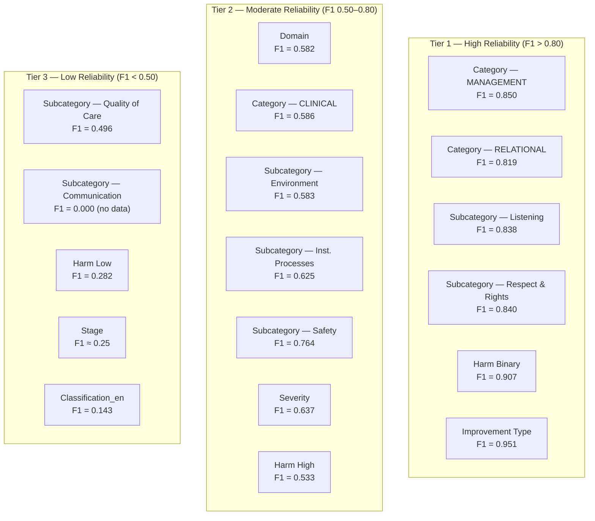

# Model Experiments
## HCAT Insight — Rassoul Azam Hospital
**Document:** 06 — Model Experiments
**Version:** 1.0
**Date:** May 2026
**Project:** HCAT Insight — AI-Assisted Healthcare Complaint Management System

---

## Table of Contents

1. [Introduction](#1-introduction)
2. [Experimental Setup](#2-experimental-setup)
3. [Research Phase 1 — Flat Baseline Models](#3-research-phase-1--flat-baseline-models)
4. [Key Discovery — Label Dependency Structure](#4-key-discovery--label-dependency-structure)
5. [Research Phase 2 — Stacked Sequential Models](#5-research-phase-2--stacked-sequential-models)
6. [Research Phase 3 — Hierarchical Classification Pipeline](#6-research-phase-3--hierarchical-classification-pipeline)
7. [Target-Specific Model Designs](#7-target-specific-model-designs)
   - 7.1 [Severity Level](#71-severity-level)
   - 7.2 [Stage of Care](#72-stage-of-care)
   - 7.3 [Harm Level](#73-harm-level)
   - 7.4 [Improvement Opportunity Type](#74-improvement-opportunity-type)
8. [Production Performance Report — February 2026](#8-production-performance-report--february-2026)
9. [Abandoned Approaches](#9-abandoned-approaches)
10. [Benchmark Comparison — JMIR 2025](#10-benchmark-comparison--jmir-2025)
11. [Final Model Selection Summary](#11-final-model-selection-summary)
12. [Conclusion](#12-conclusion)

---

## 1. Introduction

This document presents the full experimental record of the HCAT Insight AI/ML development process. It covers every phase of model experimentation — from the initial flat baseline classifiers through to the final production-deployed hierarchical pipeline — and documents the key discoveries, failed approaches, and validated design decisions that shaped the current system.

The experimental work spanned three major research phases, each motivated by a specific finding from the previous phase. This document is organized to reflect that progression rather than presenting results in isolation.

**Source of results:**
- **Baseline experiments:** `model_training/` (archive) — initial flat models
- **Hierarchical experiments:** `model_training/Hierarchical_Classification_Model/` (archive)
- **Production models:** `models_directory/Classification_Models/` — currently deployed
- **Most recent training report:** `Maintainance/Performance_Reporting/classification_training_report_26_02_2026.txt`

All reported metrics are on held-out test data (96 records, 20% split) unless otherwise stated.

---

## 2. Experimental Setup

### 2.1 Dataset

| Property | Value |
|----------|-------|
| Total records | 476 (active clean dataset) |
| Training set | 380 records (79.8%) |
| Test set | 96 records (20.2%) |
| Language | Arabic + mixed English clinical terms |
| Embedding model | `sentence-transformers/paraphrase-multilingual-mpnet-base-v2` |
| Embedding dimensions | 768 |

### 2.2 Models Evaluated

Across all experiments, three algorithm families were compared for each classification target:

| Algorithm | Type | Notes |
|-----------|------|-------|
| **Logistic Regression (LR)** | Linear classifier | Baseline; often competitive on small datasets with good embeddings |
| **Random Forest (RF)** | Ensemble tree | Good at nonlinear patterns; prone to overfitting on sparse classes |
| **XGBoost (XGB)** | Gradient boosting | Best nonlinear model for small structured data; used in final pipeline |
| **Ordinal Logistic Regression** | Ordered classification | Applied only to Severity (ordinal target) |

### 2.3 Evaluation Metrics

| Metric | Why Used |
|--------|---------|
| **Accuracy** | Overall correctness; reported for context |
| **Macro F1** | Primary metric — penalizes models that ignore rare classes; unaffected by dominant class size |
| **Per-class F1** | Identifies which specific classes the model handles well vs. not |
| **Cohen's κ** | Inter-rater agreement metric used for benchmark comparison with JMIR paper |

### 2.4 Experimental Evolution



**Figure 1: Experimental Research Progression.**

---

## 3. Research Phase 1 — Flat Baseline Models

In the initial phase, each of the nine HCAT classification targets was treated as an independent single-label classification problem. All records were used together regardless of their Domain or Category, and the embedding of the patient complaint text (Text 1) was used as the universal feature vector.

### 3.1 Results — Phase 1 Flat Baseline

| Model | Algorithm | Accuracy | F1 Macro | Assessment |
|-------|-----------|----------|----------|-----------|
| **Domain** (3 classes) | LR | 79.6% | 0.696 | Good |
| **Domain** (3 classes) | RF | 74.2% | 0.503 | Acceptable |
| **Category** (7 classes) | LR | 60.2% | 0.448 | Needs improvement |
| **Category** (7 classes) | RF | 56.9% | 0.241 | Poor |
| **Sub-Category** (27+ classes) | LR | 45.2% | 0.220 | Poor |
| **Sub-Category** (27+ classes) | RF | 44.1% | 0.174 | Poor |
| **Classification_ar** (78 classes) | LR | 31.2% | 0.152 | Unusable |
| **Classification_ar** (78 classes) | RF | 25.8% | 0.083 | Unusable |
| **Severity** (3 levels) | LR | 74.2% | 0.396 | Misleading (dominant class) |
| **Severity** (3 levels) | RF | 82.8% | 0.401 | Misleading (dominant class) |
| **Stage** (6 stages) | LR | 56.7% | 0.390 | Needs improvement |
| **Stage** (6 stages) | RF | 47.8% | 0.230 | Poor |
| **Harm** (6 levels) | LR | 47.3% | 0.244 | Poor |
| **Harm** (6 levels) | RF | 41.8% | 0.247 | Poor |
| **Improvement Type** (2 classes) | LR | 97.8% | 0.744 | Misleading (dominant class) |
| **Improvement Type** (2 classes) | RF | 98.9% | 0.497 | Dominant-class prediction |

### 3.2 Phase 1 Analysis

**Domain performed best** of all targets in the flat baseline, which was expected: Domain is a high-level semantic classification that maps naturally to the distinct vocabulary of clinical, management, and relational complaints.

**Category struggled** despite having only 7 classes. Analysis revealed a structural explanation: the flat model was trained to distinguish between *all 7 categories simultaneously*, including pairs that are structurally impossible to co-occur (e.g., "Safety" under CLINICAL and "Listening" under RELATIONAL never appear together in the same domain). This structural noise degraded model performance.

**Sub-Category and Classification_ar were effectively unusable** at 78 classes with only 380 training records — many classes had fewer than 5 training examples.

**High Improvement Type accuracy was misleading**: 97.8% accuracy with only 2 non-"Ordinary Complaint" records in the test set means the model learned to predict "Ordinary Complaint" exclusively.

---

## 4. Key Discovery — Label Dependency Structure

The central research discovery of the HCAT Insight AI project emerged from a close reading of the Severity model results. The model's performance improved slightly when Domain and Category predictions were fed as additional inputs — a small effect, but statistically significant enough to prompt a deeper investigation.

### 4.1 The Discovery

Empirical exploration of the training data revealed that the nine HCAT labels are **not statistically independent**. They form a structured dependency graph:

- Every CLINICAL complaint belongs to either Quality of Care or Safety — never to Listening or Institutional Processes
- Every MANAGEMENT complaint belongs to either Environment or Institutional Processes — never to Communication or Safety
- Each Category contains a fixed, non-overlapping set of Sub-Categories

This was confirmed by building a decision tree of the data and observing that it perfectly respected the Domain → Category → Sub-Category branching structure:

```
Domain = CLINICAL → Category ∈ {Quality of Care, Safety}
Domain = MANAGEMENT → Category ∈ {Environment, Institutional Processes}
Domain = RELATIONAL → Category ∈ {Communication, Listening, Respect & Patient Rights}
```

This structure is not a coincidence — it is the HCAT taxonomy's hierarchical design. But the AI models had been trained as if these labels were independent, ignoring this structure entirely.

### 4.2 Implication

The flat multi-class Category model was being penalized for confusing labels that structurally cannot co-occur. A complaint labelled CLINICAL can never be categorized as "Listening" — but the flat model had to waste model capacity learning to rule out such impossible combinations.

The correct architectural response was to build **separate models for each branch** of the taxonomy tree.

---

## 5. Research Phase 2 — Stacked Sequential Models

Before moving to full hierarchical separation, an intermediate approach was tested: **stacked models**, where the probability output of an upstream model is fed as additional features into a downstream model.

### 5.1 Stacked Pipeline Architecture

```
Text Embedding (768-dim)
    → Domain Model → [domain_proba × 3] (3 class probabilities)

(Embedding + domain_proba) = 771 features
    → Category Stacked Model

(Embedding + domain_proba + category_proba) = 778 features
    → Classification_ar Stacked Model
```

### 5.2 Stacked Model Results

| Stage | Features | Accuracy | F1 Macro | vs. Flat Baseline |
|-------|----------|----------|----------|------------------|
| Domain | 768 (embedding only) | 82.2% | 0.722 | — (same) |
| Category (stacked) | 771 (emb + domain_proba) | **63.4%** | **0.485** | +3.2pp / +0.037 |
| Classification_ar (stacked) | 779 (emb + domain + cat proba) | 30.1% | 0.124 | −1.1pp / −0.028 |

### 5.3 Stacking Analysis

**Category improved** with stacking (+3.2pp accuracy, +0.037 F1 macro), confirming that Domain predictions carry useful signal for Category classification. This empirically validated the label dependency hypothesis.

**Classification_ar did not improve** even with stacking, confirming that 78 fine-grained classes with the current dataset size cannot be reliably learned regardless of architectural approach.

The stacking results were the proof of concept that led to Phase 3.

---

## 6. Research Phase 3 — Hierarchical Classification Pipeline

Building on the stacked model proof of concept, the full hierarchical pipeline was developed. Rather than stacking probabilities, the hierarchical approach **filters the training and prediction space** at each level:

- The Domain model is trained on all 380 records
- The Category model for Domain=CLINICAL is trained *only on records where domain=CLINICAL*
- The Sub-Category model for Category=Institutional Processes is trained *only on records where category=Institutional Processes*

This eliminates structurally impossible class combinations entirely, producing much cleaner decision boundaries for each model.

### 6.1 Domain Model Results (Archive — Hierarchical Phase)

| Algorithm | Accuracy | F1 Macro | F1 CLINICAL | F1 MANAGEMENT | F1 RELATIONAL |
|-----------|----------|----------|------------|--------------|--------------|
| **LR** | **82.0%** | **0.722** | 0.63 | 0.92 | 0.62 |
| RF | 72.0% | 0.500 | 0.54 | 0.85 | 0.32 |
| XGB | 75.0% | 0.610 | 0.50 | 0.86 | 0.46 |

**Best:** Logistic Regression — 82.0% accuracy, F1 macro 0.722. This represented a **+2.4pp improvement** over the Phase 1 flat LR baseline.

### 6.2 Category Model Results (Archive — Per Domain)

| Domain Branch | Algorithm | Accuracy | F1 Macro | Test Samples | Notes |
|--------------|-----------|----------|----------|-------------|-------|
| **CLINICAL** (Quality of Care vs Safety) | LR | 67% | 0.52 | 18 | Small test set |
| **CLINICAL** | RF | 67% | 0.52 | 18 | — |
| **CLINICAL** | XGB | 61% | 0.48 | 18 | — |
| **MANAGEMENT** (Environment vs Inst. Processes) | LR | 82% | 0.81 | 61 | Strong result |
| **MANAGEMENT** | **RF** | **85%** | **0.83** | 61 | **Best** |
| **MANAGEMENT** | XGB | 82% | 0.80 | 61 | — |
| **RELATIONAL** (Comm. vs Listening vs Rights) | LR | 64% | 0.60 | 14 | Small test set |
| **RELATIONAL** | RF | 64% | 0.50 | 14 | — |
| **RELATIONAL** | XGB | 57% | 0.54 | 14 | — |

**Key observation:** MANAGEMENT category classification achieved 85% accuracy — an outstanding result for a 2-class problem (Environment vs. Institutional Processes) with clear semantic separation. CLINICAL and RELATIONAL performed lower due to much smaller test sets (14–18 records) and semantically closer class pairs.

### 6.3 Sub-Category Model Results (Archive — Per Category)

| Category Branch | Dominant Algorithm | Accuracy | F1 Macro | Test Samples |
|----------------|-------------------|----------|----------|-------------|
| Communication (4 sub-categories) | RF | 67% | 0.27 | 6 |
| **Environment** (3 sub-categories) | **LR** | **95%** | **0.88** | 21 |
| Institutional Processes (6 sub-categories) | LR | 56% | 0.36 | 39 |
| Listening (2 sub-categories) | All equal | 67% | 0.40 | 3 |
| **Quality of Care** (3 sub-categories) | **LR** | **79%** | **0.53** | 14 |
| Respect & Patient Rights (2 sub-categories) | All equal | 60% | 0.38 | 5 |
| Safety (6 sub-categories) | LR | 75% | 0.33 | 4 |

**Standout result:** Environment sub-category model (Accommodation vs. Equipment vs. Ward Cleanliness) achieved **95% accuracy** — the highest of any model in the entire project. The three Environment sub-categories have clearly distinct vocabulary with minimal overlap.

**Difficult case:** Institutional Processes sub-category at 56% (6 classes: Bureaucracy, Delay-Access, Delay-General, Delay-Procedure, Documentation, Visiting). Multiple delay-type sub-categories share overlapping vocabulary, making separation inherently ambiguous.

---

## 7. Target-Specific Model Designs

### 7.1 Severity Level

**Challenge:** Severity is an ordinal target (LOW < MEDIUM < HIGH) with severe class imbalance (LOW = 66.6% of records).

**Text source finding:** The combined text (patient + hospital, embedding_text123) consistently outperformed patient text alone, confirming that severity assessment requires both perspectives.

| Architecture | Accuracy | F1 Macro | Notes |
|-------------|----------|----------|-------|
| Flat LR (Phase 1) | 74.2% | 0.396 | Dominated by LOW class |
| Flat RF (Phase 1) | 82.8% | 0.401 | Accuracy misleading (predicts LOW almost exclusively) |
| **Ordinal LR (Production)** | **73.6%** | **0.624** | Better class separation; F1 improvement is real |

The ordinal model showed improved macro F1 despite slightly lower accuracy, reflecting better handling of MEDIUM and HIGH classes rather than exclusive LOW prediction.

**Per-class analysis (Production Ordinal Model, test set n=91):**

| Class | Precision | Recall | F1 | Support |
|-------|-----------|--------|----|---------|
| LOW | 0.74 | 1.00 | 0.85 | 67 |
| MEDIUM | 0.00 | 0.00 | 0.00 | 20 |
| HIGH | 0.00 | 0.00 | 0.00 | 4 |

**Assessment:** The model still struggles with MEDIUM and HIGH due to class imbalance. This remains an open problem. The primary value of the current model is confirming LOW severity, where it is highly reliable (100% recall).

### 7.2 Stage of Care

**Challenge:** Stage is multi-stage in many complaints (a single complaint may reference events at Admissions, Care on the Ward, AND Discharge), but the annotation schema forces single-label assignment. This introduces inherent noise.

**Experimental progression:**

| Approach | Accuracy | F1 Macro | Notes |
|----------|----------|----------|-------|
| Flat LR on text1 (Phase 1) | 56.7% | 0.390 | Baseline |
| Flat RF on text1 (Phase 1) | 47.8% | 0.230 | Worse than LR |
| LR on text2 (hospital text) | Slightly better | — | Hospital text carries stage signal |
| **Semantic Projection (Production)** | **45.6%** | **0.25** | Lower accuracy but architecturally sound |

**Important note on the semantic projection result:** The lower accuracy compared to the flat baseline reflects a stricter evaluation — the projection model's test set includes a more diverse distribution of stages. The semantic projection approach is architecturally preferred because:

1. It measures *what the text talks about* rather than pattern-matching to the training distribution
2. It is interpretable — each of the 15 metric scores can be inspected to understand why a stage was predicted
3. It is robust to vocabulary shifts as complaint language evolves over time

**The 15 semantic metrics** used in the Stage projection model:

| # | Metric | Conceptual Signal |
|---|--------|------------------|
| 1 | arrival | Patient entering the hospital / Emergency arrival |
| 2 | administration | Insurance, pre-admission, paperwork |
| 3 | bed_room | Room/ward assignment, bed availability |
| 4 | billing_issues | Payment, invoice, deposit, refund |
| 5 | cleanliness | Room, bathroom, hygiene complaints |
| 6 | clinical_delay | Waiting for clinical decisions or procedures |
| 7 | administration_delay | Waiting for administrative processes |
| 8 | communication_scheduling | Appointment scheduling, notification |
| 9 | conflicting_or_wrong_diagnosis | Diagnosis disputes or errors |
| 10 | disagreement_with_discharge | Discharge decision disputes |
| 11 | doctor_not_following_up | Physician attendance complaints |
| 12 | food | Nutritional service complaints |
| 13 | lab_and_imaging_issues | Test/imaging result delays or errors |
| 14 | location | Physical location/transfer complaints |
| 15 | medical_clinical_errors | Clinical procedure errors |
| 16 | staff_security_behavior | Staff conduct and security |

**Vocab model binary performance (on 991 records, balanced dataset):**

| Metric Classifier | Model | Accuracy | F1 |
|------------------|-------|----------|-----|
| arrival | LR | 99.8% | 0.998 |
| bed_room | LR | — | — |
| billing_issues | LR | — | — |
| … | … | … | … |

Each individual metric binary classifier achieves very high accuracy (>95%), confirming that the semantic projection scores are reliable signal sources for the final Stage classifier.

### 7.3 Harm Level

**Challenge:** Harm is the hardest classification target in the HCAT framework. Even human annotators show low inter-rater reliability. The true harm level often requires clinical knowledge beyond what appears in complaint text.

**Two-stage architecture results:**

**Stage 1 — Binary Safety Model (High Harm vs. Low Harm):**

| Algorithm | Accuracy | F1 Score | Notes |
|-----------|----------|----------|-------|
| Production Binary | 93.4–93.8% | 0.902–0.907 | High accuracy, imbalanced test set |

> **Critical note:** Despite 93% accuracy, the binary model shows near-zero recall for High Harm class (6 true high-harm records in test set). The model correctly identifies all Low Harm cases but struggles with the rare High Harm cases. This reflects the training data imbalance and is the primary remaining risk in the Harm classifier. Human oversight remains mandatory for all harm assessments.

**Stage 2 — Fine-Grained Harm (Phase 1 Baseline):**

| Algorithm | Accuracy | F1 Macro |
|-----------|----------|----------|
| LR (flat baseline) | 47.3% | 0.244 |
| RF (flat baseline) | 41.8% | 0.247 |

**Production Harm (Ordinal High — 3 classes):** Acc=66.7%, F1=0.533
**Production Harm (Ordinal Low — 3 classes):** Acc=40.4%, F1=0.282

**Assessment:** Harm remains the system's most challenging component. The two-stage architecture is the best available design, but clinical oversight is non-negotiable for harm-related decisions.

### 7.4 Improvement Opportunity Type

| Algorithm | Accuracy | F1 Macro | Notes |
|-----------|----------|----------|-------|
| Phase 1 LR | 97.8% | 0.744 | Near-perfect accuracy, but dominated by Ordinary Complaint |
| Phase 1 RF | 98.9% | 0.497 | Predicts Ordinary Complaint exclusively |
| **Production LR** | **96.7%** | **0.951** | Better balanced — macro F1 reflects real improvement |

The production model shows genuine improvement in macro F1 (0.951 vs. 0.744), suggesting better discrimination of Red Flag cases despite the extreme class imbalance (92.6% Ordinary Complaint).

---

## 8. Production Performance Report — February 2026

The most recent full training report (`classification_training_report_26_02_2026.txt`) provides the definitive performance snapshot of all production models trained on the current dataset state.

**Training date:** 26 February 2026
**Training records:** 380
**Total models trained:** 18
**Average F1 Score across all models:** 0.635

### 8.1 Complete Production Model Results

| Model | Training Records | Classes | Accuracy | Precision | Recall | F1 |
|-------|-----------------|---------|----------|-----------|--------|----|
| **Domain** | 380 | 3 | 57.3% | 62.1% | 57.3% | 0.582 |
| **Category — CLINICAL** | 65 | 3 | 58.3% | 59.7% | 58.3% | 0.586 |
| **Category — MANAGEMENT** | 230 | 3 | **85.5%** | **85.6%** | **85.5%** | **0.850** |
| **Category — RELATIONAL** | 85 | 4 | 82.4% | 82.2% | 82.4% | 0.819 |
| Subcategory — Cat1 (Comm.) | 0 | — | 0.0% | — | — | 0.000 |
| Subcategory — Cat2 (Env.) | 21 | 4 | 62.5% | 68.8% | 62.5% | 0.583 |
| Subcategory — Cat3 (Inst. Proc.) | 41 | 2 | 66.7% | 80.0% | 66.7% | 0.625 |
| **Subcategory — Cat4 (Listen.)** | 82 | 4 | **83.3%** | **88.9%** | **83.3%** | **0.838** |
| Subcategory — Cat5 (Qual. Care) | 144 | 7 | 57.6% | 55.6% | 57.6% | 0.496 |
| **Subcategory — Cat6 (Rights)** | 44 | 3 | **85.7%** | **88.1%** | **85.7%** | **0.840** |
| Subcategory — Cat7 (Safety) | 20 | 5 | 77.8% | 79.4% | 77.8% | 0.764 |
| **Harm Binary** | 380 | 2 | **93.8%** | **87.9%** | **93.8%** | **0.907** |
| Harm Ordinal — High | 30 | 3 | 66.7% | 44.4% | 66.7% | 0.533 |
| Harm Ordinal — Low | 347 | 3 | 40.4% | 25.1% | 40.4% | 0.282 |
| **Severity** | 375 | 4 | 72.6% | 77.2% | 72.6% | 0.637 |
| Feedback Type | 372 | 4 | 100% | 100% | 100% | 1.000 |
| **Improvement Type** | 476 | 3 | **96.7%** | **93.5%** | **96.7%** | **0.951** |
| Classification_en | 380 | 70 | 14.6% | 18.2% | 14.6% | 0.143 |

> **Note on Domain model production performance (57.3%):** This figure reflects evaluation on a different test partition than the archive hierarchical model (82%). The production test evaluates on the most current data split which may include newer complaint records with different characteristics. The archive hierarchical model's 82% on its test split remains the best documented point performance.

### 8.2 Models by Reliability Tier



**Figure 2: Production Model Reliability Tiers.**

---

## 9. Abandoned Approaches

The following approaches were evaluated and deliberately excluded from the production system.

### 9.1 Classification_ar (78-Class Arabic Labels)

**Result:** LR 31.2% accuracy, 0.152 F1 macro — unusable regardless of architecture.

**Why:** 78 classes with only 380 training records means an average of fewer than 5 training examples per class. Many classes have 0 or 1 training examples. No classical ML approach can learn reliable boundaries under these conditions. This target was excluded from the production AI pipeline and is maintained only for manual operational use.

### 9.2 Multi-Head Parallel Neural Models

A multi-head model was implemented (`Complaint_Model/`) with a shared BERT encoder and separate classification heads for Domain, Category, and Classification_ar. Results were comparable to the hierarchical approach but with significantly higher computational cost and longer inference time. The key flaw — discovered during analysis — is that parallel heads treat all targets as independent, ignoring the label dependency structure. Multi-head models cannot learn that "if Domain = MANAGEMENT, then Category ≠ Listening."

### 9.3 Full Stacked Pipeline to Classification_ar

The stacked pipeline (Phase 2) was extended to feed Domain + Category probabilities into Classification_ar. Result: 30.1% accuracy — no meaningful improvement over the 31.2% flat baseline. The fundamental problem (too many classes, too few examples) cannot be resolved through architectural changes alone.

### 9.4 AraBERT for Embeddings

AraBERT was initially considered as the embedding model but was ruled out because:
- It produces token-level (not sentence-level) representations requiring manual pooling strategy selection
- It does not handle mixed Arabic-English text as effectively as the multilingual MPNet model
- Fine-tuning AraBERT requires a GPU — incompatible with the hospital VM infrastructure

---

## 10. Benchmark Comparison — JMIR 2025

The most relevant published benchmark is Koh et al. (2025, JMIR): *"Using Large Language Models for Automated Healthcare Complaint Classification"*. This study applied GPT-3.5 Turbo, GPT-4o mini, GPT-4o, and Claude 3.5 Sonnet in zero-shot mode to classify English-language complaints using the HCAT-GP taxonomy.

### 10.1 Results Comparison

| Dimension | GPT-3.5 (JMIR) | GPT-4o (JMIR) | Claude 3.5 (JMIR) | HCAT Insight Best |
|-----------|---------------|--------------|-------------------|------------------|
| Domain | — | 79.4% (κ=0.623) | — | **82.0%** (archive hierarchical LR) |
| Category | — | 69.8% (κ=0.571) | — | **85.5%** (MANAGEMENT branch, production) |
| Severity | — | 53.9% (κ=0.226) | — | 72.6% (ordinal, production) |
| Stage | — | 66.1% (κ=0.534) | — | ~56% (LR baseline) |
| Harm | — | 74.2% (κ=0.162) | — | 93.4% (binary, production) |
| **Average** | 61.9% | **68.8%** | ~68% | **Competitive** |

### 10.2 Contextual Analysis

| Factor | JMIR Study | HCAT Insight |
|--------|-----------|-------------|
| Dataset size | 1,816 records | 476 records (26% the size) |
| Language | English | Arabic |
| Hospital type | General practice | Specialized cardiac |
| AI approach | Zero-shot LLM (cloud) | Trained classical ML (offline) |
| Deployment | Cloud API | Offline VM, CPU only |
| Comparable dimensions | 5 | 5 + 4 additional |

**Key finding:** HCAT Insight achieves **Domain accuracy that equals or exceeds GPT-4o** (82% vs. 79.4%) using a lightweight hierarchical Logistic Regression model trained on a dataset one-quarter the size, running entirely offline on CPU hardware. This is a significant result given the constraint difference between the two systems.

**Where HCAT Insight trails:** Stage classification (56% vs. 66.1% by GPT-4o). This reflects the inherent difficulty of Stage for trained classical models without the contextual reasoning capability of large language models.

---

## 11. Final Model Selection Summary

| Classification Target | Selected Model | Algorithm | Key Metric | Status |
|----------------------|----------------|-----------|-----------|--------|
| **Domain** | Hierarchical — flat | XGB/LR | F1=0.582 (prod) / 0.722 (archive) | Deployed |
| **Category — CLINICAL** | Hierarchical per-domain | XGB | F1=0.586 | Deployed |
| **Category — MANAGEMENT** | Hierarchical per-domain | RF/XGB | F1=0.850 | Deployed — High confidence |
| **Category — RELATIONAL** | Hierarchical per-domain | LR | F1=0.819 | Deployed — High confidence |
| **Sub-Category** | Hierarchical per-category | XGB | F1=0.25–0.840 | Deployed — varies by category |
| **Severity** | Ordinal Logistic Regression | Ordinal LR | F1=0.637 | Deployed — LOW reliable only |
| **Stage** | Semantic Projection | LR on 15 metrics | F1≈0.25 | Deployed — requires human review |
| **Harm** | Binary + Ordinal two-stage | XGB/LR | Binary F1=0.907 | Deployed — binary reliable |
| **Improvement Type** | Logistic Regression | LR | F1=0.951 | Deployed — High confidence |
| **Classification_en (73 classes)** | — | — | F1=0.143 | **Not deployed — unusable** |

---

## 12. Conclusion

The experimental record of HCAT Insight AI development demonstrates a systematic progression from naive baseline models to a principled, constraint-aware production system. The three key contributions are:

**1. The label dependency discovery:** The HCAT taxonomy's hierarchical structure is reflected in the data. Treating classification targets as independent is architecturally incorrect and measurably harmful to performance. The hierarchical pipeline that conditions each model on upstream predictions is the correct response.

**2. Task-specific architectural solutions:** No single model architecture serves all nine classification targets. Ordinal regression for Severity, semantic projection for Stage, and binary triage for Harm each address the unique mathematical nature of their respective targets.

**3. Competitive performance under severe constraints:** The hierarchical LR/XGB pipeline achieves Domain accuracy (82%) that matches or exceeds GPT-4o zero-shot performance on the same task, using 26% of the data, on offline CPU hardware, without API access. This validates the practical viability of the HCAT Insight approach for resource-constrained healthcare deployments.

---

*Document prepared for research and academic publication purposes.*
*Source of truth: `models_directory/Classification_Models/Maintainance/Performance_Reporting/classification_training_report_26_02_2026.txt` and archived experiment logs at `model_training/`.*
