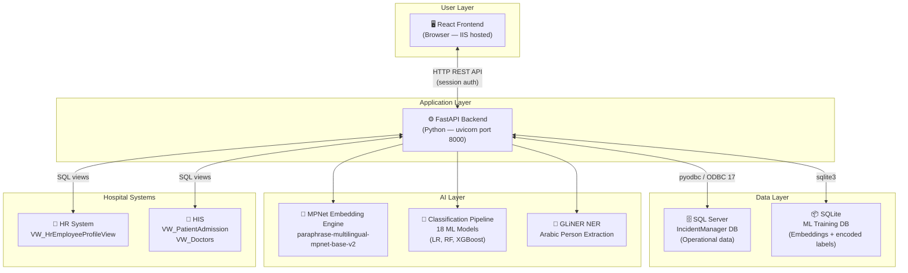
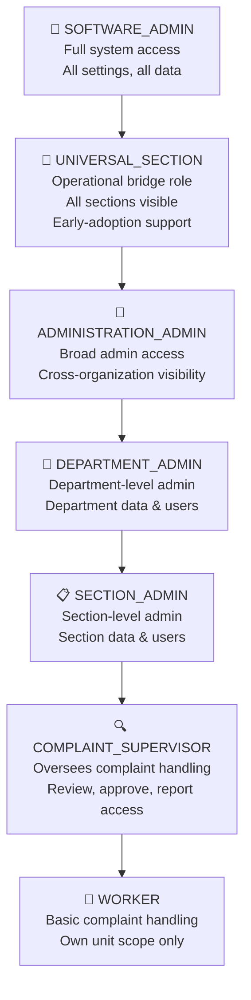
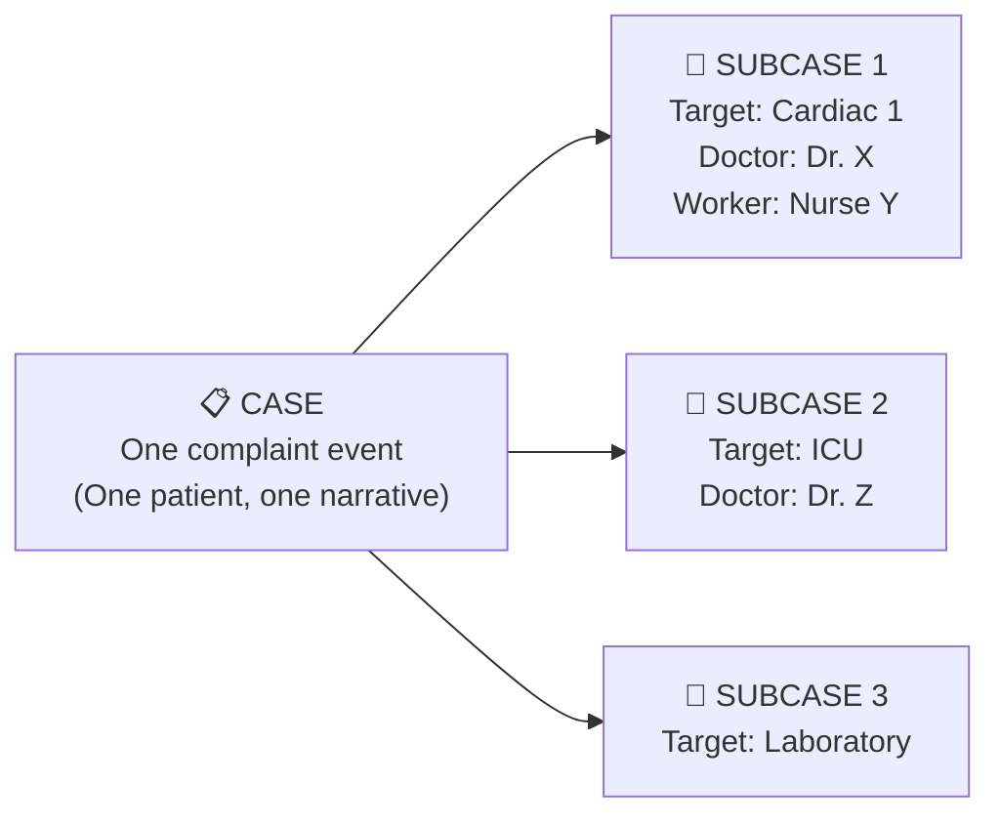
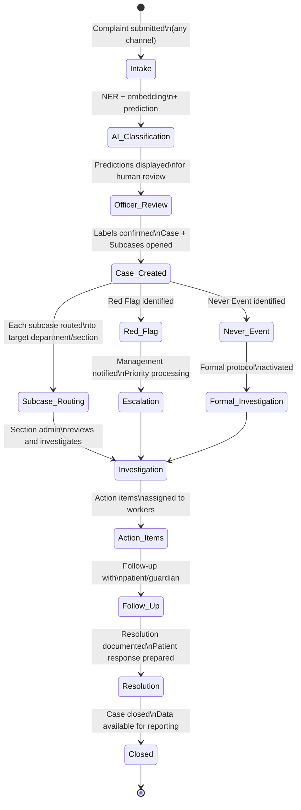

# System Overview
## HCAT Insight — Rassoul Azam Hospital
**Document:** 01 — System Overview
**Version:** 1.0
**Date:** May 2026
**Project:** HCAT Insight — AI-Assisted Healthcare Complaint Management System

---

## Table of Contents

1. [Introduction](#1-introduction)
2. [Healthcare Problem Context](#2-healthcare-problem-context)
3. [System Goals and Objectives](#3-system-goals-and-objectives)
4. [System Components Overview](#4-system-components-overview)
5. [User Roles and Responsibilities](#5-user-roles-and-responsibilities)
6. [Key System Features](#6-key-system-features)
7. [Complaint Lifecycle Overview](#7-complaint-lifecycle-overview)
8. [Technical Stack Summary](#8-technical-stack-summary)
9. [External System Integrations](#9-external-system-integrations)
10. [Deployment Environment](#10-deployment-environment)
11. [Key Innovations](#11-key-innovations)
12. [System Benefits](#12-system-benefits)
13. [Conclusion](#13-conclusion)

---

## 1. Introduction

**HCAT Insight** is a comprehensive, AI-assisted healthcare complaint management platform designed and deployed at **Rassoul Azam Hospital (RAH)**, a specialized cardiac care hospital. The system digitizes, automates, and analytically enriches the complete lifecycle of patient feedback — from initial complaint submission through investigation, resolution, and organizational reporting.

HCAT Insight is a real operational system, not a prototype or proof-of-concept. It is deployed within the hospital's internal network, serves multiple concurrent user roles, manages live complaint records, and applies machine learning models to assist with complaint classification in Arabic. The system was developed to address a specific institutional need: to replace manual, paper-based complaint handling with a structured, traceable, data-driven process that supports both operational accountability and continuous quality improvement.

The system's name reflects its two-layer purpose:
- **HCAT** — Healthcare Complaints Analysis Tool, the internationally recognized framework for complaint classification
- **Insight** — the analytical and AI-driven layer that transforms raw complaint data into operational intelligence

---

## 2. Healthcare Problem Context

Patient complaints in healthcare settings represent one of the most direct and valuable sources of quality improvement signals available to hospital management. Unlike audit data or clinical indicators, complaint narratives capture the patient's lived experience of care — including failures that may not be visible through any other monitoring mechanism.

At Rassoul Azam Hospital, the pre-HCAT Insight complaint process faced the following operational challenges:

| Challenge | Description |
|-----------|-------------|
| **Manual classification** | Each complaint required a complaint officer to manually assign nine HCAT labels — a time-consuming and cognitively demanding task |
| **Inconsistent annotation** | Different officers applying different interpretations of the same labels produced inconsistent classification across time |
| **No structured routing** | Complaint routing to the relevant department relied on informal judgment rather than systematic triage |
| **Limited analytics** | Without structured data, trend analysis and cross-department comparison were impractical |
| **No lifecycle tracking** | Complaints had no formal digital lifecycle — follow-up actions and resolution were not systematically recorded |
| **No escalation logic** | Red Flag and Never Event cases had no formal mechanism for urgent escalation |
| **Paper-based records** | Physical complaint records created risks of loss, damage, and inaccessibility for authorized reviewers |

HCAT Insight was designed to address all of these challenges simultaneously within the constraint of the hospital's offline infrastructure.

---

## 3. System Goals and Objectives

| Goal | Objective |
|------|-----------|
| **Digitize complaint records** | Provide a structured digital intake system for all patient complaints across all intake channels |
| **Automate classification** | Use AI/ML to suggest HCAT labels at intake, reducing manual classification time and improving consistency |
| **Structure complaint routing** | Route complaints to the correct department, section, and responsible person based on predicted or confirmed classification |
| **Enable escalation** | Formally identify and escalate Red Flag and Never Event cases through a defined workflow |
| **Support investigation** | Provide tools for complaint officers and supervisors to document investigations and actions taken |
| **Generate organizational reports** | Produce monthly, quarterly, and seasonal reports for management showing complaint trends, department performance, and quality indicators |
| **Integrate with hospital systems** | Connect to the hospital HR system and Hospital Information System (HIS) to auto-populate doctor and patient data |
| **Continuously improve AI** | Accumulate verified complaint labels over time to support periodic model retraining and performance improvement |

---

## 4. System Components Overview

HCAT Insight consists of five major technical components that work together to deliver its functionality.

**Figure 1: HCAT Insight System Component Architecture.**

| Component | Technology | Role |
|-----------|-----------|------|
| **React Frontend** | React.js, hosted on IIS | User interface for all roles: complaint intake, review, investigation, reporting, administration |
| **FastAPI Backend** | Python 3.10, FastAPI, uvicorn | REST API serving all business logic, authentication, data access, and AI inference |
| **SQL Server Database** | Microsoft SQL Server, database: `IncidentManager` | Primary operational database — all complaint records, user accounts, reports, settings |
| **SQLite ML Database** | SQLite (Python sqlite3) | Precomputed text embeddings and encoded training data for ML model training |
| **AI/ML Layer** | PyTorch, scikit-learn, XGBoost, GLiNER | Embedding generation, classification prediction, named entity extraction |

---

## 5. User Roles and Responsibilities

HCAT Insight implements a seven-level Role-Based Access Control (RBAC) system. Each role has a defined scope of visibility and a defined set of permitted actions within the system.

**Figure 2: HCAT Insight Role Hierarchy (highest to lowest privilege).**

| Role | Code | Primary Responsibilities | Visibility Scope |
|------|------|--------------------------|-----------------|
| **Software Administrator** | SOFTWARE_ADMIN | System configuration, user management, database settings, model training oversight | Full system |
| **Universal Section** | UNIVERSAL_SECTION | Operational fallback — handles all section-level approvals when individual section admins are not yet active | All sections (no scope filter) |
| **Administration Administrator** | ADMINISTRATION_ADMIN | Cross-department oversight, organizational reporting, high-level case review | Organization-wide |
| **Department Administrator** | DEPARTMENT_ADMIN | Department-level case management, user administration, department reporting | Own department |
| **Section Administrator** | SECTION_ADMIN | Section-level case review, approval, and reporting | Own section |
| **Complaint Supervisor** | COMPLAINT_SUPERVISOR | Day-to-day complaint processing, investigation, follow-up | Assigned organizational unit |
| **Worker** | WORKER | Complaint intake, basic case handling, action item execution | Own unit only |

**Authentication model:** HCAT Insight uses **session-based authentication** with no JWT tokens. A session cookie (`incident_manager_session`) is created on login and validated server-side on every request. User data is loaded fresh from the database on each request, ensuring immediate effect of role changes or account deactivation without requiring re-login.

---

## 6. Key System Features

### 6.1 Multi-Channel Complaint Intake

Complaints are received through eight distinct intake channels, each representing a different point of contact between patients/families and the hospital:

| Channel | Arabic Term | Description |
|---------|------------|-------------|
| Hotline | خط ساخن | Direct phone complaint |
| WhatsApp | واتساب مكتب | WhatsApp to the quality office |
| Suggestion Box | صندوق | Physical suggestion/complaint box |
| Ward Rounds | جولات | Complaints captured during ward rounds |
| Staff | موظف | Staff-reported patient concern |
| Supervisor | مشرف | Supervisor-reported observation |
| Social Media | وسائل التواصل | Social media-sourced complaint |
| Direct Submission | حضور | In-person submission |

### 6.2 Case and Subcase Architecture

The central data structure of HCAT Insight is the **Case/Subcase hierarchy**:

**Figure 3: Case/Subcase Relationship.**

- **Case:** Represents one complaint event from one patient or guardian. Contains the complaint narrative, metadata, AI classification predictions, and overall status.
- **Subcase:** Represents one department, section, or unit targeted within that complaint. A single complaint may target multiple departments, generating one subcase per target. Each subcase has its own approval and investigation workflow.

This architecture captures the multi-departmental reality of hospital complaints, where a single patient experience spans multiple care locations and personnel.

### 6.3 AI-Assisted Classification

When a complaint is entered into the system, the AI pipeline automatically:
1. **Extracts named entities** (patients, doctors, employees) from the Arabic text using GLiNER
2. **Generates text embeddings** using the MPNet multilingual model
3. **Predicts nine HCAT labels** through the hierarchical classification pipeline
4. **Presents predictions to the complaint officer** for review and confirmation

The officer can accept, modify, or reject any prediction. Confirmed labels become training data for future model retraining cycles. Full AI system details are documented in **Document 04 — AI System Design**.

### 6.4 Investigation and Follow-Up

Each case and subcase supports a structured investigation workflow:
- **Action items:** Specific tasks assigned to staff with due dates and completion tracking
- **Follow-up records:** Documentation of follow-up contacts with the patient/guardian
- **Investigation records:** Formal investigation findings and conclusions
- **Explanation documentation:** Written responses to patients and internal explanation records

### 6.5 Red Flag and Never Event Management

HCAT Insight provides dedicated workflows for high-priority complaint types:

| Type | Trigger | System Response |
|------|---------|----------------|
| **Red Flag** | Complaint identified as requiring urgent management escalation | Dedicated Red Flag queue; immediate notification to administration |
| **Never Event** | Complaint involving a serious adverse event that should never occur | Formal investigation protocol initiated; highest visibility in system |

### 6.6 Reporting and Analytics

HCAT Insight generates structured organizational intelligence through four reporting modes:

| Report Type | Scope | Period | Primary Audience |
|-------------|-------|--------|-----------------|
| **Monthly Report** | Per section/department | Monthly | Section Admins, Department Admins |
| **Seasonal Report** | Organization-wide | Quarterly (4 seasons/year) | Administration Admin |
| **Trend Analysis** | Cross-period comparison | Configurable | Management |
| **Worker/Doctor Performance** | Per individual | Configurable | Department Admin, Complaint Supervisor |

Seasonal reports support **cross-season comparison** and **export functionality** for offline distribution.

### 6.7 Dashboard

The system dashboard provides real-time organizational metrics including:
- Total open/in-progress/closed cases
- Cases by domain, category, and severity
- Red Flag and Never Event counts
- Department-level complaint distribution
- Trend indicators across time periods

### 6.8 System Administration

The administration layer provides:
- **User management:** Create, activate, deactivate, and assign roles to users
- **Section administration:** Define and manage organizational sections and departments
- **System settings:** Configure operational parameters and thresholds
- **Database configuration:** Update database connection settings via a password-protected web interface (no manual file editing required)
- **ML model training:** Trigger retraining of classification models from the admin interface via `training_router`

### 6.9 Notification System

HCAT Insight includes an SMTP-based email notification system integrated with the hospital's Outlook/Exchange server. Notifications can be triggered by case escalations, Red Flag identification, and assignment events. The notification system supports both mock mode (for testing) and live SMTP mode (for production).

---

## 7. Complaint Lifecycle Overview

**Figure 4: Complete Complaint Lifecycle State Machine.**

---

## 8. Technical Stack Summary

| Layer | Technology | Version/Details |
|-------|-----------|----------------|
| **Frontend** | React.js | JavaScript/TypeScript; hosted on IIS (Windows Server 2025) |
| **Backend** | FastAPI | Python 3.10; served via uvicorn on port 8000; managed by NSSM as Windows service |
| **Database** | Microsoft SQL Server | Database: `IncidentManager`; ODBC Driver 17; Windows Authentication |
| **ML Training DB** | SQLite | Python sqlite3; stores precomputed embeddings and encoded labels |
| **Authentication** | Session-based | Starlette SessionMiddleware; no JWT; server-side session storage |
| **Embedding Model** | MPNet Multilingual | `paraphrase-multilingual-mpnet-base-v2`; 768-dim; CPU inference |
| **ML Classifiers** | scikit-learn, XGBoost | Logistic Regression, Random Forest, XGBoost; serialized as .pkl files |
| **NER Model** | GLiNER | `NAMAA-Space/gliner_arabic-v2.1`; Arabic person extraction |
| **OS** | Windows Server 2025 | Datacenter edition; VM-based deployment |
| **Web Server** | IIS | Internet Information Services; hosts React frontend |
| **Email** | SMTP / Outlook | Exchange integration; configurable mock/live modes |
| **Configuration** | JSON + env overrides | `config/db_settings.json`; updatable via web interface |

---

## 9. External System Integrations

HCAT Insight integrates with two external hospital systems through SQL database views, providing real-time access to institutional data without duplicating records:

| System | Integration Method | Data Provided | View Name |
|--------|------------------|---------------|-----------|
| **HR System** | SQL Server View | Employee profiles for complaint officer identification and worker assignment | `VW_HrEmployeeProfileView` |
| **Hospital Information System (HIS)** | SQL Server Views | Patient admission records for complaint-patient linking; Doctor directory for named entity linking | `VW_PatientAdmission`, `VW_Doctors` |

These integrations enable:
- Auto-completion of patient data when a complaint is linked to an admission record
- Auto-completion of doctor names from the medical staff directory
- Cross-referencing of employees named in complaints with their HR records

---

## 10. Deployment Environment

HCAT Insight is deployed on a **dedicated virtual machine** within the Rassoul Azam Hospital internal network. This is an **offline deployment** — the system has no internet access and does not communicate with any external services.

| Property | Value |
|----------|-------|
| **Deployment type** | Offline VM — hospital intranet |
| **Operating system** | Windows Server 2025 Datacenter |
| **Network** | Hospital internal LAN only |
| **Internet access** | None |
| **Backend port** | 8000 (uvicorn, managed by NSSM) |
| **Frontend** | IIS on port 80 |
| **Database** | SQL Server on the same VM |
| **IP configuration** | Dynamic (auto-detected at startup for CORS) |
| **GPU** | None — all AI inference is CPU-only |
| **Bootstrap mode** | System enters limited-access bootstrap mode if database is unreachable at startup |

The offline deployment constraint was the primary driver of all AI architecture decisions: no cloud APIs, no GPU acceleration, no internet-dependent models. The system was designed from the ground up to operate reliably within these constraints. Deployment challenges and their engineering solutions are documented in detail in **Document 08 — Deployment Constraints**.

---

## 11. Key Innovations

HCAT Insight introduces several technical innovations relative to standard hospital complaint management systems:

| Innovation | Description |
|-----------|-------------|
| **Arabic HCAT Classification** | First known implementation of automated HCAT classification on Arabic-language complaint text, using a multilingual sentence transformer and hierarchical ML pipeline |
| **Hierarchical Label Pipeline** | Classification pipeline that respects the HCAT taxonomy's hierarchical structure — Domain → Category → Sub-Category — rather than treating labels as independent |
| **Semantic Stage Projection** | Novel approach to Stage of Care classification using vocabulary-based metric embeddings and dot-product projection, addressing the multi-stage nature of complaint narratives |
| **Embedded Retraining Loop** | Self-training architecture where human-verified labels from operational use feed a milestone-triggered model retraining cycle, continuously improving performance as data grows |
| **Arabic GLiNER NER** | Integration of a specialized Arabic-language GLiNER model for named entity extraction, with rule-based role classification (patient vs. doctor vs. employee) from complaint context |
| **Offline AI Deployment** | Complete ML pipeline — embedding generation, classification, and NER — running on CPU within a hospital's offline VM with no external dependencies |
| **Bootstrap Mode** | System-level resilience: the application detects database connectivity at startup and enters a limited-access configuration mode if the database is unreachable, preventing complete failure |

---

## 12. System Benefits

| Stakeholder | Benefit |
|-------------|---------|
| **Patient/Guardian** | Faster complaint processing; structured follow-up; formal resolution documentation |
| **Complaint Officers** | AI-assisted classification reduces manual annotation time; structured case management workflow |
| **Section Administrators** | Clear subcase routing; visibility into complaints targeting their section; action item tracking |
| **Hospital Management** | Real-time dashboard; seasonal and trend reports; Red Flag and Never Event escalation |
| **Quality & Safety Team** | Structured HCAT data for quality improvement analysis; harm and severity tracking |
| **IT/Technical Staff** | Self-contained offline system; web-based database configuration; bootstrap recovery mode |

---

## 13. Conclusion

HCAT Insight is a production-deployed, multi-role, AI-assisted healthcare complaint management platform purpose-built for the operational and infrastructure realities of Rassoul Azam Hospital. Its defining characteristics are:

1. **Complete digital lifecycle:** From multi-channel intake through investigation, resolution, and organizational reporting
2. **Multi-role governance:** Seven-level RBAC with session authentication and organizational unit scoping
3. **Arabic AI classification:** Multilingual embeddings and hierarchical ML pipeline achieving competitive performance under offline, CPU-only constraints
4. **Hospital system integration:** Real-time linkage with HR and HIS data through SQL views
5. **Offline resilience:** Designed to operate fully without internet access, with bootstrap mode for startup failure recovery
6. **Self-improving:** Embedded retraining pipeline ensures AI performance improves as the operational complaint dataset grows

The subsequent documents in this series provide detailed technical documentation of each aspect of the system: its workflow model, technical architecture, AI design, deployment infrastructure, testing methodology, benchmark results, and future development directions.

---

*Document prepared for research and academic publication purposes.*
*Source of truth: HCAT Insight codebase at `c:\Users\Administrator\Documents\GitHub\Patient_Feedback\` and operational deployment at Rassoul Azam Hospital.*
