# Workflow Model
## HCAT Insight — Rassoul Azam Hospital
**Document:** 02 — Workflow Model
**Version:** 1.0
**Date:** May 2026
**Project:** HCAT Insight — AI-Assisted Healthcare Complaint Management System

---

## Table of Contents

1. [Introduction](#1-introduction)
2. [Organizational Structure](#2-organizational-structure)
3. [Role Responsibilities in the Workflow](#3-role-responsibilities-in-the-workflow)
4. [Complaint Intake Workflow](#4-complaint-intake-workflow)
5. [Case and Subcase Lifecycle](#5-case-and-subcase-lifecycle)
6. [Subcase Approval Chain](#6-subcase-approval-chain)
7. [Root Cause Analysis Workflow](#7-root-cause-analysis-workflow)
8. [Action Item Workflow](#8-action-item-workflow)
9. [Follow-Up and Patient Communication Workflow](#9-follow-up-and-patient-communication-workflow)
10. [Explanation and Reporting Workflow](#10-explanation-and-reporting-workflow)
11. [Red Flag and Never Event Workflow](#11-red-flag-and-never-event-workflow)
12. [Seasonal Reporting Workflow](#12-seasonal-reporting-workflow)
13. [Organizational Policy and Thresholds](#13-organizational-policy-and-thresholds)
14. [Visibility and Scope Rules](#14-visibility-and-scope-rules)
15. [Workflow Limitations and Operational Challenges](#15-workflow-limitations-and-operational-challenges)
16. [Conclusion](#16-conclusion)

---

## 1. Introduction

This document describes the operational workflow of **HCAT Insight** in full detail — how complaints move through the system, who acts at each stage, what decisions are made, and how the workflow branches for different complaint types.

The HCAT Insight workflow is not a simple linear pipeline. It is a multi-branch, role-scoped process that handles ordinary complaints, Red Flag escalations, Never Events, and seasonal organizational reporting through distinct but interconnected paths. Understanding this workflow is essential for understanding both the system's operational value and its technical design.

The workflow was derived directly from the implemented codebase: the database layer (`backend/api/db_layer/`), the router definitions (`backend/api/routers/`), and the role and policy constants (`backend/core/constants/`).

---

## 2. Organizational Structure

HCAT Insight models the hospital's organizational hierarchy as a three-tier tree, each tier corresponding to a level of administrative responsibility within the complaint workflow.

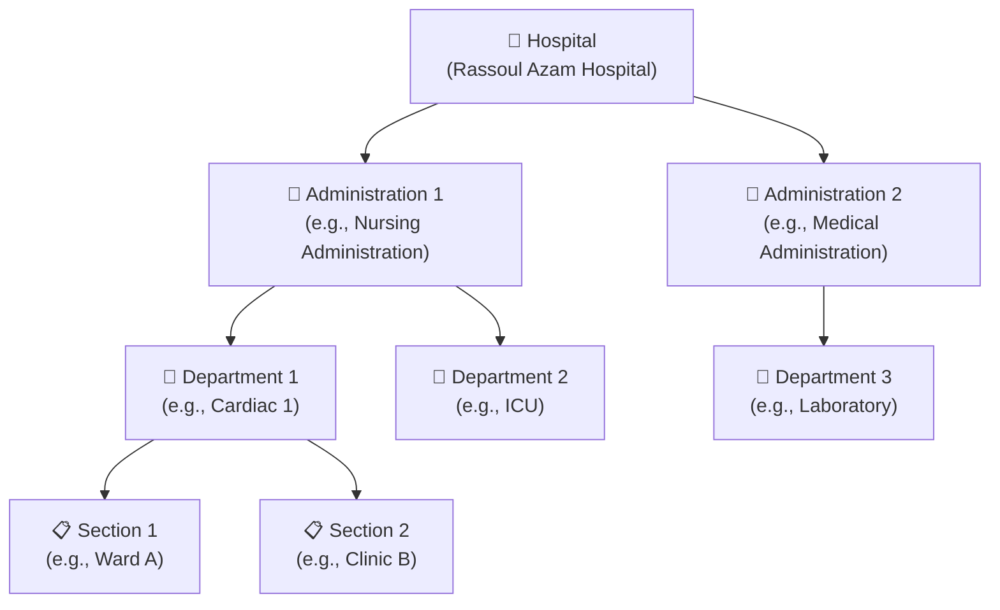

**Figure 1: Organizational Hierarchy Model.**

Each node in this hierarchy has:
- A designated **administrator** responsible for complaints affecting that unit
- A set of configurable **severity and domain thresholds** that define alert levels
- A **scope of visibility** — administrators at each level can only see complaints relevant to their unit and below

The complaint routing system uses this hierarchy to determine which administrator receives a complaint subcase, which policy applies, and which reports are generated.

---

## 3. Role Responsibilities in the Workflow

Each of the seven system roles has defined responsibilities at specific stages of the complaint workflow.

| Role | Workflow Stage | Key Responsibilities |
|------|---------------|---------------------|
| **WORKER** | Intake, Action Execution | Enter complaints, execute assigned action items, basic case data entry |
| **COMPLAINT_SUPERVISOR** | Review, Classification, Follow-Up | Review complaints, confirm AI classification, document investigation, follow up with patients |
| **SECTION_ADMIN** | Subcase Response, RCA | Receive subcases in inbox, submit Root Cause Analysis, provide department explanation |
| **DEPARTMENT_ADMIN** | Subcase Oversight, Approval | Oversee subcases within department, approve completed subcases |
| **ADMINISTRATION_ADMIN** | Final Approval, Reporting | Final approval of resolved cases, seasonal reporting, cross-department visibility |
| **UNIVERSAL_SECTION** | Bridging Role | Handles all section-level approvals during early adoption; sees all subcases without scope filter |
| **SOFTWARE_ADMIN** | System Management | User management, system settings, force-close oversight, ML retraining |

---

## 4. Complaint Intake Workflow

The intake workflow begins when a complaint is received through any of the eight supported channels and ends when the case is formally opened in the system with all required fields populated.

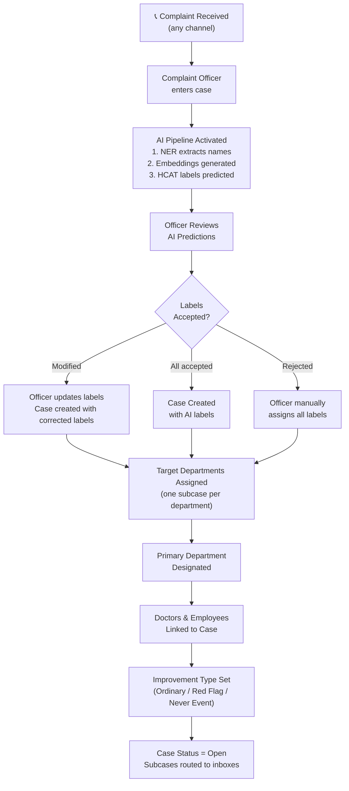

**Figure 2: Complaint Intake Workflow.**

**Key intake decisions:**

| Decision Point | Options | System Effect |
|---------------|---------|--------------|
| **Patient type** | Inpatient / Outpatient | Linked to admission record via HIS view |
| **Intake channel** | 8 channels | Recorded as SourceID; affects reporting segmentation |
| **HCAT classification** | Accept AI / Modify / Manual | Determines labels applied to case |
| **Target departments** | One or multiple | One subcase created per target department |
| **Primary department** | Designated from targets | Receives priority in reporting |
| **Improvement type** | Ordinary / Red Flag / Never Event | Triggers different downstream workflows |
| **Requires explanation** | Yes / No | Activates explanation request in parallel |

---

## 5. Case and Subcase Lifecycle

### 5.1 Case States

A Case in HCAT Insight progresses through three lifecycle states:

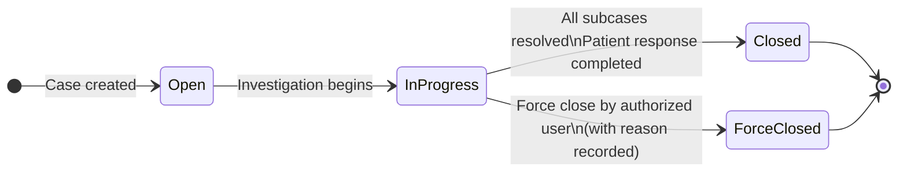

**Figure 3: Case Status State Machine.**

| Status | Description | Who Can Advance |
|--------|-------------|----------------|
| **Open** | Case created, pending assignment | System (auto) |
| **In Progress** | Active investigation or follow-up | Complaint Supervisor, Admin roles |
| **Closed** | Fully resolved; all subcases complete | Complaint Supervisor, Admin roles |
| **Force Closed** | Administratively closed before natural resolution; reason required | SOFTWARE_ADMIN |

### 5.2 Case Data Structure

Each case record contains:

**Identity fields:** PatientName, FeedbackReceivedDate, IssuingOrgUnitID, SourceID, isINPatient (inpatient/outpatient flag)

**Clinical classification:** DomainID, CategoryID, SubCategoryID, ClassificationID, SeverityID, StageID, HarmLevelID, ClinicalRiskTypeID

**Operational fields:** CaseStatusID, FeedbackIntentTypeID, BuildingID, RequiresExplanation, ExplanationStatusID

**Text content:** ComplaintText (patient narrative), ImmediateAction (immediate response), TakenAction (detailed actions taken)

**Audit fields:** CreatedByUserID, ForceClosedAt, ForceClosedByUserID, ForceCloseReason

### 5.3 Subcase Structure

Each target department assignment creates one **subcase** (`APP_IncidentCaseTargetDepartment`) linked to the parent case. A case with three target departments generates three subcases, each with its own approval workflow.

| Subcase Property | Description |
|-----------------|-------------|
| `IsPrimary` | Exactly one subcase is designated as primary per case |
| `DepartmentID` | The target department this subcase is directed to |
| `AssignedByUserID` | The user who assigned this department target |
| `AssignedAt` | Timestamp of assignment |

---

## 6. Subcase Approval Chain

Each subcase follows its own approval chain, independent of other subcases in the same case. The approval chain reflects the organizational hierarchy: complaints pass through the Section level before reaching the Administration level.

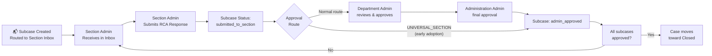

**Figure 4: Subcase Approval Chain.**

**Approval shortcut — UNIVERSAL_SECTION role:**
During the early adoption phase, when individual Section Admins may not yet be fully operational in the system, the UNIVERSAL_SECTION role can directly advance subcases from `submitted_to_section` to `admin_approved`, bypassing the intermediate Department Admin step. This role sees all subcases across all sections without scope filtering, acting as an operational bridge until the full role structure is in place.

---

## 7. Root Cause Analysis Workflow

When a Section Administrator responds to a subcase in their inbox, they are required to complete a **Root Cause Analysis (RCA)** before the subcase can advance to the approval stage. The RCA is stored in `APP_IncidentCaseFeedback` linked to the specific subcase.

### 7.1 RCA Categories

The RCA framework structures the cause analysis across four domains:

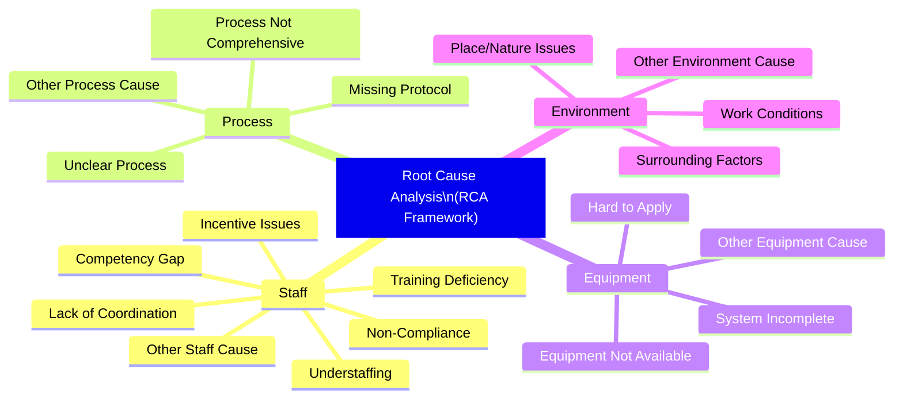

**Figure 5: RCA Cause Analysis Framework.**

### 7.2 Preventive Actions

Alongside cause identification, the RCA requires documentation of planned preventive actions:

| Preventive Action | Description |
|------------------|-------------|
| Monthly Meetings | Schedule meetings to address the root cause |
| Training Programs | Implement staff training |
| Increase Staffing | Request additional personnel |
| M&M Committee Actions | Submit to Morbidity & Mortality committee |
| Other | Custom preventive action with free text |

### 7.3 Department Explanation

After completing the RCA, the section may also provide a **Department Explanation** — a formal written response to the complaint, which is tracked with:
- `DepartmentExplanationText`: the full written explanation
- `DepartmentExplanationStatusID`: workflow state (Waiting → Submitted → Reviewed)
- `DepartmentExplanationReceivalDate`: when the explanation was officially received

---

## 8. Action Item Workflow

Action items are discrete tasks created in response to a complaint case, a seasonal report, or a seasonal case. They represent concrete corrective or preventive steps that must be executed and tracked.

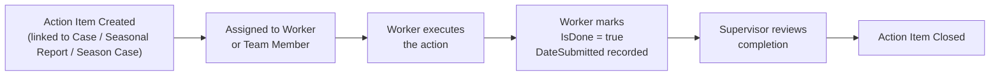

**Figure 6: Action Item Workflow.**

**Action item properties:**
- `ActionTitle`: Concise task name
- `ActionDescription`: Detailed task description
- `DueDate`: Required completion date
- `IsDone`: Completion flag
- `DateSubmitted`: Auto-stamped when marked done
- **Parent linkage** (exactly one):
  - `IncidentRequestCaseID` → linked to a complaint case
  - `SeasonalReportID` → linked to a seasonal report
  - `SeasonCaseID` → linked to a specific department's seasonal case

Action items can accumulate per case over its lifecycle and are visible in the case detail view, providing an audit trail of all corrective actions taken.

---

## 9. Follow-Up and Patient Communication Workflow

HCAT Insight tracks follow-up contacts with the patient or guardian throughout the complaint lifecycle. The follow-up module (`follow_up_db.py`, `follow_up_router.py`) records:

- Date and method of contact
- Summary of communication
- Patient/guardian response
- Status of the follow-up (pending, completed, unsuccessful contact)

Follow-up records are attached to the parent case and visible to the Complaint Supervisor and above. Multiple follow-up contacts may be recorded for a single case, providing a complete communication timeline.

**Follow-up requirement:** Cases with the `RequiresExplanation` flag set must include a formal follow-up record confirming that the patient/guardian received and acknowledged the hospital's formal explanation before the case can be closed.

---

## 10. Explanation and Reporting Workflow

HCAT Insight manages three distinct explanation tracks, reflecting the three complaint priority types:

```mermaid
graph TD
    subgraph "Ordinary Complaint"
        OE["DepartmentExplanationText\nSubmitted by Section"] --> OR["Explanation Reviewed\nby Administration"]
        OR --> OC["ExplanationStatusID = Reviewed\nCase eligible for close"]
    end

    subgraph "Red Flag"
        RF["Formal Red Flag\nExplanation Required"] --> RFR["Priority Review\nAdministration Admin"]
        RFR --> RFC["Red Flag Closed\nwith formal documentation"]
    end

    subgraph "Seasonal"
        SR["Seasonal Report\nGenerated quarterly"] --> SRC["Per-Department\nSeason Case created"]
        SRC --> SRF["Department provides\nSeasonal Report Feedback"]
        SRF --> SRA["Administration reviews\nand approves"]
    end
```

**Figure 7: Explanation Workflow Branches by Complaint Type.**

The `explanation_ordinary_db.py`, `explanation_red_flag_db.py`, and `explanation_seasonal_db.py` database layers implement these three separate explanation tracks, each with their own status progression and approval requirements.

---

## 11. Red Flag and Never Event Workflow

Red Flag and Never Event cases follow accelerated and enhanced workflows compared to ordinary complaints.

### 11.1 Red Flag Workflow

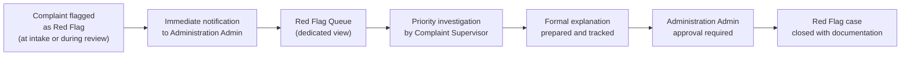

**Figure 8: Red Flag Workflow.**

### 11.2 Never Event Workflow

Never Events represent the highest severity category — events that should never occur in a properly functioning healthcare environment.

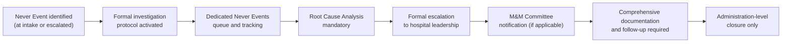

**Figure 9: Never Event Workflow.**

Both Red Flag and Never Event cases are accessible through dedicated router endpoints (`red_flags_router.py`, `never_events_router.py`) and appear in dedicated filtered views in the frontend, ensuring they are never buried within the general complaint queue.

---

## 12. Seasonal Reporting Workflow

In addition to the per-complaint workflow, HCAT Insight operates a parallel **seasonal reporting cycle** that generates quarterly organizational reports for management.

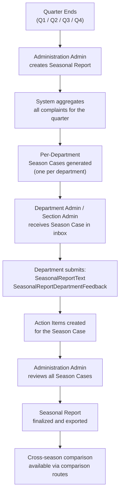

**Figure 10: Seasonal Reporting Workflow.**

**Seasonal action items:** Seasonal cases have their own action items (`SeasonCaseID` linkage), separate from per-complaint action items. This allows corrective actions arising from quarterly analysis to be tracked independently from individual case resolution actions.

**Export functionality:** Finalized seasonal reports can be exported via `seasonal_export_router.py`, enabling offline distribution to stakeholders who do not have system access.

---

## 13. Organizational Policy and Thresholds

Each organizational unit (Administration, Department, or Section) has a configurable **policy** stored in `APP_OrgUnitPolicy` that defines alert thresholds. These policies drive automatic flagging and reporting logic.

| Policy Parameter | Description |
|-----------------|-------------|
| `LowSeverityLimit` | Maximum acceptable number of Low severity complaints per period |
| `MediumSeverityLimit` | Maximum acceptable number of Medium severity complaints per period |
| `HighSeverityLimit` | Maximum acceptable number of High severity complaints per period |
| `ClinicalDomainLimit` | Threshold for complaints in the CLINICAL domain |
| `ManagementDomainLimit` | Threshold for complaints in the MANAGEMENT domain |
| `RelationalDomainLimit` | Threshold for complaints in the RELATIONAL domain |
| `EnableLowSeverityRepetitionRule` | Flag repeated Low severity complaints as patterns |
| `EnableMediumSeverityRepetitionRule` | Flag repeated Medium severity complaints |
| `EnableHighSeverityPercentageRule` | Alert when High severity exceeds a percentage of total |
| `EnableHighSeverityPercentageByDomainRule` | Alert when High severity in a specific domain exceeds threshold |

These thresholds enable HCAT Insight to move beyond simple complaint counting toward **pattern-aware quality monitoring** — alerting administrators when complaint patterns indicate systemic issues rather than isolated incidents.

---

## 14. Visibility and Scope Rules

Each role has a defined scope of visibility that controls which cases, subcases, and reports it can access.

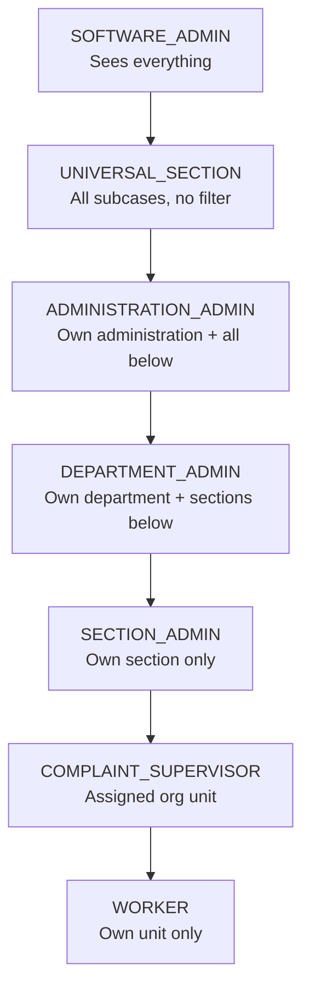

**Figure 11: Scope Hierarchy for Data Visibility.**

**Scope enforcement:** The backend enforces scoping at the database query level through dynamic WHERE clauses that filter by `IssuingOrgUnitID` against the authenticated user's organizational unit assignments. A Section Admin cannot access cases from a different section, even if they share the same department.

**Scope override:** The UNIVERSAL_SECTION role bypasses scope filtering entirely ("no scope filter" as noted in the role code comment), allowing it to see all subcases across all sections. This is intentional for the early adoption period.

---

## 15. Workflow Limitations and Operational Challenges

| Challenge | Description | Current Mitigation |
|-----------|-------------|-------------------|
| **Multi-department complaint complexity** | A single complaint targeting five departments generates five subcases, each requiring separate RCA and approval | System supports this natively; dashboard aggregates status |
| **Section Admin non-participation** | If a Section Admin does not log in or respond, their subcase stalls the case | UNIVERSAL_SECTION role bridges the gap during early adoption |
| **Force close requirement** | Some cases must be closed administratively when patients cannot be reached | Force close mechanism with mandatory reason and audit trail |
| **Explanation tracking fragmentation** | Three separate explanation tracks (ordinary, red flag, seasonal) require different database tables | Separate router and service layers handle each track |
| **Seasonal workflow length** | Quarterly reporting requires coordination across many departments | Season cases provide per-department tracking within the same seasonal report |
| **Workflow state visibility** | Users at lower role levels cannot see the full case status across all subcases | Dashboard aggregates provide summary visibility |

---

## 16. Conclusion

The HCAT Insight workflow model is a multi-path, role-scoped complaint management process that operates at two parallel levels:

1. **Per-complaint workflow:** Individual complaints enter through intake, are AI-classified, split into department-specific subcases, processed through a Root Cause Analysis and approval chain, and closed with documented resolution and patient follow-up.

2. **Seasonal reporting workflow:** Quarterly, the system aggregates all complaints into organizational reports, generates department-level seasonal cases, and tracks corrective actions and management responses at the organizational level.

The workflow reflects the operational reality of a specialized hospital: complaints frequently involve multiple departments, require structured cause analysis, generate concrete action items, and must be documented in a way that supports both patient communication and organizational learning.

The key design principles are:
- **Role-scoped access** ensures each participant sees only what is relevant to their responsibilities
- **Subcase independence** allows multi-department complaints to be processed in parallel
- **RCA requirement** transforms complaint response from reactive to analytical
- **Policy thresholds** move the system from incident tracking to pattern detection
- **Dual workflow tracks** (per-complaint and seasonal) ensure both immediate resolution and long-term quality improvement are captured

---

*Document prepared for research and academic publication purposes.*
*Source of truth: HCAT Insight codebase — `backend/api/db_layer/`, `backend/api/routers/`, `backend/core/constants/roles.py`, `backend/api/db_layer/org_unit_policy.py`.*
