# Technical Architecture
## HCAT Insight — Rassoul Azam Hospital
**Document:** 03 — Technical Architecture
**Version:** 1.0
**Date:** May 2026
**Project:** HCAT Insight — AI-Assisted Healthcare Complaint Management System

---

## Table of Contents

1. [Introduction](#1-introduction)
2. [High-Level Architecture](#2-high-level-architecture)
3. [Backend Architecture](#3-backend-architecture)
4. [API Versioning Strategy](#4-api-versioning-strategy)
5. [Middleware Stack](#5-middleware-stack)
6. [Router Registry](#6-router-registry)
7. [Service Layer Pattern](#7-service-layer-pattern)
8. [Database Access Layer](#8-database-access-layer)
9. [Guards and Authorization Pattern](#9-guards-and-authorization-pattern)
10. [Authentication Architecture](#10-authentication-architecture)
11. [Frontend Architecture](#11-frontend-architecture)
12. [Database Architecture](#12-database-architecture)
13. [ML Model Integration Architecture](#13-ml-model-integration-architecture)
14. [Application Startup Sequence](#14-application-startup-sequence)
15. [Configuration Architecture](#15-configuration-architecture)
16. [Request Lifecycle](#16-request-lifecycle)
17. [Subcase Workflow State Machine](#17-subcase-workflow-state-machine)
18. [Architectural Tradeoffs and Design Decisions](#18-architectural-tradeoffs-and-design-decisions)
19. [Known Architectural Limitations](#19-known-architectural-limitations)
20. [Conclusion](#20-conclusion)

---

## 1. Introduction

This document provides a complete technical description of the HCAT Insight system architecture. It covers the backend application structure, API design, middleware configuration, database layers, ML model integration, authentication system, and the key design decisions that shaped each component.

The source of truth for all content in this document is the actual implemented codebase, primarily:
- `backend/main.py` — FastAPI application definition and router registration
- `backend/core/` — Configuration, constants, database connection, bootstrap
- `backend/api/` — API v1 routers, services, db_layer, schemas
- `backend/api_v2/` — API v2 routers, services, guards, db_layer

---

## 2. High-Level Architecture

HCAT Insight follows a layered client-server architecture with three primary tiers and an AI subsystem operating alongside the application layer.

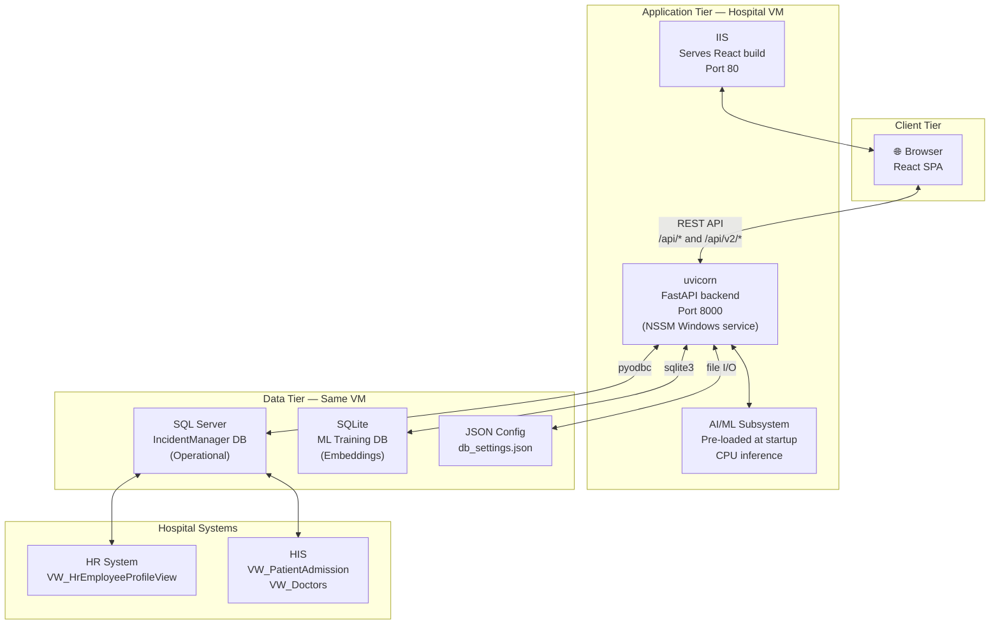

**Figure 1: HCAT Insight High-Level Architecture.**

All three tiers run on the **same virtual machine** within the hospital's intranet. There is no network separation between tiers — this is a deliberate consequence of the offline deployment constraint.

---

## 3. Backend Architecture

The backend is a **FastAPI** application written in Python 3.10, served by **uvicorn** and managed as a Windows service via **NSSM** (Non-Sucking Service Manager). It is organized into a clean four-layer architecture.

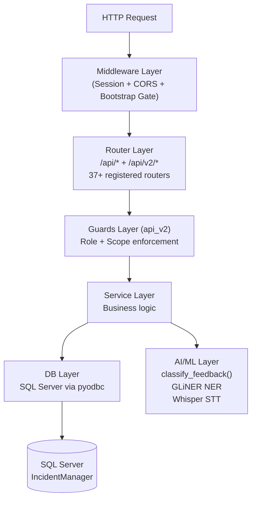

**Figure 2: Backend Layered Architecture.**

| Layer | Location | Responsibility |
|-------|----------|---------------|
| **Middleware** | `main.py` | Cross-cutting concerns: authentication gates, CORS, bootstrap mode |
| **Router** | `api/routers/`, `api_v2/routers/` | HTTP endpoint definitions, request validation, response formatting |
| **Guards** | `api_v2/guards/` | Role and scope enforcement (api_v2 only) |
| **Service** | `api/services/`, `api_v2/services/` | Business logic, orchestration, workflow transitions |
| **DB Layer** | `api/db_layer/`, `api_v2/db_layer/` | All SQL queries via pyodbc; one file per domain entity |
| **AI/ML Layer** | `models_directory/` | Inference, NER, STT — called from service layer |

---

## 4. API Versioning Strategy

HCAT Insight uses **coexisting API versions** within a single FastAPI application instance. Both versions are registered on the same `app` object and run simultaneously.

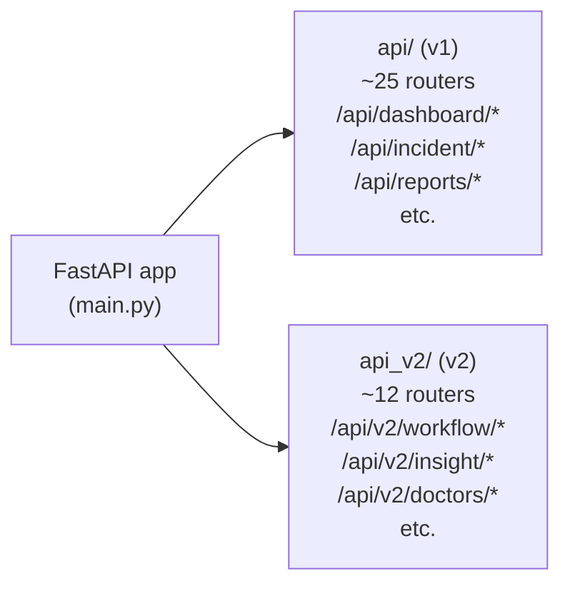

**Figure 3: API Versioning — Coexisting v1 and v2.**

| Aspect | API v1 (`api/`) | API v2 (`api_v2/`) |
|--------|----------------|-------------------|
| **Purpose** | Core functionality, data retrieval, legacy operations | New features, workflow engine, advanced analytics |
| **Guard system** | Inline checks in endpoints | Dedicated `guards/` module with dependency injection |
| **Service pattern** | Mixed (some services, some direct DB calls) | Clean service layer separation |
| **Phase** | Original development phases 1–5 | Phases 3.5–G and beyond |
| **Examples** | Dashboard, incidents, investigation, reports | Workflow, Insight, Drawer Notes, Action Log |

The versioning strategy allows progressive migration of features from v1 patterns to the cleaner v2 patterns without disrupting existing frontend integrations. v1 endpoints remain stable while new features are built on v2.

---

## 5. Middleware Stack

Three middleware layers are applied to every HTTP request in order:

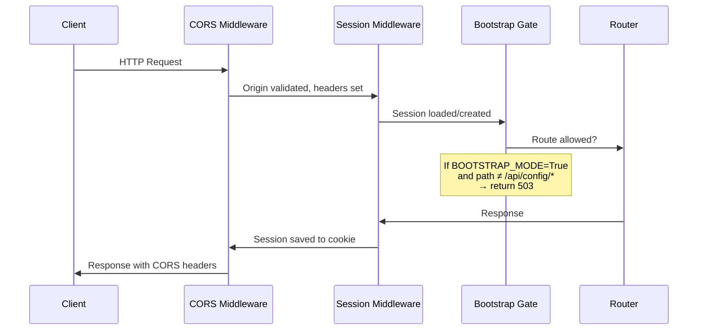

**Figure 4: Middleware Execution Order.**

### 5.1 Session Middleware (Starlette)

```python
SessionMiddleware(
    secret_key="...",
    session_cookie="incident_manager_session",
    max_age=86400,   # 24-hour lifetime
    same_site="lax",
    https_only=False
)
```

Manages server-side session storage. The session cookie stores only a `user_id` — all user data is loaded fresh from the database on every authenticated request.

> **Security Note:** The session `secret_key` is hardcoded in the codebase with a placeholder comment `# TODO: Move to environment variable`. This is a known security gap that should be addressed before any expansion beyond the hospital's local network.

### 5.2 CORS Middleware

Auto-generates allowed origins from the VM's detected IP address at startup, ensuring the backend accepts requests from the React frontend regardless of dynamic IP assignment. Allows all methods and headers with credentials enabled.

### 5.3 Bootstrap Gate Middleware

A custom middleware that intercepts all requests when `BOOTSTRAP_MODE = True` (database unreachable). In bootstrap mode, only the following paths are accessible:
- `/api/config/*` — database configuration endpoints
- `/api/status` — system status
- `/docs`, `/redoc`, `/openapi.json` — API documentation
- `/` — health check

All other routes return HTTP 503 with a configuration instruction payload.

---

## 6. Router Registry

HCAT Insight registers **37+ routers** at startup. The table below organizes them by functional domain.

| Domain | Router | API Version | Key Endpoints |
|--------|--------|------------|---------------|
| **Auth** | `auth_router` | v1 | POST /api/auth/login, POST /api/auth/logout |
| **Config** | `config_router` | v1 | GET/POST /api/config/* (bootstrap mode) |
| **Dashboard** | `dashboard_router` | v1 | GET /api/dashboard/* |
| **Complaints** | `incident_router` | v1 | CRUD /api/incident/* |
| **Complaints** | `insert_router` | v1 | POST /api/insert/* (complaint intake) |
| **Complaints** | `table_view_router` | v1 | GET /api/table-view/* |
| **Workflow** | `workflow_router` | **v2** | GET/POST /api/v2/workflow/* |
| **Classification** | `classification_router` | v1 | POST /api/classify/* |
| **NER** | `ner_router` | v1 | POST /api/ner/* |
| **STT** | `stt_router` | v1 | POST /api/stt/* |
| **Red Flags** | `red_flags_router` | v1 | GET/POST /api/red-flags/* |
| **Never Events** | `never_events_router` | v1 | GET/POST /api/never-events/* |
| **Investigation** | `investigation_router` | v1 | GET/POST /api/investigation/* |
| **Follow-up** | `follow_up_router` | v1 | GET/POST /api/follow-up/* |
| **Action Items** | `action_items_router` | v1 | CRUD /api/action-items/* |
| **Action Log** | `action_log_router` | **v2** | GET /api/v2/action-log/* |
| **Patients** | `patients_router` | v1 | GET /api/patients/* |
| **Patients** | `patients_v2_router` | **v2** | GET /api/v2/patients/* |
| **Doctors** | `doctors_router` | v1 | GET /api/doctors/* |
| **Doctors** | `doctors_v2_router` | **v2** | GET /api/v2/doctors/* |
| **Workers** | `workers_v2_router` | **v2** | GET /api/v2/workers/* |
| **Reports** | `reports_router` | v1 | GET /api/reports/* |
| **Seasonal** | `seasonal_export_router` | v1 | GET /api/seasonal-export/* |
| **Seasonal** | `seasonal_comparison_router` | v1 | GET /api/seasonal-comparison/* |
| **Seasonal** | `person_seasonal_report_router` | v1 | GET /api/person-seasonal/* |
| **Explanations** | `explanation_router` | v1 | GET/POST /api/explanation/* |
| **Insights** | `insight_router` | **v2** | GET /api/v2/insight/* |
| **Satisfaction** | `satisfaction_router` | **v2** | GET/POST /api/v2/satisfaction/* |
| **Drawer Notes** | `drawer_notes_router` | **v2** | CRUD /api/v2/drawer-notes/* |
| **Drawer Labels** | `drawer_labels_router` | **v2** | CRUD /api/v2/drawer-labels/* |
| **Operators** | `operators_router` | v1 | GET /api/operators/* |
| **Trends** | `trend_router` | v1 | GET /api/trend/* |
| **Reference** | `reference_router` | v1 | GET /api/reference/* |
| **Training** | `training_router` | v1 | POST /api/training/* (ML retraining) |
| **Settings** | `settings_router`, `settings_users_router`, `system_settings_router` | v1 | GET/POST /api/settings/* |
| **Admin** | `admin_section_router`, `admin_user_management_router`, `user_inventory_router` | v1 | Admin-only endpoints |
| **Org Units** | `org_unit_router` | v1 | GET /api/org-unit/* |
| **Migration** | `migration_router` | v1 | POST /api/migration/* (legacy data) |
| **Custom Views** | `custom_views_router` | v1 | GET /api/custom/* |

---

## 7. Service Layer Pattern

The service layer encapsulates all business logic, keeping routers thin and db_layer files focused on pure SQL operations.

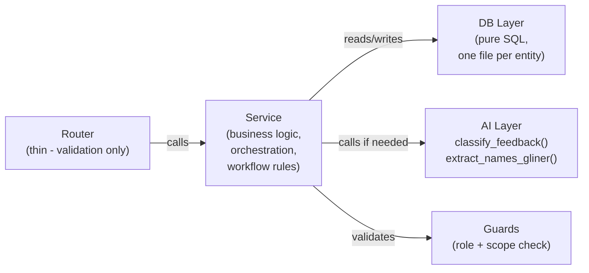

**Figure 5: Service Layer Pattern.**

**v1 pattern (legacy):** Some v1 routers contain business logic directly, calling db_layer functions without an intermediate service. This is a known inconsistency from early development.

**v2 pattern (preferred):** All v2 routers delegate to a service, which may call multiple db_layer functions, validate workflow transitions, and orchestrate AI calls. This produces cleaner, testable code.

Key v2 services:
- `inbox_service.py` — read-only inbox views per role
- `workflow_incident_service.py` — subcase workflow transition logic
- `case_creation_service.py` — complaint intake orchestration
- `case_response_service.py` — section response and RCA submission
- `insight_service.py` — analytics and KPI computation
- `action_log_classification_service.py` — action item classification for export

---

## 8. Database Access Layer

All SQL Server access goes through `pyodbc` via a connection factory in `core/database.py`. The db_layer files issue raw parameterized SQL — there is no ORM. Each file corresponds to one domain entity.

**Key db_layer files:**

| File | Entity | Key Tables |
|------|--------|-----------|
| `incident_case.py` | Main complaint case | `APP_IncidentCase` |
| `incident_case_feedback.py` | RCA records | `APP_IncidentCaseFeedback` |
| `incident_case_target_department.py` | Subcases | `APP_IncidentCaseTargetDepartment` |
| `incident_case_doctor.py` | Doctor linkages | `APP_IncidentCaseDoctor` |
| `incident_case_employee.py` | Employee linkages | `APP_IncidentCaseEmployee` |
| `action_items.py` | Action items | `APP_ActionItem` |
| `season_cases.py` | Seasonal cases | `APP_SeasonCase` |
| `seasonal_report.py` | Seasonal reports | `APP_SeasonalReport` |
| `org_unit_policy.py` | Thresholds | `APP_OrgUnitPolicy` |
| `auth_db.py` | User auth | `APP_Users`, `APP_Roles`, `APP_UserScopes` |
| `user_management_db.py` | User admin | `APP_Users` |
| `administrative_subcase_db.py` (v2) | Full subcase workflow | `APP_AdministrativeSubcase` |

**Connection management:** The connection factory uses `pyodbc.connect()` with the ODBC Driver 17 connection string. Connections are opened per request and closed after each db_layer call. There is no connection pooling — a known limitation under high concurrency.

---

## 9. Guards and Authorization Pattern

API v2 introduces a dedicated **guards layer** for clean, reusable authorization enforcement.

```python
# Example guard usage in v2 router
@router.get("/api/v2/workflow/inbox")
def get_inbox(current_user = Depends(require_section_admin)):
    return inbox_service.get_section_inbox(current_user)
```

**Guard types in `api_v2/guards/`:**

| Guard File | Guard Functions | Enforcement |
|-----------|----------------|-------------|
| `role_guards.py` | `require_supervisor_or_worker`, `require_section_admin`, `require_dept_admin`, `require_admin_level` | Role-only check, no DB access |
| `scoping.py` | `apply_scope_filter` | Org unit scope enforcement at query level |
| `high_level_guards.py` | High-level composite guards | Role + scope combined |
| `action_log_guards.py` | Action log specific | Export permission control |
| `drawer_notes_guards.py` | Drawer note visibility | Note-level access control |

**Guard design philosophy (v2):** Guards are FastAPI dependencies injected via `Depends()`. They perform only role validation — no DB queries, no business logic. Scope filtering is handled separately in the service layer, keeping concerns separated.

---

## 10. Authentication Architecture

HCAT Insight uses **session-based authentication** with no JWT tokens, no API keys, and no Authorization headers.

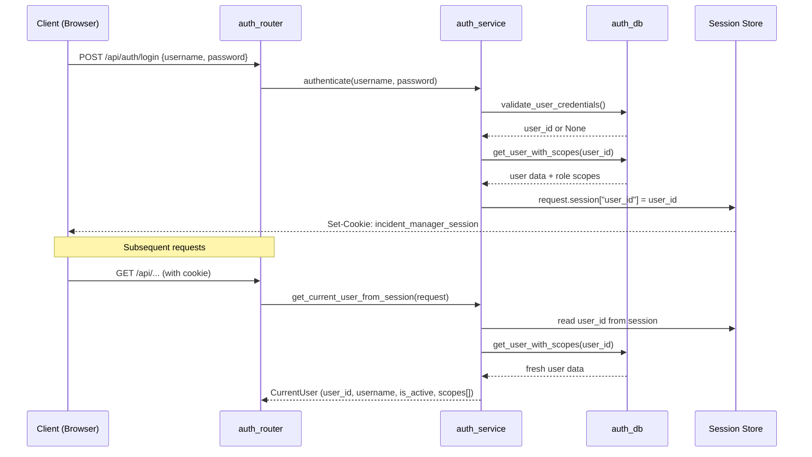

**Figure 6: Authentication Flow.**

**Scope resolution:** When a user logs in, `scope_resolver.py` selects the primary organizational unit from the user's role assignments using a priority hierarchy:
1. Administration-level scope (highest)
2. Department-level scope
3. Section-level scope (lowest)

This primary scope determines the default data visibility for the session.

**Security model:** Server-side sessions mean that deactivating a user in the database immediately prevents access on the next request — there is no token invalidation delay. The trade-off is that session storage is in-process memory, which is reset on server restart.

---

## 11. Frontend Architecture

The frontend is a **React Single Page Application (SPA)** served by IIS on port 80. It communicates with the backend exclusively through the REST API.

**Frontend technology stack:**
- React.js (JavaScript/TypeScript)
- State management: Redux Toolkit (inferred from `@reduxjs/toolkit` in node_modules)
- HTTP client: Axios or Fetch API
- Build output: static files served by IIS

**Frontend page categories** (derived from router and db_layer naming):
- Dashboard
- Table View (complaint list)
- Insert / Complaint Intake
- Case Detail View
- Investigation
- Follow-Up
- Red Flags
- Never Events
- Seasonal Reports
- Worker / Doctor Profiles
- Admin Panel (user management, section management)
- Settings / Configuration

**IIS hosting:** The React build output (static HTML, CSS, JS bundle) is placed in the IIS web root. IIS serves the files directly. The React Router handles client-side navigation, with IIS configured to redirect all 404s to `index.html` for SPA routing to work correctly.

---

## 12. Database Architecture

HCAT Insight uses two separate databases for two distinct purposes.

### 12.1 SQL Server — IncidentManager (Operational)

The primary operational database stores all live system data.

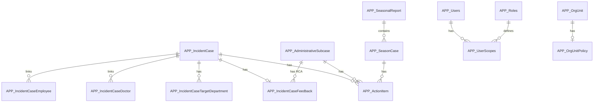

**Figure 7: Core Database Entity Relationships (simplified).**

**Key table groups:**

| Group | Tables | Purpose |
|-------|--------|---------|
| Complaint | `APP_IncidentCase`, `APP_IncidentCaseTargetDepartment`, `APP_IncidentCaseFeedback`, `APP_IncidentCaseDoctor`, `APP_IncidentCaseEmployee` | Core complaint data and linkages |
| Workflow | `APP_AdministrativeSubcase` | Subcase status state machine |
| Action | `APP_ActionItem` | Corrective actions |
| Seasonal | `APP_SeasonalReport`, `APP_SeasonCase` | Quarterly reporting |
| Auth | `APP_Users`, `APP_Roles`, `APP_UserScopes` | RBAC authentication |
| Org | `APP_OrgUnit`, `APP_OrgUnitPolicy` | Hospital hierarchy and thresholds |
| External | `VW_HrEmployeeProfileView`, `VW_PatientAdmission`, `VW_Doctors` | SQL views to hospital systems |

### 12.2 SQLite — ML Training Database

The ML training database (`patient_feedback_ml.db`) stores precomputed embeddings and encoded labels for model training.

| Table | Rows | Purpose |
|-------|------|---------|
| `patient_feedback_encoded` | 476 | Active clean dataset with all embeddings |
| `patient_feedback_encoded_Old` | 485 | Previous version (archived) |
| `table_feedback_train` | 380 | Training split |
| `table_feedback_test` | 96 | Test split |

---

## 13. ML Model Integration Architecture

The ML system is integrated as a module import — not as a separate microservice. All AI inference happens in-process within the FastAPI application.

### 13.1 Model Loading Strategy

All ML models are **pre-loaded at application startup** via warmup events to eliminate cold-start latency on first request:

```python
# Startup event 1: ML classification models
classify_feedback("Warmup initialization text.", "", "", Print=False)
# → Loads: tokenizer, transformer, all hierarchical predictors,
#   severity, harm, stage, classification EN models

# Startup event 2: Whisper STT model
get_whisper_model()
# → Loads: Faster Whisper model into RAM
```

The GLiNER NER model uses **lazy loading** — loaded on first NER request, then cached as a singleton.

### 13.2 ML Model Package

The unified inference entry point is:
```
models_directory/Classification_Models/package_models.py → classify_feedback()
```

This function:
1. Takes `patient_text`, `text_2`, `text_3` as inputs
2. Generates embeddings using the pre-loaded MPNet model
3. Passes embeddings through the hierarchical classification pipeline
4. Returns predicted labels for all nine HCAT dimensions

### 13.3 Speech-to-Text Integration

The Faster Whisper STT model is loaded at startup from:
```
models_directory/STT_Models/Faster_Wisper.py
```

The `stt_router` exposes STT as an API endpoint. The router accepts audio input and returns transcribed Arabic text, which can then be passed through the standard classification pipeline.

### 13.4 NER Integration

GLiNER NER is integrated via:
```
models_directory/NER_Model/solution_gliner.py → extract_names_gliner_arabic()
backend/api/services/ner_service.py → extract_entities()
backend/api/routers/ner_router.py
```

---

## 14. Application Startup Sequence

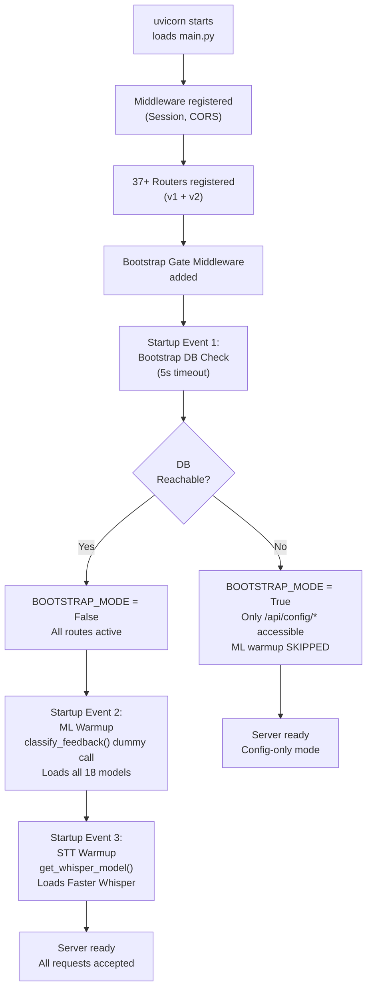

**Figure 8: Application Startup Sequence.**

**Startup performance:** On a CPU-only VM, loading all 18 ML models plus the Whisper STT model at startup takes approximately 30–120 seconds depending on hardware. This is a one-time cost — subsequent inferences use pre-loaded models with near-zero initialization delay.

---

## 15. Configuration Architecture

HCAT Insight uses a layered configuration system designed for easy management in a hospital's offline environment.

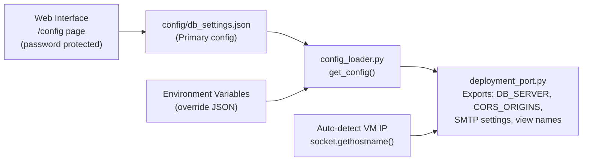

**Figure 9: Configuration Architecture.**

**Configuration hierarchy:**
1. `config/db_settings.json` — base configuration file (edited via web interface or manually)
2. Environment variables — override JSON values if set
3. `deployment_port.py` — the single source of truth exported throughout the codebase

**Auto-IP detection:** At module load time, `deployment_port.py` detects the VM's current IP address by attempting a socket connection to `8.8.8.8:80`. This auto-generated IP is added to CORS origins and used in API URL construction, ensuring the system works after VM IP changes without manual configuration updates.

**Bootstrap mode:** If the database is unreachable at startup, only the `/config` web page and `/api/config/*` endpoints are accessible, allowing the database connection to be reconfigured without filesystem access.

---

## 16. Request Lifecycle

A typical authenticated API v2 request follows this path:

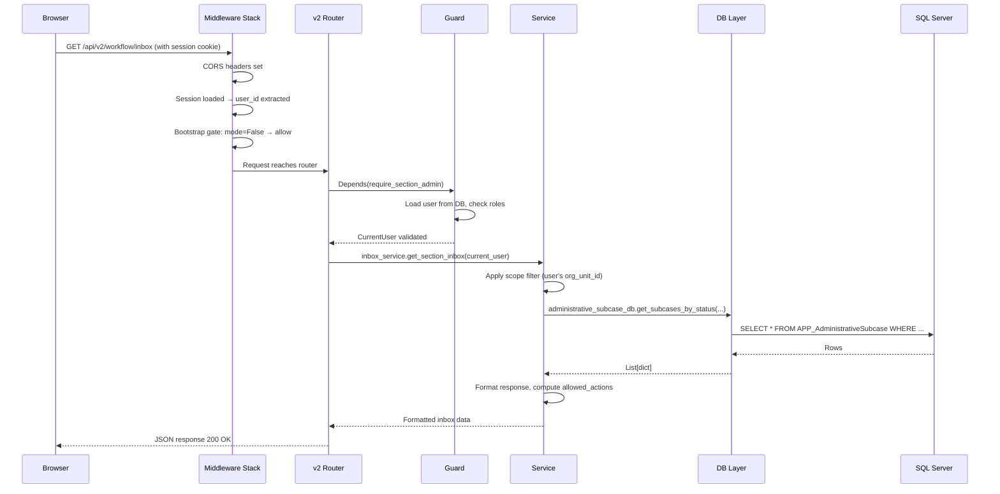

**Figure 10: API v2 Request Lifecycle.**

---

## 17. Subcase Workflow State Machine

The subcase approval state machine is the core of the HCAT Insight workflow engine, implemented in `api_v2/services/workflow_incident_service.py` and `api_v2/services/inbox_service.py`.

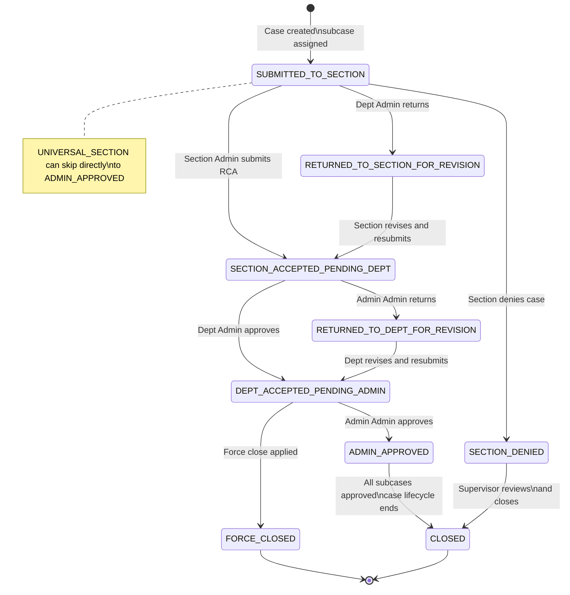

**Figure 11: Complete Subcase Status State Machine.**

**Inbox routing by status:**

| Status | Inbox Owner | Allowed Actions |
|--------|-------------|----------------|
| `SUBMITTED_TO_SECTION` | SECTION_ADMIN, UNIVERSAL_SECTION | Submit RCA, Deny |
| `RETURNED_TO_SECTION_FOR_REVISION` | SECTION_ADMIN, UNIVERSAL_SECTION | Revise and resubmit |
| `SECTION_ACCEPTED_PENDING_DEPT` | DEPARTMENT_ADMIN | Approve, Return |
| `RETURNED_TO_DEPT_FOR_REVISION` | DEPARTMENT_ADMIN | Revise and resubmit |
| `DEPT_ACCEPTED_PENDING_ADMIN` | ADMINISTRATION_ADMIN | Final approve, Force close |
| `SECTION_DENIED` | COMPLAINT_SUPERVISOR | Review |
| `ADMIN_APPROVED` | — (terminal) | No actions |
| `CLOSED` | — (terminal) | No actions |
| `FORCE_CLOSED` | — (terminal) | No actions |

---

## 18. Architectural Tradeoffs and Design Decisions

| Decision | What Was Chosen | Alternative Not Chosen | Reason |
|----------|----------------|----------------------|--------|
| **No ORM** | Raw SQL via pyodbc | SQLAlchemy, Django ORM | Full control over queries; no abstraction overhead for complex reporting queries |
| **Session auth** | Starlette sessions | JWT tokens | Immediate revocation capability; simpler for hospital network; no token storage on client |
| **Coexisting API versions** | v1 + v2 on same app | Full migration to v2 | Backward compatibility with frontend; progressive migration without breaking changes |
| **In-process AI** | ML models loaded into FastAPI process | Separate ML microservice | Simpler deployment on single VM; no inter-service network call |
| **Pre-loaded models** | Warmup at startup | Lazy loading per request | Eliminates first-request latency; better user experience |
| **Raw config JSON** | `db_settings.json` with web editor | Environment-only config | Hospital staff can reconfigure via browser without server access |
| **SQLite for ML** | Local SQLite database | Storing embeddings in SQL Server | Keeps ML artifacts separate from operational data; SQLite is portable and serverless |
| **No connection pooling** | Open/close per db call | Connection pool | Simpler implementation; acceptable under expected concurrent load |
| **Single VM deployment** | All tiers on one machine | Separated DB server | Offline constraint — hospital does not allow internet or external server access |

---

## 19. Known Architectural Limitations

| Limitation | Description | Impact |
|-----------|-------------|--------|
| **Session secret hardcoded** | `secret_key="CHANGE_ME_IN_PRODUCTION..."` in main.py | Security risk if VM is compromised; should be env variable |
| **No connection pooling** | pyodbc connections opened and closed per request | Performance degradation under concurrent load |
| **In-process ML** | ML models share FastAPI's process RAM | Large memory footprint; no isolation if model causes error |
| **system_settings_router disabled** | Commented out in main.py due to pydantic bug | Admin feature unavailable until bug is fixed |
| **v1/v2 pattern inconsistency** | Some v1 routers contain business logic; v2 has clean separation | Maintenance complexity |
| **Session memory only** | Sessions lost on server restart | Users must re-login after server restart |
| **No HTTPS** | `https_only=False` on session cookie | Session cookie sent over HTTP; acceptable on intranet only |
| **Static CORS** | Auto-detected IP added at startup | If VM IP changes while server is running, CORS must be restarted |

---

## 20. Conclusion

HCAT Insight's technical architecture is a pragmatic, constraint-driven design that prioritizes operational reliability in an offline hospital environment over theoretical elegance.

The key architectural characteristics are:

1. **Four-layer backend:** Middleware → Router → Service → DB Layer, with a dedicated Guards layer in api_v2
2. **Dual API versioning:** v1 for stability, v2 for progressive modernization — both coexisting on one FastAPI instance
3. **Session-based security:** No JWT complexity, immediate revocation, simple hospital network deployment
4. **In-process AI:** All models loaded at startup and served from FastAPI's process — no microservice overhead
5. **Configuration-first design:** Web-based config editor, auto-IP detection, and bootstrap mode make the system self-configuring in the hospital's dynamic network environment
6. **Complete subcase state machine:** Nine-state workflow implemented in api_v2 with strict role-based inbox routing

The primary technical debt items are the hardcoded session secret, missing HTTPS enforcement, the absence of connection pooling, and the v1/v2 pattern inconsistency — all manageable within the current intranet-only deployment context.

---

*Document prepared for research and academic publication purposes.*
*Source of truth: `backend/main.py`, `backend/core/`, `backend/api/`, `backend/api_v2/` — HCAT Insight codebase at Rassoul Azam Hospital.*
