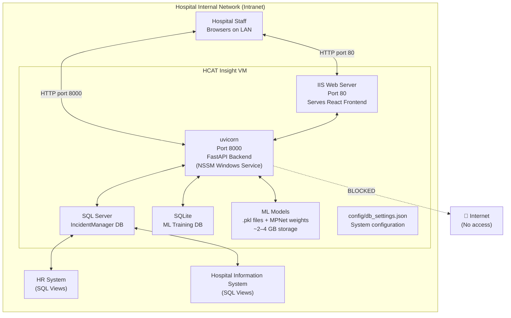
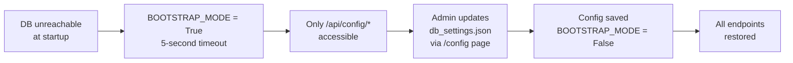
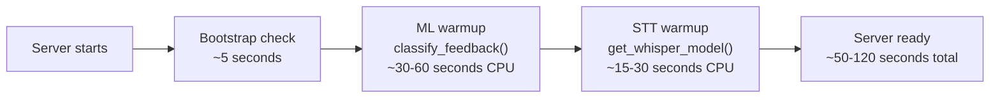
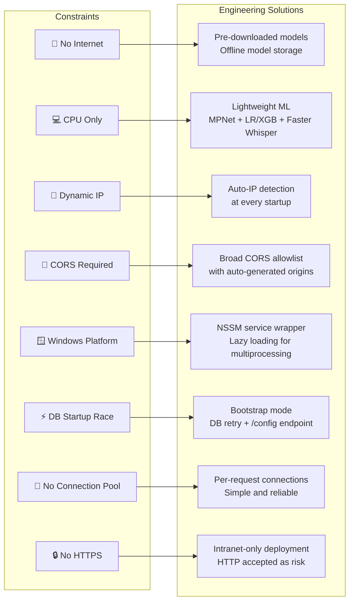

# Deployment Constraints
## HCAT Insight — Rassoul Azam Hospital
**Document:** 08 — Deployment Constraints
**Version:** 1.0
**Date:** May 2026
**Project:** HCAT Insight — AI-Assisted Healthcare Complaint Management System

---

## Table of Contents

1. [Introduction](#1-introduction)
2. [Deployment Environment Overview](#2-deployment-environment-overview)
3. [Offline Network Constraint](#3-offline-network-constraint)
4. [Hardware Limitations](#4-hardware-limitations)
5. [Operating System and Platform Constraints](#5-operating-system-and-platform-constraints)
6. [Database Connectivity Challenges](#6-database-connectivity-challenges)
7. [Networking and IP Challenges](#7-networking-and-ip-challenges)
8. [CORS Configuration Complexity](#8-cors-configuration-complexity)
9. [Frontend Deployment on IIS](#9-frontend-deployment-on-iis)
10. [Backend Service Management](#10-backend-service-management)
11. [AI Model Deployment Constraints](#11-ai-model-deployment-constraints)
12. [Security Constraints](#12-security-constraints)
13. [Startup and Reliability Challenges](#13-startup-and-reliability-challenges)
14. [Storage and Backup Constraints](#14-storage-and-backup-constraints)
15. [Constraint-to-Solution Map](#15-constraint-to-solution-map)
16. [Lessons Learned](#16-lessons-learned)
17. [Conclusion](#17-conclusion)

---

## 1. Introduction

This document honestly documents the real-world deployment constraints, infrastructure limitations, engineering struggles, and operational challenges that shaped and affected the development and deployment of **HCAT Insight** at Rassoul Azam Hospital (RAH).

The deployment environment is a **single offline virtual machine** within the hospital's internal network. Every architectural decision described in Document 03 — Technical Architecture has a counterpart constraint described here. Understanding these constraints is essential context for interpreting the system's design choices, performance characteristics, and known limitations.

This document does not present an idealized deployment. It presents the operational reality — including failures, workarounds, and unresolved issues — because accurate constraint documentation is itself a research and engineering contribution.

---

## 2. Deployment Environment Overview



**Figure 1: Real Deployment Environment.**

**Hardware specifications:**

| Property | Value |
|----------|-------|
| **Deployment type** | Virtual Machine — hospital intranet |
| **Operating system** | Windows Server 2025 Datacenter (10.0.26100) |
| **GPU** | None |
| **Internet access** | None |
| **Network scope** | Hospital LAN only |
| **Backend port** | 8000 (uvicorn) |
| **Frontend port** | 80 (IIS) |
| **Database** | Microsoft SQL Server on the same VM |

---

## 3. Offline Network Constraint

The most fundamental and far-reaching constraint on the entire HCAT Insight system is the **complete absence of internet access**. The VM operates exclusively within the hospital's internal network with no outbound connectivity.

### 3.1 What This Ruled Out

| Capability | Why Ruled Out |
|-----------|--------------|
| OpenAI / Anthropic APIs | Require internet; cannot be called from offline VM |
| Hugging Face model downloads at runtime | No internet; all models must be pre-downloaded |
| Cloud databases | No connectivity |
| Any SaaS service | No connectivity |
| Package installation at runtime | pip install requires internet |
| Automatic model updates | Cannot pull new weights |
| External authentication services | No OAuth, no LDAP unless on LAN |

### 3.2 Engineering Response

All dependencies — Python packages, ML model weights, tokenizer files, and reference data — must be **pre-installed and stored locally** before the VM is disconnected from internet access. This was done once during the development setup phase.

The embedding model (`paraphrase-multilingual-mpnet-base-v2`) and the GLiNER NER model (`NAMAA-Space/gliner_arabic-v2.1`) are stored in:
```
models_directory/Classification_Models/model_storage/mpnet_embeddings/
models_directory/NER_Model/
```

The Faster Whisper STT model is stored locally in:
```
models_directory/STT_Models/
```

**Consequence:** Any future model upgrade, library update, or new dependency must be downloaded externally and manually transferred to the VM. This creates a maintenance overhead that scales with system complexity.

---

## 4. Hardware Limitations

### 4.1 CPU-Only Inference

The VM has no GPU. All ML inference — embedding generation, classification, NER, and STT — runs on CPU cores only.

**Impact on model selection:**

| Requirement | GPU-Assumed Approach | CPU-Compatible Approach Chosen |
|------------|---------------------|-------------------------------|
| Text embeddings | Fine-tuned BERT variants | Pre-trained MPNet (no fine-tuning) |
| Classification | Neural heads, end-to-end training | scikit-learn + XGBoost on embeddings |
| NER | Custom fine-tuned NER model | Pre-trained GLiNER (zero-shot capable) |
| STT | Real-time neural transcription | Faster Whisper (CTranslate2 optimized for CPU) |
| LLM inference | GPT/Claude via API | Not applicable (offline) |

**Embedding generation time (CPU):** Generating embeddings for one complaint text takes approximately 0.5–2 seconds depending on text length. At inference time this is acceptable. For batch retraining (476 records), total embedding generation takes several minutes.

### 4.2 RAM Constraints

Loading all ML components simultaneously into RAM represents a significant memory footprint:

| Component | Estimated RAM |
|-----------|--------------|
| MPNet embedding model | ~400 MB |
| 18 classification models (.pkl) | ~50–200 MB |
| GLiNER NER model | ~300–600 MB |
| Faster Whisper model | ~500 MB – 1.5 GB (depends on variant) |
| FastAPI + Python runtime | ~200–400 MB |
| SQL Server (same VM) | Variable (typically 1–4 GB) |
| **Total estimated** | **~2–7 GB** |

If the VM's RAM is insufficient to hold all components simultaneously, model loading will fail silently or cause server crashes. The startup warmup events were designed to surface these failures early — a failed warmup logs an error but does not prevent the server from starting, allowing the system to degrade gracefully.

### 4.3 No GPU Acceleration

Without a GPU, the following approaches are impractical on this hardware:
- Fine-tuning any transformer model
- Running large language models (>1B parameters) for inference
- Real-time high-quality STT on long audio
- Batch processing of hundreds of complaints in parallel

All these limitations are documented in **Document 14 — Limitations and Future Work** as future improvement opportunities.

---

## 5. Operating System and Platform Constraints

### 5.1 Windows Server 2025

The VM runs Windows Server 2025 Datacenter. While Python and FastAPI are cross-platform, the Windows environment introduced several platform-specific challenges:

| Challenge | Description | Resolution |
|-----------|-------------|-----------|
| **NSSM for service management** | uvicorn does not natively install as a Windows service | NSSM (Non-Sucking Service Manager) wraps uvicorn as a Windows service |
| **pyodbc ODBC driver** | SQL Server connection requires ODBC Driver 17 installed separately | ODBC Driver 17 for SQL Server installed on VM |
| **File path separators** | Windows uses `\` vs Unix `/` in paths | Python's `pathlib` used throughout; some raw string paths with `r"..."` |
| **Process isolation** | Windows process model differs from Linux for multiprocessing | GLiNER model uses lazy loading to avoid Windows multiprocessing issues |
| **Case sensitivity** | Windows file system is case-insensitive; code written on case-sensitive systems may break | Verified all imports use correct casing |

The GLiNER model code explicitly comments on Windows compatibility:
```python
# Load Arabic GLiNER model (lazy loading to support Windows multiprocessing)
_gliner_model = None
def get_gliner_model():
    global _gliner_model
    if _gliner_model is None:
        _gliner_model = GLiNER.from_pretrained("NAMAA-Space/gliner_arabic-v2.1")
    return _gliner_model
```

### 5.2 IIS Hosting

The React frontend is hosted on IIS (Internet Information Services). This introduced specific configuration requirements:

- **URL Rewrite rules:** React Router uses client-side routing. Without IIS URL Rewrite configured, navigating directly to a URL like `/dashboard/cases` returns a 404 from IIS because no physical file exists at that path. A URL Rewrite rule redirecting all 404s to `index.html` is required.
- **Static file MIME types:** Some file extensions (`.webp`, `.woff2`, `.json`) may not be registered in IIS by default and require manual MIME type addition.
- **Cache headers:** Aggressive caching of JS/CSS bundles vs. no-cache for `index.html` requires IIS web.config configuration.

---

## 6. Database Connectivity Challenges

### 6.1 SQL Server on the Same VM

Running SQL Server on the same VM as the application is a deployment choice driven by the single-VM constraint. This creates several operational characteristics:

- **Resource contention:** SQL Server competes with FastAPI, ML models, and IIS for RAM and CPU. Under heavy load, this can cause slow query responses.
- **No network latency:** The SQL connection is loopback, providing near-zero network latency for queries.
- **Single point of failure:** If the VM goes down, everything goes down simultaneously.

### 6.2 Dynamic Database Configuration

A recurring operational challenge was updating the database connection string without restarting the application or editing files directly on the server. The bootstrap configuration system was built to address this:



**Figure 2: Bootstrap Mode Recovery Flow.**

This mechanism allows the system to be reconfigured without filesystem access — through the browser — which is critical when the hospital's network team changes SQL Server settings.

### 6.3 Connection String Management

The ODBC connection string is built dynamically from `db_settings.json`:

```python
f"DRIVER={{{DB_DRIVER}}};SERVER={DB_SERVER};DATABASE={DB_DATABASE};Trusted_Connection=yes;TrustServerCertificate=yes;"
```

`TrustServerCertificate=yes` is required because the SQL Server on the VM does not have a valid CA-signed SSL certificate — a common reality in hospital infrastructure where certificates are managed at the network perimeter, not on individual servers.

### 6.4 No Connection Pooling

Every database operation opens a fresh `pyodbc` connection and closes it after the operation. This is a simplicity-first decision that avoids connection pool management complexity, but it has measurable performance implications:

- Each request that hits the database incurs a connection establishment overhead (~5–20ms on loopback)
- Under concurrent user load, this overhead compounds
- There is no upper bound on simultaneous connections, though the SQL Server itself will enforce its own connection limits

---

## 7. Networking and IP Challenges

### 7.1 Dynamic VM IP Address

The hospital's internal network does not guarantee a static IP address for the HCAT Insight VM. The VM's IP may change after reboots or network reconfigurations. This created a recurring problem: the frontend JavaScript bundle contains the backend API URL baked in at build time, and CORS headers require explicit origin allowlists.

**Engineering solution:** Auto-IP detection in `deployment_port.py`:

```python
def _get_local_ip() -> str:
    try:
        s = socket.socket(socket.AF_INET, socket.SOCK_DGRAM)
        s.settimeout(2)
        s.connect(("8.8.8.8", 80))   # Does not send data; just resolves local IP
        ip = s.getsockname()[0]
        s.close()
        return ip
    except Exception:
        # Fallback: hostname resolution
        ...
        return "127.0.0.1"
```

At every server startup, the VM's current IP is detected and dynamically added to both the CORS origins list and the backend API URL. This means that if the IP changes and the server is restarted, the new IP is automatically accommodated — without any manual configuration change.

**Remaining limitation:** If the VM IP changes while the server is running, the new IP is not in the CORS allowlist until the next restart. Users on the new IP will experience CORS errors until the server is restarted.

### 7.2 Port Separation Between Frontend and Backend

Because IIS serves the frontend on port 80 and uvicorn serves the backend on port 8000, the browser treats these as different origins. CORS is required even though both components are on the same machine.

The CORS configuration generates origin patterns for both the detected IP and the hostname:
```python
_auto_cors = [
    f"http://{AUTO_DETECTED_IP}",
    f"http://{AUTO_DETECTED_IP}:80",
    f"http://{AUTO_DETECTED_IP}:3000",
    f"http://{AUTO_DETECTED_IP}:5173",
    f"https://{AUTO_DETECTED_IP}",
    "http://localhost",
    "http://localhost:80",
    ...
]
```

This broad CORS allowlist is a pragmatic response to the VM's changing IP and the multiple development/test environments the system was accessed from.

---

## 8. CORS Configuration Complexity

CORS was one of the most persistent and time-consuming operational problems during development and deployment.

| CORS Problem | Trigger | Symptoms | Resolution |
|-------------|---------|----------|-----------|
| **Origin mismatch** | VM IP changed | All API calls fail with CORS error | Restart server (auto-detection picks up new IP) |
| **Mixed content** | HTTP frontend calling HTTP backend | CORS works but browsers block on some configurations | `https_only=False` on session; no HTTPS in LAN |
| **Credential cookie** | Session cookie not sent cross-origin | 401 on all authenticated requests after login | `allow_credentials=True` + `same_site="lax"` |
| **Preflight failure** | OPTIONS request blocked | POST/DELETE requests fail | `allow_methods=["*"]` + `allow_headers=["*"]` |
| **Development vs Production** | `localhost:3000` vs VM IP | API works in dev, fails on VM | Both origins added to allowlist |

---

## 9. Frontend Deployment on IIS

### 9.1 React SPA on IIS

Deploying a React single-page application on IIS requires specific configuration that is not required on development servers (like `npm start`):

```xml
<!-- web.config required for React Router on IIS -->
<configuration>
  <system.webServer>
    <rewrite>
      <rules>
        <rule name="React Routes" stopProcessing="true">
          <match url=".*" />
          <conditions>
            <add input="{REQUEST_FILENAME}" matchType="IsFile" negate="true" />
            <add input="{REQUEST_FILENAME}" matchType="IsDirectory" negate="true" />
          </conditions>
          <action type="Rewrite" url="/index.html" />
        </rule>
      </rules>
    </rewrite>
  </system.webServer>
</configuration>
```

Without this URL rewrite rule, any direct navigation to a non-root URL returns a 404 from IIS, breaking React Router navigation.

### 9.2 Frontend Build Deployment

After every code change, the React build must be:
1. Built on a development machine (`npm run build`)
2. Transferred to the VM (no internet-based CI/CD)
3. Copied to the IIS web root
4. IIS application pool recycled if needed

This manual process creates deployment friction and requires direct VM access for every update.

---

## 10. Backend Service Management

### 10.1 NSSM — Windows Service Wrapper

uvicorn is a Python ASGI server that does not natively integrate with Windows Service Control Manager. NSSM wraps it as a Windows service, providing:
- Automatic restart on crash
- Startup with Windows boot
- Log file management
- Service start/stop via Windows Services panel

**NSSM configuration for HCAT Insight:**
```
Service name: HCATInsightBackend
Application: C:\path\to\python.exe
Arguments: -m uvicorn backend.main:app --host 0.0.0.0 --port 8000
Startup directory: C:\path\to\Patient_Feedback\
```

### 10.2 Service Restart Behavior

When the NSSM service restarts (after crash or update):
- All in-process session data is lost → all users are logged out
- ML models must be reloaded from disk → 30–120 second startup delay
- The bootstrap check runs again → if SQL Server is starting up simultaneously, bootstrap mode may trigger

**Startup race condition:** If Windows restarts the VM, SQL Server and the FastAPI backend both start simultaneously. If FastAPI starts before SQL Server is ready, the bootstrap check fails and the system enters bootstrap mode even though SQL Server will be available shortly. This requires a manual server restart or a delayed startup configuration in NSSM.

---

## 11. AI Model Deployment Constraints

### 11.1 Local Model Storage

All AI models must be pre-downloaded and stored on the VM. The storage requirement for all AI components:

| Component | Storage | Location |
|-----------|---------|---------|
| MPNet embedding model | ~400 MB | `models_directory/Classification_Models/model_storage/mpnet_embeddings/` |
| 18 classification models (.pkl) | ~10–50 MB | `models_directory/Classification_Models/` |
| GLiNER NER model | ~300–600 MB | `models_directory/NER_Model/` (downloads to cache on first load) |
| Faster Whisper model | ~500 MB – 1.5 GB | `models_directory/STT_Models/` |
| SQLite ML database | ~2–4 GB | `model_training/patient_feedback_ml.db` |
| **Total** | **~4–7 GB** | — |

### 11.2 Cold Start Latency

On server startup, loading all models takes significant time on CPU-only hardware:



**Figure 3: Startup Timeline.**

This startup delay is acceptable for a hospital system that runs continuously, but creates friction after planned or unplanned restarts.

### 11.3 Model Upgrade Process

Upgrading a model requires:
1. Download new model externally (internet access required)
2. Transfer files to VM (USB or network share)
3. Replace model files in the appropriate directory
4. Restart the NSSM service
5. Wait for warmup to complete

There is no automated model update mechanism — all upgrades are manual. This is a deliberate consequence of the offline constraint.

### 11.4 Model Version Tracking

There is no formal model registry or versioning system. Model files are replaced in-place. The training performance report (e.g., `classification_training_report_26_02_2026.txt`) serves as the primary record of which model version is deployed. This is a known gap in the operational infrastructure.

---

## 12. Security Constraints

### 12.1 No HTTPS

HCAT Insight runs on HTTP, not HTTPS. The session cookie is set with `https_only=False`, meaning it is transmitted in plaintext over HTTP.

**Why HTTP is used:**
- The hospital's HTTPS termination occurs at the network perimeter (firewall/load balancer), not at individual application servers
- Obtaining and managing SSL certificates for internal VM services was not within the project scope
- Within the hospital's intranet, the practical risk of HTTP-based session interception is lower than on a public internet connection

**Risk:** Session cookies can be intercepted by any device on the hospital's internal network through passive traffic capture. This is an accepted risk for an intranet-only system, but should be addressed if the system is ever exposed beyond the hospital LAN.

### 12.2 Hardcoded Session Secret

The session middleware secret key is hardcoded in `main.py`:
```python
SessionMiddleware(
    secret_key="CHANGE_ME_IN_PRODUCTION_USE_SECURE_RANDOM_KEY",  # TODO: Move to environment variable
    ...
)
```

This means all sessions share a static, predictable secret. If an attacker knows this key, they can forge session cookies. This is a documented technical debt item.

### 12.3 No Audit Logging

HCAT Insight does not implement centralized audit logging. Individual operations record `CreatedByUserID` and timestamps in the database, but there is no system-level log of who accessed what data, when, or what changes were made beyond database record timestamps.

### 12.4 Organizational Access Controls

Role-based access control is enforced at the application layer (FastAPI guards and service-layer scoping). There is no database-level row security — all database reads from the SQL Server connection have full table access. Application-layer scoping is the sole enforcement mechanism.

---

## 13. Startup and Reliability Challenges

### 13.1 Bootstrap Mode Trigger Conditions

Bootstrap mode (`BOOTSTRAP_MODE = True`) is triggered whenever the SQL Server connection test fails at startup. Common trigger conditions:

| Trigger | Frequency | Resolution |
|---------|-----------|-----------|
| SQL Server not yet ready on VM boot | Common after cold starts | Delay NSSM start or retry bootstrap check |
| Wrong database hostname after IP change | Occasional | Reconfigure via `/config` page |
| SQL Server service stopped | Rare | Restart SQL Server service |
| ODBC driver issue | Very rare | Reinstall ODBC Driver 17 |
| `db_settings.json` corrupted | Very rare | Restore from backup or reconfigure |

### 13.2 Process Crash Behavior

If the FastAPI process crashes while handling a request:
- NSSM detects the crash and restarts the process
- All in-flight requests fail
- All authenticated users are logged out (session memory cleared)
- ML models must reload (~50–120 seconds before server accepts requests)
- Active complaint sessions lose any unsaved data

### 13.3 VM Restart Procedure

A full VM restart requires a specific sequence to ensure stable startup:

```
1. Allow SQL Server to fully start (typically 30-60 seconds after Windows login)
2. NSSM service for HCATInsightBackend starts automatically
3. Bootstrap check runs — should pass since SQL Server is ready
4. ML warmup runs — takes 50-120 seconds
5. System accepts requests
```

If the NSSM service starts before SQL Server is ready, the administrator must manually restart the HCAT Insight service after SQL Server is up.

---

## 14. Storage and Backup Constraints

### 14.1 No Automated Backup

There is no automated backup system for the HCAT Insight database or model files. All data is stored on the VM's local disk. A disk failure would result in complete data loss.

Backup responsibility falls to the hospital's IT infrastructure team, which manages VM snapshots according to their standard procedures. The frequency and reliability of these snapshots is outside the HCAT Insight project's control.

### 14.2 SQLite Database Portability

The SQLite ML training database (`patient_feedback_ml.db`, ~2–4 GB due to embedding storage) can be copied as a single file for backup or transfer. This portability is one of the advantages of SQLite over SQL Server for the ML workload.

### 14.3 Model File Integrity

Replacing model `.pkl` files without a checksum verification system creates a risk of deploying corrupted or incompatible model files. There is no file integrity check at startup — if a `.pkl` file is corrupted, the error appears only when that specific model is called during inference or warmup.

---

## 15. Constraint-to-Solution Map



**Figure 4: Constraint-to-Solution Map.**

---

## 16. Lessons Learned

The following lessons emerged directly from the HCAT Insight deployment experience and are documented here for future reference and for the benefit of similar projects in constrained healthcare environments.

| # | Lesson | Detail |
|---|--------|--------|
| **1** | **Auto-detect, don't hardcode** | Dynamic IP detection eliminated a category of recurring deployment failures. Any network identifier (IP, hostname, port) should be detected at runtime rather than hardcoded. |
| **2** | **Bootstrap mode is essential** | A system that cannot configure itself when the database is unreachable requires manual file editing — unacceptable in a hospital environment. Bootstrap mode paid dividends immediately. |
| **3** | **Pre-load at startup, not on demand** | Model loading at first request creates an unacceptable user experience (30-second wait). Startup warmup events, while lengthening server start time, produce consistent inference response times. |
| **4** | **Separate ML storage from operational storage** | Keeping ML embeddings in SQLite and operational data in SQL Server prevented ML training operations from impacting the production database performance. |
| **5** | **CORS is harder than it looks** | In multi-port, dynamic-IP, mixed-protocol deployments, CORS requires careful, comprehensive configuration. The auto-generated CORS list handles edge cases that hardcoded lists would miss. |
| **6** | **Windows service management is non-trivial** | uvicorn + NSSM works, but startup ordering (SQL Server before FastAPI) requires explicit operational procedures that should be documented and ideally automated. |
| **7** | **Document the session secret immediately** | The hardcoded session secret was noted as a TODO in the first commit but never resolved. Security technical debt accumulates rapidly — it should have been moved to environment variable from the start. |
| **8** | **Offline means manual everything** | Model updates, library updates, frontend deployments, and configuration changes all require manual VM access. Plan for this operational overhead from the beginning. |

---

## 17. Conclusion

The HCAT Insight deployment environment represents a genuinely constrained real-world healthcare infrastructure scenario: a single offline VM, CPU-only computation, dynamic network configuration, Windows Server platform, and no internet connectivity. These constraints are not unusual for hospital IT environments, particularly in regions where cloud adoption in healthcare is limited.

The engineering response to these constraints was systematic:

- **Offline first:** All dependencies pre-installed; no runtime downloads
- **Auto-configuring:** IP detection, CORS generation, and bootstrap mode make the system self-adjusting within its environment
- **Startup-heavy:** Model loading at startup amortizes initialization cost over the entire session
- **Pragmatic security:** HTTP-only intranet deployment is an accepted risk, with session-based auth providing application-level security

The unresolved constraints — hardcoded session secret, no HTTPS, no connection pooling, no automated backup, no audit logging, and no model versioning — represent the honest technical debt of a system built under time and resource constraints. They are documented in full in **Document 14 — Limitations and Future Work** with concrete remediation paths.

The deployment experience of HCAT Insight demonstrates that production-quality AI-assisted healthcare systems can be built and operated under severe infrastructure constraints. The system processes real complaints, serves real hospital staff, and generates real organizational intelligence — entirely within a single offline VM with no cloud dependencies.

---

*Document prepared for research and academic publication purposes.*
*Source of truth: `backend/main.py`, `backend/core/deployment_port.py`, `backend/core/bootstrap.py`, operational deployment at Rassoul Azam Hospital (Windows Server 2025 Datacenter).*
