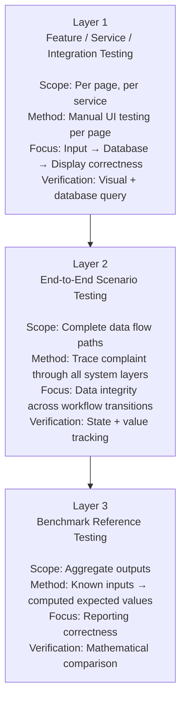
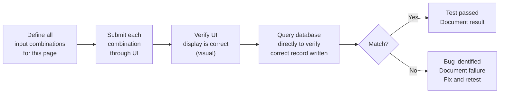
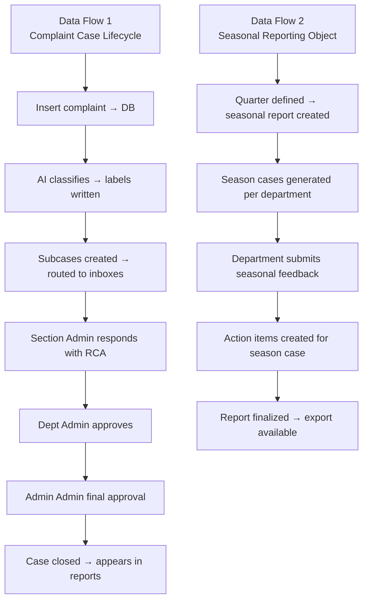

# Testing Methodology
## HCAT Insight — Rassoul Azam Hospital
**Document:** 12 — Testing Methodology
**Version:** 1.0
**Date:** May 2026
**Project:** HCAT Insight — AI-Assisted Healthcare Complaint Management System

---

## Table of Contents

1. [Introduction](#1-introduction)
2. [Testing Philosophy](#2-testing-philosophy)
3. [Testing Layers Overview](#3-testing-layers-overview)
4. [Layer 1 — Feature / Service / Integration Testing](#4-layer-1--feature--service--integration-testing)
5. [Layer 2 — End-to-End Scenario Testing](#5-layer-2--end-to-end-scenario-testing)
6. [Layer 3 — Benchmark Reference Testing](#6-layer-3--benchmark-reference-testing)
7. [Test Case Specification — 10-Complaint Benchmark](#7-test-case-specification--10-complaint-benchmark)
8. [AI Model Validation](#8-ai-model-validation)
9. [Deployment and Infrastructure Testing](#9-deployment-and-infrastructure-testing)
10. [Testing Limitations](#10-testing-limitations)
11. [Debugging Methodology](#11-debugging-methodology)
12. [Conclusion](#12-conclusion)

---

## 1. Introduction

This document describes the testing methodology applied to **HCAT Insight** during development and deployment. Testing a real-world operational system deployed in a hospital environment presents unique challenges: there is no automated CI/CD pipeline, no internet access for external testing services, no test environment separate from production, and no formal QA team. All testing was conducted manually or through purpose-built scripts within the constraints of the offline hospital VM.

Despite these limitations, a structured and mathematically grounded approach to testing was developed — one that produces verifiable, reproducible test results against known reference values rather than relying purely on subjective visual inspection.

The testing framework described here covers three distinct layers:
1. **Feature / Service / Integration Testing** — per-page, per-service validation
2. **End-to-End Scenario Testing** — complete complaint lifecycle data flow verification
3. **Benchmark Reference Testing** — mathematically defined test cases with computed expected outputs

---

## 2. Testing Philosophy

The central insight that drove the HCAT Insight testing approach is the following:

> *"If we make the input confined and well-defined, we will have a ground truth expected value for all the outputs of the system."*

This principle transforms testing from a subjective activity ("does this look right?") into a mathematically verifiable one ("does this output match the computed expected value?"). By designing test cases with precisely specified inputs and calculating the exact expected outputs before testing, the test becomes a formal verification rather than an exploratory check.

This approach was chosen because HCAT Insight's reporting system computes aggregate statistics (complaint counts per doctor, section case volumes, Red Flag distributions, seasonal breakdowns) that are mathematically deterministic given a known set of inputs. The test strategy exploits this determinism.

---

## 3. Testing Layers Overview



**Figure 1: Three-Layer Testing Structure.**

Each layer builds on the previous: feature testing confirms individual components work, end-to-end testing confirms components integrate correctly, and benchmark testing confirms the aggregate outputs of the whole system are mathematically accurate.

---

## 4. Layer 1 — Feature / Service / Integration Testing

This layer is sometimes called **per-page testing** because each test targets one page of the frontend and the services it invokes. The scope combines what software engineering calls Feature Testing, Service Testing, and Integration Testing into one practical unit, because in HCAT Insight each page corresponds to one feature, one or more services, and one or more database tables.

### 4.1 Testing Approach

For each page, a testing procedure is defined that:
1. Identifies all possible input combinations (binary and multi-value options)
2. Tests each combination systematically
3. Verifies that the correct data appears in the UI
4. Independently verifies that the correct data was written to the database



**Figure 2: Per-Page Testing Procedure.**

### 4.2 Pages Under Test

| Page | Primary Service | Test Focus |
|------|----------------|-----------|
| **Insert / Complaint Intake** | Case creation service | All input fields correct in DB; AI predictions applied; subcases created |
| **Table View** | List and filter service | Correct records displayed; filters produce correct subsets |
| **Case Detail** | Incident case service | All case fields displayed; subcase list correct |
| **Dashboard** | Dashboard service | Counts match database aggregates |
| **Investigation** | Investigation service | Investigation record linked to correct case |
| **Follow-Up** | Follow-up service | Follow-up record created and linked |
| **Red Flags** | Red flag router | Red Flag cases appear only in Red Flag view |
| **Never Events** | Never event router | Never Event cases appear correctly |
| **Seasonal Report** | Seasonal service | Correct complaint counts per department per season |
| **Worker Profile** | Worker reporting | Correct complaint/praise counts per worker |
| **Doctor Profile** | Doctor reporting | Correct complaint/praise counts per doctor |
| **Admin — Users** | User management | User created, role assigned, active/inactive toggle |
| **Admin — Sections** | Section admin | Section created; admin user linked |
| **Settings / Config** | Config router | DB settings saved and applied |

### 4.3 Insert Page — Detailed Test Protocol

The Insert (complaint intake) page is the most critical page for testing because it is the entry point for all data. Every field combination must be verified.

**Test dimensions for Insert page:**

| Dimension | Options | Test Approach |
|-----------|---------|--------------|
| Feedback type | Ordinary / Red Flag / Never Event | Test each independently |
| Patient type | Inpatient / Outpatient | Test both; verify HIS linkage |
| Target departments | 1 / 2 / 3+ departments | Test each; verify correct subcase count |
| Doctors linked | 0 / 1 / Multiple | Test each; verify APP_IncidentCaseDoctor records |
| Employees linked | 0 / 1 / Multiple | Test each; verify APP_IncidentCaseEmployee records |
| AI classification | Accept / Modify / Manual | Test each; verify correct labels in DB |

**Subcase creation verification:**
After inserting a complaint with N target departments, the database must contain exactly N rows in `APP_IncidentCaseTargetDepartment` linked to the new case ID. Exactly one row must have `IsPrimary = 1`.

---

## 5. Layer 2 — End-to-End Scenario Testing

End-to-end testing tracks the complete journey of data through all system layers — from initial complaint submission through the full workflow lifecycle — to verify that data remains consistent and correct at every transition.

### 5.1 Two Primary Data Flows

HCAT Insight has two major data flows, each with multiple branching paths that must be independently tested:



**Figure 3: Two Primary End-to-End Data Flows.**

### 5.2 Workflow State Verification

At each workflow transition, the test verifies:
- The subcase status in `APP_AdministrativeSubcase` changed to the expected value
- The correct user's inbox no longer shows the subcase (it moved to the next inbox)
- The next role's inbox now contains the subcase
- Any associated data (RCA record, explanation text) was correctly persisted

**Subcase transition test matrix:**

| Transition | Actor | Pre-condition | Post-condition | Verification |
|-----------|-------|--------------|----------------|-------------|
| Create → SUBMITTED_TO_SECTION | System | Case created | Subcase in section inbox | DB query: status = SUBMITTED_TO_SECTION |
| SUBMITTED → SECTION_ACCEPTED | Section Admin | RCA submitted | Subcase in dept inbox | DB: status = SECTION_ACCEPTED_PENDING_DEPT; RCA record exists |
| SECTION_ACCEPTED → DEPT_ACCEPTED | Dept Admin | Approved | Subcase in admin inbox | DB: status = DEPT_ACCEPTED_PENDING_ADMIN |
| DEPT_ACCEPTED → ADMIN_APPROVED | Admin Admin | Approved | Terminal state | DB: status = ADMIN_APPROVED |
| Any → RETURNED | Higher level | Revision required | Returns to lower inbox | DB: RETURNED_TO_* status; lower inbox shows case |

### 5.3 Red Flag and Never Event Path Testing

These high-priority cases must be verified to appear in their dedicated queues and trigger the correct notification behavior:

| Scenario | Expected Behavior | Verification |
|----------|-----------------|-------------|
| Insert with Red Flag type | Appears in Red Flag queue immediately | Red Flags endpoint returns the case |
| Insert with Never Event type | Appears in Never Events queue | Never Events endpoint returns the case |
| Red Flag case reaches ADMIN_APPROVED | Removed from active Red Flag queue | Queue no longer shows case |

---

## 6. Layer 3 — Benchmark Reference Testing

This is the most rigorous and mathematically structured layer of testing. It defines a **fixed test universe** — a controlled set of inputs with precisely known properties — and uses that universe to compute exact expected output values for every reporting feature in the system.

### 6.1 Design Principle

The benchmark test works by:
1. Defining the complete set of test data (patients, complaints, departments, doctors, workers, months)
2. Computing the ground truth expected value for every report metric **from the inputs alone** (without running the system)
3. Entering the test data into the system
4. Comparing the system's reported outputs against the precomputed expected values
5. Claiming correctness only when all outputs match their expected values exactly

### 6.2 Test Universe Definition

The benchmark test universe contains a deliberately small but maximally informative set of inputs:

| Parameter | Value | Rationale |
|-----------|-------|----------|
| Complaints | 10 | Small enough to track manually; large enough to produce meaningful aggregates |
| Patients | 5 | Each with a different complaint count (1, 2, 2, 2, 3) |
| Doctors | 5 | Each involved in different complaint subsets |
| Workers | 5 | Each involved in different complaint subsets |
| Months | 2 | Month 1 (Semester 1) and Month 12 (Semester 4) |
| Sections | 8 | Hospital sections covered across the 10 complaints |

**Patient distribution:**

| Patient | Complaints |
|---------|-----------|
| Patient 1 | 1 |
| Patient 2 | 2 |
| Patient 3 | 2 |
| Patient 4 | 2 |
| Patient 5 | 3 |
| **Total** | **10** |

---

## 7. Test Case Specification — 10-Complaint Benchmark

### 7.1 Case Definitions

Each test case is fully specified to eliminate ambiguity. The department targeting pattern is designed so that the expected aggregation results are easily computable.

**Month 1 (Cases 1–5):**

| Case | Patient | Type | Departments Targeted | Doctors | Workers | Priority |
|------|---------|------|---------------------|---------|---------|---------|
| 1 | Patient 1 | Complaint | Cardiac 1 | Doctor 1 | Worker 1 | Never Event |
| 2 | Patient 2 | Praise | Cardiac 1, قسم بنك الدم | Doctors 1–2 | Workers 1–2 | Red Flag |
| 3 | Patient 2 | Complaint | Cardiac 1, قسم بنك الدم, قسم التدريب | Doctors 1–3 | Workers 1–3 | Never Event |
| 4 | Patient 3 | Praise | Cardiac 1, قسم بنك الدم, قسم التدريب, قسم المباني | Doctors 1–4 | Workers 1–4 | Ordinary |
| 5 | Patient 3 | Complaint | Cardiac 1, قسم بنك الدم, قسم التدريب, قسم المباني, قسم ضبط العدوى | Doctors 1–5 | Workers 1–5 | Ordinary |

**Month 12 (Cases 6–10):**

| Case | Patient | Type | Departments Targeted | Doctors | Workers | Priority |
|------|---------|------|---------------------|---------|---------|---------|
| 6 | Patient 4 | Praise | قسم المنظرة | Doctor 5 | Worker 5 | Ordinary |
| 7 | Patient 4 | Complaint | قسم المنظرة, قسم الذكاء الاصطناعي | Doctors 4–5 | Workers 4–5 | Ordinary |
| 8 | Patient 5 | Praise | قسم المنظرة, قسم الذكاء الاصطناعي, قسم الجراحة القلبية | Doctors 3–5 | Workers 3–5 | Never Event |
| 9 | Patient 5 | Complaint | قسم المنظرة, قسم الذكاء الاصطناعي, قسم الجراحة القلبية, قسم ضبط العدوى | Doctors 2–5 | Workers 2–5 | Red Flag |
| 10 | Patient 5 | Praise | قسم المنظرة, قسم الذكاء الاصطناعي, قسم الجراحة القلبية, قسم ضبط العدوى, قسم المباني | Doctors 1–5 | Workers 1–5 | Red Flag |

**Total subcases Month 1 = 15, Total subcases Month 12 = 15, Total = 30**

### 7.2 Precomputed Reference Results

The following reference results are the mathematically correct expected outputs. They are computed purely from the case definitions above — without running the system. The system's output is correct if and only if it matches every reference result.

**Reference Result 1 — Patient Profiles (complaint count per patient):**

| Patient | Expected Complaint Count |
|---------|------------------------|
| Patient 1 | 1 |
| Patient 2 | 2 |
| Patient 3 | 2 |
| Patient 4 | 2 |
| Patient 5 | 3 |

**Reference Result 2 — Doctor Profiles (Month 1):**

| Doctor | Complaints | Praises |
|--------|-----------|---------|
| Doctor 1 | 3 (Cases 1,3,5) | 2 (Cases 2,4) |
| Doctor 2 | 2 (Cases 3,5) | 2 (Cases 2,4) |
| Doctor 3 | 2 (Cases 3,5) | 1 (Case 4) |
| Doctor 4 | 1 (Case 5) | 1 (Case 4) |
| Doctor 5 | 1 (Case 5) | 0 |

**Reference Result 3 — Doctor Profiles (Month 12):**

| Doctor | Complaints | Praises |
|--------|-----------|---------|
| Doctor 1 | 0 | 1 (Case 10) |
| Doctor 2 | 1 (Case 9) | 1 (Case 10) |
| Doctor 3 | 1 (Case 9) | 2 (Cases 8,10) |
| Doctor 4 | 2 (Cases 7,9) | 2 (Cases 8,10) |
| Doctor 5 | 2 (Cases 7,9) | 3 (Cases 6,8,10) |

**Reference Result 4 — Doctor Full Profile (both months combined):**

| Doctor | Total Complaints | Total Praises |
|--------|-----------------|--------------|
| Doctor 1 | 3 | 3 |
| Doctor 2 | 3 | 3 |
| Doctor 3 | 3 | 3 |
| Doctor 4 | 3 | 3 |
| Doctor 5 | 3 | 3 |

> This symmetric result is intentional — it confirms that the aggregation is working correctly and symmetrically across both months for all doctors.

**Reference Result 5 — Section Monthly Report (Month 1 — Subcases per section):**

| Section | Expected Subcase Count |
|---------|----------------------|
| Cardiac 1 | 5 |
| قسم بنك الدم | 4 |
| قسم التدريب | 3 |
| قسم المباني | 2 |
| قسم ضبط العدوى | 1 |
| قسم الجراحة القلبية | 0 |
| قسم الذكاء الاصطناعي | 0 |
| قسم المنظرة | 0 |
| **Total Month 1 Subcases** | **15** |

**Reference Result 6 — Section Monthly Report (Month 12 — Subcases per section):**

| Section | Expected Subcase Count |
|---------|----------------------|
| Cardiac 1 | 0 |
| قسم بنك الدم | 0 |
| قسم التدريب | 0 |
| قسم المباني | 1 |
| قسم ضبط العدوى | 2 |
| قسم الجراحة القلبية | 3 |
| قسم الذكاء الاصطناعي | 4 |
| قسم المنظرة | 5 |
| **Total Month 12 Subcases** | **15** |

**Reference Result 7 — Section Combined Report (Both months, total subcases):**

| Section | Total Subcases |
|---------|---------------|
| Cardiac 1 | 5 |
| قسم بنك الدم | 4 |
| قسم التدريب | 3 |
| قسم المباني | 3 |
| قسم ضبط العدوى | 3 |
| قسم الجراحة القلبية | 3 |
| قسم الذكاء الاصطناعي | 4 |
| قسم المنظرة | 5 |
| **Grand Total** | **30** |

**Reference Result 8 — Red Flag and Never Event Counts:**

| Month | Red Flags | Never Events |
|-------|-----------|-------------|
| Month 1 | 1 (Case 2) | 2 (Cases 1, 3) |
| Month 12 | 2 (Cases 9, 10) | 1 (Case 8) |

### 7.3 Test Execution Summary Table

| Feature | Reference Result | Claimed Status |
|---------|-----------------|---------------|
| Patient Profile counts | Reference Result 1 | To be verified |
| Doctor Month 1 counts | Reference Result 2 | To be verified |
| Doctor Month 12 counts | Reference Result 3 | To be verified |
| Doctor Full Profile | Reference Result 4 | To be verified |
| Section Month 1 subcases | Reference Result 5 | To be verified |
| Section Month 12 subcases | Reference Result 6 | To be verified |
| Section combined total | Reference Result 7 | To be verified |
| Red Flag counts | Reference Result 8 | To be verified |
| Never Event counts | Reference Result 8 | To be verified |
| Subcase Month 1 total | 15 | To be verified |
| Subcase Month 12 total | 15 | To be verified |
| Grand total subcases | 30 | To be verified |

---

## 8. AI Model Validation

AI prediction quality is validated separately from the system testing described above, using the held-out test set in the ML database.

### 8.1 Validation Approach

The ML models were trained on 380 records and evaluated on 96 held-out test records. The evaluation is performed by the training scripts and production evaluation scripts in `models_directory/Classification_Models/`.

**Primary evaluation metrics:**
- **Macro-averaged F1 score** (primary — accounts for class imbalance)
- **Per-class F1** (identifies model behavior on rare classes)
- **Accuracy** (reported but secondary — misleading under class imbalance)

**Evaluation scripts:**
- `model_training/Hierarchical_Classification_Model/evaluate_packaged_models.py` — evaluates the full hierarchical pipeline
- `model_training/Hierarchical_Classification_Model/generate_hierarchical_report.py` — generates a structured results report

### 8.2 Human Validation of Predictions

Beyond metric-based evaluation, AI predictions are validated operationally by complaint officers who review, accept, or correct each prediction. This human validation loop serves as:
- A real-world accuracy check beyond the test set
- A source of corrected training data for retraining cycles
- An ongoing audit of model reliability in production conditions

**Validation trigger:** If complaint officers consistently correct a specific prediction (e.g., Stage is frequently wrong for a specific category of complaint), this signals that the model for that target requires architectural revision or additional training data before the next retraining cycle.

### 8.3 Regression Testing After Retraining

After every retraining cycle, the new model set is evaluated against the same held-out test set. The new F1 scores are compared against the previous version's scores. The system requires that:
- No model's F1 score degrades by more than 5 percentage points
- The overall average F1 across all models does not decrease

If these conditions are not met, the previous model version is restored and the retraining is investigated before redeployment.

---

## 9. Deployment and Infrastructure Testing

### 9.1 Bootstrap Mode Testing

The bootstrap mode must be verified to:
- Activate correctly when the database connection string is wrong
- Block all non-config endpoints with HTTP 503
- Allow `/api/config/*` endpoints to work correctly
- Exit correctly when a valid connection is saved via `/api/config/save`

**Test procedure:** Temporarily provide an incorrect database hostname in `db_settings.json`, restart the service, confirm 503 responses on `/api/dashboard/`, confirm success on `/api/config/test-connection`, correct the hostname, verify normal operation resumes.

### 9.2 CORS Testing

CORS must be verified to work from:
- `http://localhost:3000` (development)
- `http://[VM_IP]:80` (production via IIS)
- `http://[VM_IP]` (production, no port)

**Test procedure:** Access the frontend from a different machine on the LAN. Confirm API calls succeed. Confirm session cookies are sent correctly (credentials mode).

### 9.3 Session Expiry Testing

Sessions are configured with a 24-hour lifetime. After 24 hours of inactivity, the session cookie expires and the user must re-authenticate.

**Test procedure:** Log in, wait for session expiry (or manually expire the cookie), confirm that the next API request returns HTTP 401, confirm redirect to login page occurs in the frontend.

### 9.4 Concurrent User Testing

HCAT Insight does not have a formal load testing framework. Basic concurrent user behavior is verified by having multiple simultaneous logins with different roles and confirming:
- Each user sees only their scoped data
- Simultaneous operations on different cases do not interfere
- The server does not crash or return errors under normal multi-user load

---

## 10. Testing Limitations

| Limitation | Description | Impact |
|-----------|-------------|--------|
| **No automated test suite** | All tests are manual; no pytest, no CI/CD pipeline | Regressions can be introduced undetected between manual test cycles |
| **No test environment** | Testing occurs on the production VM | Test data contaminates production reports until cleaned |
| **No load testing** | No formal assessment of performance under high concurrent load | Unknown behavior under peak usage |
| **No security testing** | No penetration testing, no OWASP scan | Security vulnerabilities may exist beyond documented gaps |
| **Manual AI validation** | Human review of predictions is not systematic | Prediction quality may degrade between retraining cycles without formal detection |
| **No browser compatibility matrix** | Tested informally on available browsers | May have issues on older hospital workstation browsers |
| **Test data cleanup** | Benchmark test data must be manually deleted from production DB after testing | Risk of contaminating production reports if cleanup is skipped |
| **No integration tests for AI pipeline** | ML pipeline tested via metrics, not end-to-end API calls | API-level failures in classification endpoint may not be caught during model testing |

---

## 11. Debugging Methodology

Given the absence of a formal test environment, debugging in HCAT Insight relied on a practical combination of approaches:

### 11.1 Backend Diagnostic Scripts

The `backend/` directory contains 20+ diagnostic scripts (prefixed with `TEST_`, `VERIFY_`, `DIAGNOSE_`, `CHECK_`, `TROUBLESHOOTING_`) that were written and retained as operational debugging tools:

```
TEST_COUNT_INTEGRITY.py       — Verifies record counts match expected values
TEST_DIRECT_DB.py             — Direct database connectivity test
DIAGNOSE_TARGET_DEPT_TYPES.py — Diagnoses subcase type mismatches
TROUBLESHOOTING_ML_INSERT.py  — Debugs ML prediction insert failures
VERIFY_FIELDS_SIMPLE.py       — Validates field presence in DB records
```

These scripts are not automated tests but **on-demand diagnostic tools** that can be run directly on the VM to investigate specific issues.

### 11.2 Database Query Validation

For every suspected data integrity issue, the debugging approach was:
1. Reproduce the issue through the UI
2. Query the relevant table(s) directly using the diagnostic scripts
3. Compare actual database state with expected state
4. Identify the discrepancy (missing record, wrong value, wrong relationship)
5. Trace back through the service and db_layer code to find the root cause
6. Fix and retest using the same query

### 11.3 FastAPI Documentation Interface

The FastAPI auto-generated documentation (`/docs`) was used extensively for isolated endpoint testing during development:
- Test individual endpoints without going through the frontend
- Verify request/response shapes
- Debug CORS and authentication issues in isolation
- Validate ML prediction endpoint outputs

### 11.4 Archive of Debug Scripts

The `archive/debug_scripts/` directory contains 40+ debugging scripts from development phases. These represent the debugging history of the project and serve as documentation of issues that were investigated and resolved.

---

## 12. Conclusion

The HCAT Insight testing methodology is built around three complementary approaches:

1. **Per-page functional testing** confirms that individual system components produce correct database records and display correct information for all input combinations.

2. **End-to-end flow testing** confirms that data remains consistent and correct as it travels through the complete complaint lifecycle — from intake through workflow transitions to final closure and reporting.

3. **Benchmark reference testing** provides mathematically verifiable ground truth: by defining a controlled set of 10 complaints with known properties, and computing the exact expected values for all aggregate metrics, the system's correctness can be verified with precision rather than approximation.

The testing framework's primary limitation is that it is entirely manual. The absence of automated tests, CI/CD integration, and a separate test environment represents a significant operational risk as the system evolves. The 20+ diagnostic scripts in the backend and 40+ debug scripts in the archive provide partial mitigation, but a formal automated test suite remains the most important single improvement to the testing infrastructure.

The benchmark reference test cases documented in Section 7 can be reproduced at any time to verify that a new deployment or software update has not broken any reporting functionality. This reproducibility is the strongest guarantee of correctness the current testing framework provides.

---

*Document prepared for research and academic publication purposes.*
*Source of truth: Obsidian project notes (41. Feature-Service-Integration Testing.md, 42. End-to-End Scenario Testing.md, 43. Building a Useful Test.md), HCAT Insight codebase — `backend/` diagnostic scripts.*
