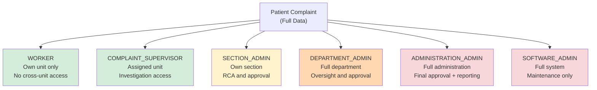
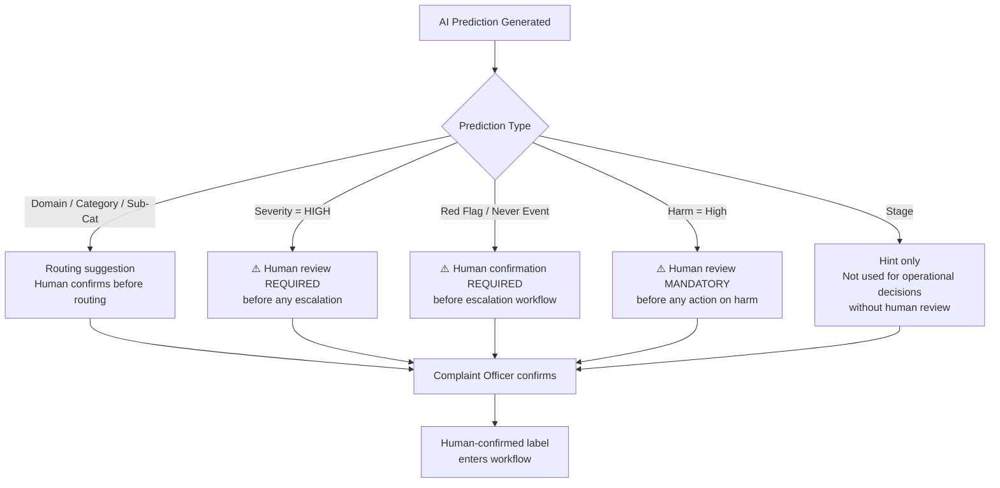

# Ethics and Privacy
## HCAT Insight — Rassoul Azam Hospital
**Document:** 13 — Ethics and Privacy
**Version:** 1.0
**Date:** May 2026
**Project:** HCAT Insight — AI-Assisted Healthcare Complaint Management System

---

## Table of Contents

1. [Introduction](#1-introduction)
2. [Healthcare Privacy Context](#2-healthcare-privacy-context)
3. [Sensitive Data Characteristics](#3-sensitive-data-characteristics)
4. [Patient Confidentiality](#4-patient-confidentiality)
5. [Organizational Confidentiality](#5-organizational-confidentiality)
6. [Role-Based Access and Visibility Controls](#6-role-based-access-and-visibility-controls)
7. [AI Ethics Considerations](#7-ai-ethics-considerations)
8. [Human Oversight Requirements](#8-human-oversight-requirements)
9. [Risks of AI Misclassification](#9-risks-of-ai-misclassification)
10. [Dataset Privacy Concerns](#10-dataset-privacy-concerns)
11. [Offline Deployment and Security](#11-offline-deployment-and-security)
12. [Operational Confidentiality](#12-operational-confidentiality)
13. [Ethical Limitations](#13-ethical-limitations)
14. [Institutional Governance](#14-institutional-governance)
15. [Conclusion](#15-conclusion)

---

## 1. Introduction

This document examines the ethical and privacy dimensions of **HCAT Insight** as deployed at Rassoul Azam Hospital (RAH). HCAT Insight handles patient complaints — a category of healthcare data that is simultaneously sensitive from the patient's perspective, sensitive from the organizational perspective, and consequential from the clinical safety perspective.

This document does not present idealized compliance frameworks. It presents the actual ethical and privacy realities of the deployed system — including genuine protections, acknowledged limitations, and unresolved risks. Honest documentation of ethical constraints is itself an ethical act.

---

## 2. Healthcare Privacy Context

Patient complaints occupy a unique position in the healthcare privacy landscape:

- They contain **patient-identifiable information** (names, medical conditions, dates, ward numbers)
- They describe **alleged staff failures**, making them sensitive from an employment and legal perspective
- They may be used as **evidence** in administrative investigations or legal proceedings
- They carry **clinical safety implications** — complaints about medication errors or surgical complications may indicate systemic risks to other patients
- They represent **a patient's exercise of their rights**, which must be protected to maintain trust in the complaint system itself

HCAT Insight's ethical obligations arise at the intersection of these four dimensions. A failure on any one — disclosure of patient identity, exposure of staff complaints to unauthorized staff, misuse of clinical safety information, or suppression of legitimate complaints — would constitute a serious ethical breach.

---

## 3. Sensitive Data Characteristics

HCAT Insight stores and processes the following categories of sensitive data:

| Data Category | Sensitivity Level | Examples |
|--------------|-----------------|---------|
| Patient full name | High — PII | Name extracted from complaint narrative |
| Patient ward/room | Medium — indirect PII | "Room 323", "ICU" |
| Medical condition details | High — PHI | Diagnosis names, procedure types, medication names |
| Named doctors | Medium | Doctor names mentioned in complaints |
| Named employees | Medium | Nurse, technician, staff names |
| Complaint narrative text | High | Contains all of the above in free text |
| Hospital administrative response | High | Contains clinical outcome data |
| HCAT classification labels | Low-Medium | Domain, Category, Harm level |
| User credentials | High | Usernames and hashed/stored passwords |

The most sensitive single item is the **complaint narrative text** (`ComplaintText` column). This field is a free-text Arabic narrative that may contain the patient's full name, the names of doctors and staff, descriptions of clinical events, medication information, and expressions of distress. It is not structured and cannot be automatically sanitized without potentially losing clinically significant information.

---

## 4. Patient Confidentiality

### 4.1 Access Scope

Patient complaint data is visible only to authorized users with a legitimate operational need. The scope controls described in Document 02 (Workflow Model) and Document 03 (Technical Architecture) enforce this:

- A **Worker** can only see complaints from their own organizational unit
- A **Section Admin** can only see complaints targeting their section
- A **Department Admin** can only see complaints within their department
- An **Administration Admin** sees all complaints within their administrative scope
- **SOFTWARE_ADMIN** has full access for system maintenance

No role provides access to complaints from outside the user's organizational scope. This means a nurse in one ward cannot browse complaints about a different ward.

### 4.2 Patient Name in ML Pipeline

The patient name (`PatientName` column) is **explicitly excluded from all ML inputs**. The ML classification pipeline accepts only the text fields (`ComplaintText`, `ImmediateAction`, `TakenAction`) and does not receive the patient's name as a feature. This is a deliberate data minimization decision.

The NER model (`GLiNER`) may extract patient names **mentioned within the complaint narrative text** for the purpose of case linkage. Extracted names are stored in `APP_IncidentCaseFeedback` linked to the specific case, not in any shared accessible index.

### 4.3 Patient Data Not Anonymized in Storage

Patient complaint data is stored in identifiable form in the SQL Server database. There is no anonymization or pseudonymization of stored records. This is consistent with operational requirements — complaint officers need to identify the patient to conduct follow-up and resolution.

The ethical protection is **access control**, not anonymization: only authorized staff with a legitimate need can access any specific complaint record.

---

## 5. Organizational Confidentiality

Complaint data is sensitive not only for patients but for the hospital organization. Complaints that name specific doctors, allege clinical errors, or describe institutional failures carry legal, reputational, and employment-related implications.

### 5.1 Staff Privacy

Named doctors and employees in complaints are linked to their HR and hospital directory records through the external system integration (`VW_HrEmployeeProfileView`, `VW_Doctors`). This linkage enables accurate reporting but also creates a risk: if complaint data were exposed to unauthorized parties, it could constitute unauthorized disclosure of employment-sensitive information.

HCAT Insight's access controls ensure that:
- Complaint data naming a specific doctor is visible to administrators at the level of that doctor's department and above
- Staff complaints are not visible to peers or subordinates
- A doctor cannot access complaints filed about themselves unless they also hold an administrative role in the system

### 5.2 Departmental Performance Data

Seasonal and monthly reports aggregate complaint data by department. A department administrator can see complaint rates, severity distributions, and Red Flag counts for their department. This information is operationally valuable but must be treated with the same confidentiality as individual complaint records — it reflects on the performance and quality of specific clinical teams.

---

## 6. Role-Based Access and Visibility Controls

**Figure 1: Data Visibility by Role.**

**Enforcement mechanism:** Visibility restrictions are enforced at the database query level through dynamic WHERE clauses filtering by `IssuingOrgUnitID` against the authenticated user's organizational assignments. There is no reliance on frontend-only filtering — the database returns only records the user is authorized to see.

**Limitation:** Enforcement is at the application layer, not at the database layer. A database administrator with direct SQL Server access can query any record without going through the HCAT Insight application. This represents an unmitigated privilege escalation path for IT administrators with direct database access.

---

## 7. AI Ethics Considerations

### 7.1 The Nature of AI-Assisted Classification

HCAT Insight uses AI to suggest classifications — it does not make autonomous decisions. The ethical boundary is maintained by the following principles:

| Principle | Implementation |
|-----------|---------------|
| **Suggestions, not decisions** | All AI predictions are displayed as suggestions; a human officer must confirm, modify, or reject each one |
| **No autonomous routing** | AI predictions influence display order and highlighting, but subcases are not routed to departments without human confirmation of the classification |
| **No autonomous escalation** | Red Flag and Never Event identification requires human confirmation — the AI can flag a case as a possible Red Flag, but a human sets the official classification |
| **Transparency of prediction** | Predictions are clearly marked as AI-generated in the interface |
| **Correction is expected** | The system is designed for prediction correction — corrected labels become training data, acknowledging that AI predictions will sometimes be wrong |

### 7.2 Algorithmic Fairness

HCAT Insight's training data reflects RAH's operational complaint history. Any systematic biases in how complaints have been historically classified — for example, if certain types of complaints were historically downgraded in severity — will be replicated by models trained on that data.

Known bias risks:

| Bias Type | Risk | Mitigation |
|-----------|------|-----------|
| **Severity underestimation** | Historical human annotators may have systematically assigned LOW severity to avoid escalation; the model learns this pattern | Human review of all HIGH severity predictions before operational action |
| **Domain skew** | MANAGEMENT dominates (60% of data) — model may default to MANAGEMENT for ambiguous cases | Macro F1 evaluation; class weighting in training |
| **Harm level bias** | "No Harm" may be assigned when information is incomplete rather than when harm genuinely did not occur | Both stages of the two-stage Harm classifier require human review |
| **Language bias** | Model trained on RAH's specific Arabic dialect and medical vocabulary — complaints using unfamiliar terminology may be misclassified | Continuous retraining as dataset grows |

### 7.3 Responsible Use of Predictions in Reporting

Aggregate reports (monthly, seasonal) are derived in part from AI-assigned or AI-assisted labels. If predictions are systematically biased in a direction, reports may misrepresent complaint patterns. This risk is mitigated by:
- Human review and correction of all labels before they enter the training pool
- The training-retraining cycle that learns from human corrections over time
- Transparency in reports that predictions are AI-assisted, not purely human-annotated

---

## 8. Human Oversight Requirements

The HCAT Insight system is designed with mandatory human oversight at every stage where an AI prediction could trigger a consequential action.

**Figure 2: Human Oversight Gates.**

**Non-negotiable oversight requirements:**
1. All HIGH Severity predictions must be reviewed by a Complaint Supervisor before escalation
2. All Red Flag predictions must be confirmed by the complaint officer before the Red Flag workflow activates
3. All Never Event predictions require COMPLAINT_SUPERVISOR or above confirmation before formal investigation initiates
4. All Harm predictions must be reviewed — the AI Harm prediction is never acted upon automatically

---

## 9. Risks of AI Misclassification

### 9.1 Clinical Risk — Harm Underestimation

The most serious ethical risk in HCAT Insight is **harm level underestimation**. If the AI classifies a complaint that involves actual patient harm as "No Harm" or "Low Harm," and this prediction is accepted by an inattentive reviewer, the complaint may not receive the clinical safety investigation it warrants.

**Current status of this risk:** The binary Harm classifier has zero recall for High Harm in the current test set (0 of 6 High Harm test cases correctly identified). This means the model systematically fails to flag the most serious harm cases. Human oversight is not just recommended — it is the only safety mechanism for High Harm detection in the current system.

**Mitigation:** All Harm predictions are explicitly marked as requiring human verification in the UI. The training router documentation and operational guidance instructs complaint officers never to accept a "No Harm" or "Low Harm" prediction for complaints that describe clinical interventions, hospital admissions, or patient outcomes without independently verifying the assessment.

### 9.2 Operational Risk — Misrouting

Incorrect Domain or Category predictions may route a complaint subcase to the wrong department. The affected department then receives an investigation task for a complaint that may not concern them, while the correct department receives no notification.

**Mitigation:** Subcases are displayed to the complaint officer for confirmation before routing is finalized. The officer reviews the target departments and can add, remove, or reassign them.

### 9.3 Escalation Risk — Red Flag / Never Event Misclassification

A false negative in Red Flag classification (a Red Flag complaint classified as Ordinary) means the complaint enters the standard queue without priority treatment.

A false positive (Ordinary complaint classified as Red Flag) creates unnecessary escalation workload and may cause alert fatigue.

**Current performance context:** The Improvement Opportunity Type classifier achieves F1=0.951 for the Ordinary Complaint class, but Red Flag recall is more limited due to the extreme class imbalance (19 Red Flag records in 476 total). Human review of all AI-flagged Red Flag predictions remains essential.

---

## 10. Dataset Privacy Concerns

### 10.1 Real Patient Data in Training

The ML models were trained on 476 real patient complaints. These complaints contain identifiable information (patient names in the text, ward information, clinical details). The training data is stored in the SQLite ML database (`patient_feedback_ml.db`) which is located on the same VM as the production system.

**Privacy risk:** The SQLite database contains both the encoded labels used for training AND the raw complaint text used to generate embeddings. Anyone with access to this file can read the complaint narratives.

**Mitigation:** The SQLite file is stored on the VM's local disk, accessible only to users with VM login credentials. It is not exposed through any API endpoint. Access is restricted to technical staff authorized for VM access.

### 10.2 Embeddings as Potential Privacy Risk

The 768-dimensional embedding vectors stored in the SQLite database are derived from the complaint text. Research has shown that under some conditions, embedding vectors can be partially reversed to reconstruct fragments of the original text — a phenomenon called "embedding inversion."

For HCAT Insight's specific embedding model and use case, the practical risk of embedding inversion is low: the vectors are used for classification, not retrieval, and the model is a general-purpose multilingual model rather than one fine-tuned on medical data. However, this theoretical risk exists and should be documented.

### 10.3 Informed Consent

Patients who submit complaints through RAH's complaint channels are informed that their feedback will be used for quality improvement purposes, in accordance with the hospital's patient feedback policy. The use of complaints for AI model training is an extension of this quality improvement purpose and was authorized by hospital administration as part of the HCAT Insight project mandate.

---

## 11. Offline Deployment and Security

### 11.1 Network Boundary as Primary Protection

HCAT Insight's primary security boundary is the hospital's intranet — physical and network-level access control enforced by the hospital's IT infrastructure. The system is not accessible from the internet.

This means that external attackers cannot reach the system through network-based attacks. The residual risk is from insiders — hospital staff or IT personnel with LAN access.

### 11.2 No Audit Logging

HCAT Insight does not maintain a centralized audit log. Individual database records store `CreatedByUserID` and creation timestamps, but:
- There is no log of who viewed which complaint
- There is no log of failed login attempts
- There is no log of who exported or printed data
- There is no log of configuration changes

This is a significant privacy and accountability gap. If a data access incident occurred, there would be no mechanism to determine what was accessed, by whom, or when.

### 11.3 HTTP Transmission

All data, including complaint narratives and credentials, is transmitted over HTTP (not HTTPS) within the hospital intranet. While the intranet is a physically controlled environment, this means that any device on the hospital's internal network could potentially capture session cookies or data payloads through passive monitoring.

---

## 12. Operational Confidentiality

### 12.1 Staff Rights During Investigation

When a complaint names a specific doctor or employee, that staff member is subject to an administrative investigation they may not be aware of. HCAT Insight does not notify named staff members that a complaint has been filed against them. Notification is a human decision made by the complaint supervisor or department administrator, not an automated system function.

This is consistent with standard complaint investigation practice — premature notification can compromise the objectivity of an investigation. However, it creates an asymmetry: the patient's complaint is fully documented and tracked, while the named staff member has no system-level awareness or representation.

### 12.2 Complaint Officer Discretion

Complaint officers who enter complaints into HCAT Insight exercise significant discretion — they determine the initial classification, whether to flag as Red Flag, and how to describe the complaint in the narrative field. HCAT Insight does not validate or constrain the complaint officer's choices beyond enforcing required fields.

This discretion creates a risk of inconsistent documentation — two officers processing similar complaints may document and classify them differently. The AI classification system was partly designed to address this inconsistency, but human discretion at entry remains a source of variability.

---

## 13. Ethical Limitations

The following ethical limitations are acknowledged honestly:

| Limitation | Description |
|-----------|-------------|
| **No formal ethics review** | HCAT Insight was developed and deployed without a formal institutional ethics board review of the AI component. The use of patient complaint data for ML training was approved operationally, not ethically reviewed. |
| **No patient consent for AI use** | Patients consenting to complaint submission were not specifically informed that their complaint text would be used to train AI classification models. |
| **No formal bias assessment** | No systematic bias analysis was conducted on the training data or model outputs. The bias risks described in Section 7.2 are acknowledged but not formally measured. |
| **No model explainability** | HCAT Insight does not provide explanations for why a model made a specific prediction. This limits the complaint officer's ability to critically evaluate a prediction. |
| **Harm recall = 0** | The binary Harm classifier has zero recall for High Harm in testing. This is an active patient safety risk that is mitigated only by mandatory human review. |
| **No independent oversight** | There is no external oversight of HCAT Insight's AI performance or data handling. Monitoring is entirely internal to RAH. |

---

## 14. Institutional Governance

### 14.1 Authorization

The development and deployment of HCAT Insight was authorized by hospital administration at RAH as part of a quality improvement initiative. This authorization covers:
- Digital management of patient complaints
- AI-assisted classification of complaints
- Integration with HR and HIS systems
- Storage and processing of complaint data on the hospital VM

### 14.2 Data Retention

HCAT Insight does not implement automated data retention or deletion policies. Complaint records accumulate indefinitely in the SQL Server database. Data retention decisions are made by hospital administration in accordance with RAH's general records management policies.

### 14.3 Incident Response

There is no documented incident response procedure specific to HCAT Insight data breaches. If a data access incident were discovered, the response would follow RAH's general IT security incident procedures, not a system-specific protocol.

---

## 15. Conclusion

HCAT Insight handles genuinely sensitive healthcare data — patient identities, clinical descriptions, and institutional performance information — in an operational hospital environment. The ethical and privacy protections in place are:

**Strengths:**
- Role-based access control enforced at the database query level
- Patient names excluded from all AI training inputs
- Mandatory human review for all high-risk predictions
- Offline deployment limiting external attack surface
- Human-in-the-loop design at every consequential decision point

**Acknowledged weaknesses:**
- No HTTPS — data transmitted in plaintext on the intranet
- No audit logging — access events not tracked
- Zero recall for High Harm — the most safety-critical classification is unreliable
- No formal ethics review or bias assessment
- Database-level access not controlled at row level
- Hardcoded session secret — potential session forgery vulnerability
- No patient notification or consent specific to AI use of complaint data

The ethical operation of HCAT Insight rests significantly on human judgment — the complaint officers who review predictions, the supervisors who approve escalations, and the administrators who oversee the system. The AI assists human decision-making; it does not replace it. This human-centered design is both the system's primary ethical safeguard and an acknowledgment that, at current performance levels, autonomous AI classification in high-stakes healthcare complaint management is not justified.

---

*Document prepared for research and academic publication purposes.*
*Source of truth: HCAT Insight codebase, deployed system at Rassoul Azam Hospital, and operational practices observed during development.*
