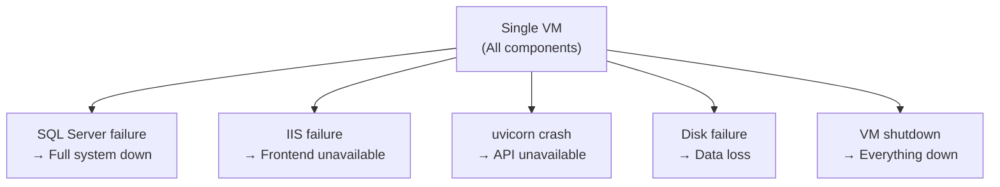
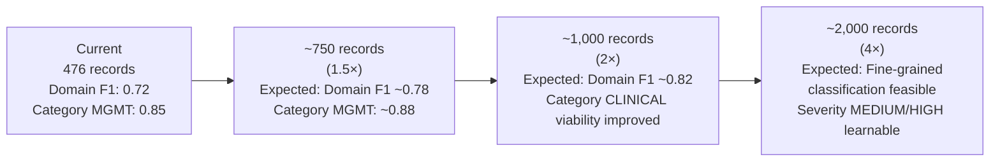

# Limitations and Future Work
## HCAT Insight — Rassoul Azam Hospital
**Document:** 14 — Limitations and Future Work
**Version:** 1.0
**Date:** May 2026
**Project:** HCAT Insight — AI-Assisted Healthcare Complaint Management System

---

## Table of Contents

1. [Introduction](#1-introduction)
2. [Dataset Limitations](#2-dataset-limitations)
3. [AI and NLP Limitations](#3-ai-and-nlp-limitations)
4. [Infrastructure and Deployment Limitations](#4-infrastructure-and-deployment-limitations)
5. [Workflow and Operational Limitations](#5-workflow-and-operational-limitations)
6. [Security and Privacy Limitations](#6-security-and-privacy-limitations)
7. [Testing and Quality Assurance Limitations](#7-testing-and-quality-assurance-limitations)
8. [Technical Debt](#8-technical-debt)
9. [Future AI Improvements](#9-future-ai-improvements)
10. [Future Architecture Improvements](#10-future-architecture-improvements)
11. [Future Infrastructure Improvements](#11-future-infrastructure-improvements)
12. [Future Workflow Enhancements](#12-future-workflow-enhancements)
13. [Lessons Learned](#13-lessons-learned)
14. [Conclusion](#14-conclusion)

---

## 1. Introduction

This document provides an honest, complete accounting of the current limitations of **HCAT Insight**, alongside a structured roadmap of future improvements that would address them. Documenting limitations is not a concession of failure — it is a professional obligation and a contribution to the field.

HCAT Insight is a real operational system that processes real complaints in a real hospital. Its limitations are the limitations of a first-generation deployment under genuine constraints: a small dataset, CPU-only hardware, no internet access, a single developer, and the complexity of Arabic clinical text. These limitations are well-understood, and the majority have concrete, feasible remediation paths.

---

## 2. Dataset Limitations

### 2.1 Small Dataset Size

| Limitation | Impact | Severity |
|-----------|--------|---------|
| **476 records total; 380 for training** | Insufficient for reliable classification of rare classes; limits deep learning approaches | High |
| **Data spans from January 2025 only** | No seasonal trend history; cannot detect year-over-year patterns | Medium |
| **Single hospital source** | Models reflect RAH's specific complaint culture; may not generalize | Medium |
| **Specialized cardiac context** | Harm distribution skewed toward severe outcomes; not representative of general hospitals | Medium |
| **No synthetic augmentation** | Rare classes (Safety, Never Event, High Harm) remain underrepresented | High |

### 2.2 Annotation Limitations

| Limitation | Impact |
|-----------|--------|
| **No inter-annotator agreement measurement** | Cannot quantify annotation reliability; unknown label noise |
| **Single annotator per record** | No cross-validation of human labels |
| **Forced single-label for multi-stage complaints** | Inherent noise in Stage labels |
| **Subjectivity in Severity and Harm** | Different annotators may assign different levels to the same complaint |

### 2.3 Fine-Grained Label Sparsity

The 78-class Arabic (`classification_ar`) and 73-class English (`classification_en`) fine-grained labels are too sparse for any ML approach at current dataset sizes. With 476 records distributed across 78 classes, the average class has just 6 training examples — far below the minimum needed for reliable learning.

**Threshold for viability:** Approximately 50 training examples per class are required for a classical classifier to learn reliably. For the fine-grained classification to become viable, the dataset would need to grow to approximately 78 × 50 = **~4,000 records** — roughly 8× the current size.

---

## 3. AI and NLP Limitations

### 3.1 Classification Performance Gaps

| Model | Current F1 | Gap | Root Cause |
|-------|-----------|-----|-----------|
| Stage of Care | ~0.25 | Large | Multi-stage nature of complaints; insufficient stage-discriminating vocabulary |
| Harm Level (Fine-grained) | 0.28–0.53 | Large | Extreme imbalance; outcome information in hospital text insufficient |
| **Harm (High class recall) ** | **0.00** | **Critical** | Only 6 High Harm test samples; model never predicts High Harm |
| Sub-Category Quality of Care | 0.496 | Moderate | 7 sub-classes with overlapping vocabulary |
| Category CLINICAL | 0.586 | Moderate | Only 89 CLINICAL records; Quality of Care vs Safety distinction is subtle |
| Classification_en / Classification_ar | 0.14 / 0.15 | Fundamental | Too many classes; too few records |

### 3.2 Arabic NLP Challenges

| Challenge | Description | Current Mitigation |
|-----------|-------------|-------------------|
| **Dialectal variation** | Lebanese, Iraqi, and Gulf dialects co-exist with Modern Standard Arabic in complaint text | Multilingual MPNet handles dialects partially |
| **Mixed Arabic-English** | Medical terms, device names, procedure names in English within Arabic sentences | MPNet multilingual handles code-switching |
| **Informal grammar** | Patient complaint narratives use colloquial constructions | Sentence-level embeddings smooth over grammar variations |
| **Diacritics absent** | Arabic text without diacritics creates ambiguity | GLiNER NER includes alef normalization; general model limitation |
| **Clinical term density** | High density of Arabic transliterations of English clinical terms | No specific handling; relies on embedding model's training distribution |

### 3.3 Embedding Model Limitations

The `paraphrase-multilingual-mpnet-base-v2` model was not trained on Arabic clinical text. Its embedding quality for specialized Arabic medical vocabulary is lower than it would be for a domain-adapted model. Specifically:

- Technical clinical terms (Arabic equivalents of ICU, suction, catheter, etc.) may have lower-quality representations than common language
- The model produces a single 768-dimensional vector for variable-length texts — a 13-character complaint and a 1,457-character complaint produce the same-size output, with the longer text inevitably losing information through the mean-pooling process

### 3.4 Stage Model Architectural Limitation

The semantic projection approach for Stage classification, while architecturally motivated, shows performance (~45% accuracy) below the Phase 1 LR baseline (~57%). The projection model measures conceptual alignment between complaint sentences and 15 semantic metrics, but the mapping from metric scores to specific stage labels remains imprecise — multiple stages can produce similar metric profiles.

---

## 4. Infrastructure and Deployment Limitations

### 4.1 Single Point of Failure

**Figure 1: Single Point of Failure Architecture.**

Every system component — database, backend, frontend, and ML models — runs on a single VM. Any hardware failure, disk issue, or power event brings down the entire system simultaneously with no failover.

### 4.2 No Scalability Path

The current architecture does not scale beyond a single VM:
- No horizontal scaling (multiple backend instances)
- No read replicas for the database
- No caching layer
- No load balancer
- ML models are loaded once per process — multiple processes would require multiple model copies in RAM

### 4.3 Startup Latency

A server restart requires 50–120 seconds before the system accepts requests, due to ML model loading. During this window, the system is completely unavailable. For a hospital system, unplanned downtime during complaint intake hours is a real operational risk.

### 4.4 No Automated Backup

No automated backup system protects complaint data. A disk failure would result in permanent loss of all complaint records and ML training data.

### 4.5 Manual Deployment Pipeline

Every frontend update requires a manual build-transfer-deploy cycle. Every backend update requires manual file replacement and service restart. This creates deployment friction and increases the risk of human error during updates.

---

## 5. Workflow and Operational Limitations

| Limitation | Description |
|-----------|-------------|
| **Subcase stalling** | A subcase stalls if the responsible role holder does not log in; no automated reminder or escalation |
| **No SLA enforcement** | No time limits on subcase resolution; no alerts for overdue subcases |
| **No patient-facing portal** | Patients cannot check the status of their complaint online; all follow-up is staff-initiated |
| **Manual report generation** | Seasonal reports require manual creation by an Administration Admin; no automated generation |
| **No notification system fully active** | SMTP notification is implemented but in "mock" mode by default; email notifications are not operational |
| **Workflow revision loops** | Returned subcases (RETURNED_TO_SECTION, RETURNED_TO_DEPT) can create long resolution cycles with no upper bound |
| **Force close with no appeal** | Cases can be force-closed administratively with only a reason field; no patient notification or appeal mechanism |

---

## 6. Security and Privacy Limitations

| Limitation | Risk Level | Description |
|-----------|-----------|-------------|
| **Hardcoded session secret** | High | `secret_key="CHANGE_ME_..."` in main.py — enables session forgery |
| **No HTTPS** | Medium | Credentials and complaint data in plaintext on LAN |
| **No audit logging** | High | Cannot trace who accessed what data or when |
| **No database row security** | Medium | Application-layer scoping only; DBA has full access |
| **Harm recall = 0** | Critical | High Harm cases never flagged by AI — human oversight is sole safety net |
| **No penetration testing** | Unknown | Security vulnerabilities may exist beyond documented gaps |
| **system_settings_router disabled** | Low | Admin configuration endpoint unavailable due to unresolved bug |

---

## 7. Testing and Quality Assurance Limitations

| Limitation | Impact |
|-----------|--------|
| **No automated test suite** | Regressions undetectable between manual test cycles |
| **No CI/CD pipeline** | Every change requires manual testing |
| **No test environment** | Testing contaminates production data |
| **No load testing** | Unknown behavior under concurrent peak usage |
| **No browser compatibility matrix** | Untested on older hospital workstation browsers |
| **No formal AI regression testing** | Model performance may degrade between retraining cycles without automated detection |

---

## 8. Technical Debt

| Item | Description | Priority |
|------|-------------|---------|
| **Session secret** | Move to environment variable | Critical |
| **system_settings_router bug** | Fix pydantic `any` vs `Any` type annotation | High |
| **v1/v2 pattern inconsistency** | Migrate v1 routers to v2 clean service pattern | Medium |
| **No connection pooling** | Add pyodbc connection pool | Medium |
| **Hardcoded configurations** | Several values should be configurable without code change | Low |
| **Debug scripts in production codebase** | 20+ TEST_*.py, VERIFY_*.py files in backend/ root | Low |
| **Old encoding JSON file** | `archive/data_exploration/Encoding/categorical_value_mapping.json` — confirmed outdated | Low |

---

## 9. Future AI Improvements

### 9.1 Data Growth — The Highest-Priority Action

The single most impactful improvement to AI performance is **growing the training dataset**. The relationship between data volume and model performance is well-understood:

**Figure 2: Projected Impact of Data Growth.**

The retraining pipeline is already built and designed for milestone-based execution at 1.5×, 2×, and 2.5× data volumes. No architectural changes are needed to benefit from data growth.

### 9.2 Arabic Clinical BERT Fine-Tuning

Once sufficient GPU resources are available (either through a more powerful VM or a temporary cloud environment for training only), fine-tuning a domain-adapted Arabic BERT model on RAH's complaint data would provide significantly better embeddings than the general-purpose MPNet model:

- **Model candidate:** CAMeLBERT, AraBERT-v2, or Arabic Clinical BERT (if available)
- **Training approach:** Masked language modeling on complaint narratives, then classification fine-tuning
- **Expected improvement:** 5–15 F1 points on Category and Sub-Category models

### 9.3 Stage Model Redesign

The Stage classification system needs a fundamental redesign rather than incremental improvement:

**Option 1 — Multi-label Stage:** Treat Stage as a multi-label problem (a complaint can reference multiple stages simultaneously). This better reflects the reality of complex complaints and eliminates forced single-label noise.

**Option 2 — Sentence-Level Stage Tagging:** Assign a Stage label to each sentence in the complaint rather than to the whole complaint. This requires a sequence labeling approach but would produce more precise stage information.

**Option 3 — Rule-Based Temporal Parsing:** Build a more sophisticated Arabic temporal expression parser that extracts explicit temporal markers ("before the operation," "after discharge," "during the rounds") as features for stage classification.

### 9.4 Harm Classifier Improvement

The binary Harm classifier's zero recall on High Harm is the most critical AI improvement needed. Concrete steps:

1. **Rebalance training data:** Upsample High Harm records or synthesize new ones using paraphrase techniques
2. **Threshold calibration:** Adjust the decision threshold toward higher recall for High Harm, accepting some false positives
3. **Feature engineering:** Add explicit clinical outcome keywords (readmission, ICU transfer, surgical complication) as binary features alongside embeddings
4. **Stacked architecture:** Use Severity and Category predictions as additional inputs to the Harm model

### 9.5 Large Language Model Integration

If the hospital's infrastructure is upgraded to permit either:
- A local LLM (e.g., Mistral 7B or Llama 3.1 8B on a GPU-enabled VM), or
- A controlled connection to a healthcare-compliant LLM API

The following LLM-assisted capabilities become feasible:
- Zero-shot classification without training data (useful for new complaint types)
- Explanation generation ("Why was this classified as CLINICAL/Quality of Care?")
- Complaint summarization for reporting
- Patient response generation drafts

### 9.6 Data Synthesis

For classes with fewer than 20 training examples, controlled data synthesis using:
- **Back-translation:** Translate complaint to English, then back to Arabic (produces paraphrased variants)
- **Paraphrase generation:** Use a multilingual paraphrase model to generate variants
- **LLM-assisted generation:** Use a language model to generate plausible synthetic complaints for rare categories

Synthetic data should be clearly labeled and evaluated separately from real data before inclusion in training.

---

## 10. Future Architecture Improvements

| Improvement | Benefit | Effort |
|-------------|---------|--------|
| **Move session secret to environment variable** | Eliminates critical security gap | Low |
| **Add HTTPS via reverse proxy** | Encrypted data transmission | Medium |
| **Connection pooling** | Better concurrent request handling | Medium |
| **Separate ML service** | Isolate ML from application failures | High |
| **Automated test suite (pytest)** | Catch regressions automatically | High |
| **Database row-level security** | Defense-in-depth access control | Medium |
| **Audit logging middleware** | Full access tracking | Medium |
| **Model versioning system** | Track which model version is deployed | Low |
| **Complete v1→v2 migration** | Consistent, maintainable codebase | High |

---

## 11. Future Infrastructure Improvements

| Improvement | Benefit | Effort |
|-------------|---------|--------|
| **Automated database backup** | Prevent data loss | Low |
| **Static IP assignment** | Eliminate CORS restart requirement | Low (network config) |
| **Separate DB server** | Eliminate resource contention | Medium |
| **GPU-enabled VM** | Enable fine-tuning and faster inference | High (hardware) |
| **Staging environment** | Test changes without production risk | Medium |
| **Automated CI/CD pipeline** | Streamline updates | High |
| **VM snapshot automation** | Regular system state backups | Low |
| **NSSM startup delay** | Fix SQL Server race condition | Low |
| **Faster Whisper GPU variant** | Reduce STT transcription time | Medium (hardware) |

---

## 12. Future Workflow Enhancements

| Enhancement | Description | Priority |
|-------------|-------------|---------|
| **Subcase SLA timers** | Alert when subcases exceed defined resolution time | High |
| **Automated reminder notifications** | Email section admins when subcases are overdue | High (requires SMTP activation) |
| **Patient-facing status portal** | Allow patients to check complaint status via reference number | Medium |
| **Automated seasonal report generation** | Trigger quarterly reports automatically rather than manually | Medium |
| **Mobile-responsive frontend** | Enable complaint entry from tablets during ward rounds | Medium |
| **STT integration in intake** | Allow voice complaint submission via hotline → automatic transcription → classification | Low (infrastructure needed) |
| **Multi-label Stage** | Allow complaints to be tagged with multiple Stages simultaneously | Medium |
| **Complaint deduplication** | Detect duplicate complaints from the same patient about the same event | Medium |
| **Cross-department case linking** | Link related complaints from different patients about the same systemic issue | Low |

---

## 13. Lessons Learned

The development of HCAT Insight produced a set of engineering and research lessons that extend beyond this specific system:

| # | Lesson | Applicable To |
|---|--------|--------------|
| **1** | **Label dependency is the most important structural property to discover.** The HCAT taxonomy's hierarchical structure was present in the data from day one. Discovering it later cost months of suboptimal flat-model experiments. Future projects should test for label dependency before choosing any architecture. | Any multi-label classification system |
| **2** | **Small dataset + rich structure beats large dataset + flat assumptions.** 476 records in a hierarchical pipeline outperforms flat classification on datasets 4× larger. Structure is more data-efficient than volume when structure exists. | Healthcare NLP, resource-constrained ML |
| **3** | **Ordinal targets need ordinal models.** Treating Severity as categorical and Harm as unordered produces models that make large errors (predicting LOW when TRUE is HIGH) as freely as small ones. Ordinal-aware models are essential for clinical risk features. | Any ordered classification problem |
| **4** | **The most dangerous prediction failure is the one with zero recall.** A model that never predicts High Harm is worse than no model — it creates false confidence. Always check per-class recall, especially for safety-critical classes. | Any safety-critical classification |
| **5** | **Offline deployment requires solving problems that cloud deployment avoids.** Auto-IP detection, bootstrap mode, local model storage, NSSM service management, and manual update procedures — none of these are required in a cloud deployment. Plan for them from the start. | Edge/offline AI deployments |
| **6** | **Semantic projection for multi-concept texts is architecturally sound but practically hard.** The Stage model's projection approach correctly identifies that a single global embedding loses stage information. The challenge is building vocabulary lists that are exhaustive enough to capture all relevant concepts. | Domain-specific NLP |
| **7** | **MANAGEMENT complaints are much more predictable than CLINICAL ones.** Organizational process complaints (delays, bureaucracy, documentation) have more distinct vocabulary than clinical care quality complaints. AI systems for complaint management should set different expectations for different domains. | Healthcare complaint analysis |
| **8** | **A working system beats a perfect design.** HCAT Insight is deployed and handling real complaints with acknowledged limitations. A more sophisticated architecture that was never deployed would have contributed nothing to patient care quality. | System engineering generally |

---

## 14. Conclusion

HCAT Insight is a functional, deployed, and operationally valuable system. Its limitations are real but bounded — most trace back to two root causes: **dataset size** and **infrastructure constraints**. Both are resolvable with time and institutional investment.

The priority order for future improvements, based on impact-to-effort ratio:

**Immediate (low effort, high impact):**
1. Move session secret to environment variable (security)
2. Activate SMTP notifications (operational value)
3. Implement automated database backup (data protection)
4. Fix system_settings_router pydantic bug (admin capability)

**Short-term (medium effort, high impact):**
5. Allow dataset to grow naturally — the retraining pipeline is ready
6. Implement subcase SLA timers and automated reminders
7. Add audit logging middleware
8. Retrain at 1.5× milestone when ~715 records are available

**Medium-term (higher effort, transformational impact):**
9. Fine-tune Arabic clinical BERT when GPU access is available
10. Redesign Stage model as multi-label or sentence-level tagging
11. Rebalance Harm training data to improve High Harm recall
12. Automate the full CI/CD pipeline and add a staging environment

**Long-term (infrastructure dependent):**
13. Separate DB server for resource isolation
14. GPU-enabled VM for model training and faster inference
15. LLM integration for explanation generation and zero-shot classification
16. Patient-facing complaint status portal

The most important single action is the one that requires no engineering effort at all: **allowing the complaint database to grow**. Every new complaint that enters the system, is reviewed by a human, and receives verified labels is training data for the next retraining cycle. The self-improving loop is already built. Time and operational continuity are the primary inputs it needs.

---

*Document prepared for research and academic publication purposes.*
*Source of truth: HCAT Insight codebase, operational deployment at Rassoul Azam Hospital, experimental records at `model_training/`, and Obsidian project notes.*
